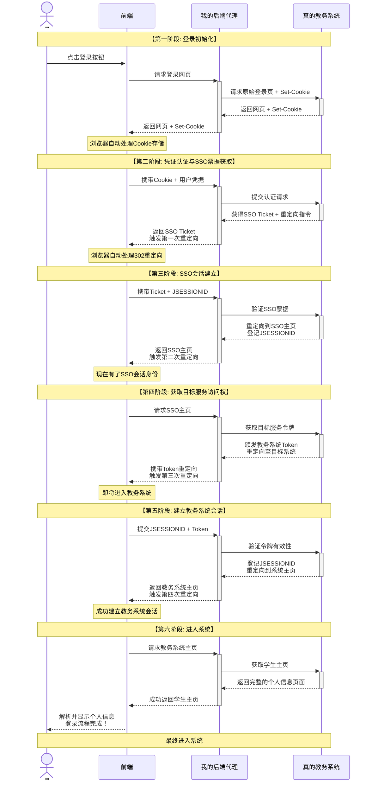
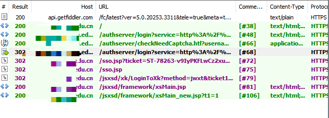
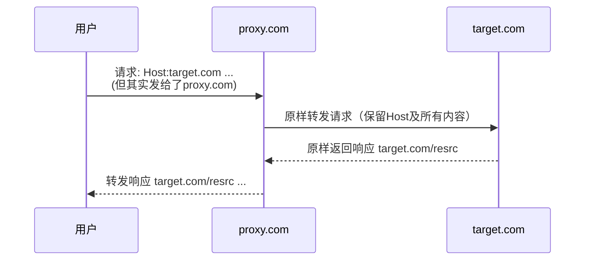
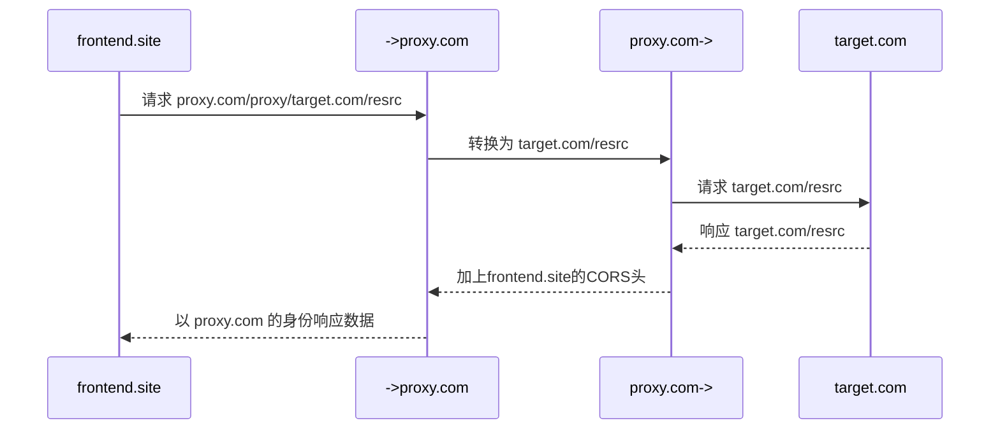

月宫小站教务系统是一个以前端为主，实际上是全栈的项目。与其细说作为大头但高度注ai的前端，我还是想着重讲讲关于后端代理的事情。

因为显然，那个难看到爆又经常套娃又时不时宕机的jsp页面教务系统肯定不是现代程序员的杰作。数科的大佬似乎也是有人从表开始做新的系统了。本着不能把这个想法憋死在娘胎里的想法，我还是在假期紧赶慢赶把这个系统做了出来。

项目遇到的第一个，也是最根本的障碍，就是 CORS（跨源资源共享） 限制。

简单来说，CORS是现代浏览器的一项核心安全策略。它规定: `example.com` 网站的前端 JavaScript，不能随意向 `another.com` 发起请求并读取响应。

为什么要有这种限制？设想一个场景: `evil.com` 精心仿造了 `bilibili.com` 的登录页面。当你在这个高仿页面输入账号密码时，如果允许跨域请求，`evil.com` 的脚本就能将你的凭证直接发往真正的B站服务器。登录成功后，它甚至可以窃取你的登录状态或个人数据。而这一切，用户可能毫不知情。

CORS 机制的存在，使得 `evil.com` 的恶意请求被浏览器直接拦截。它能发出请求，但用户的浏览器会出手，它无法读取来自 `bilibili.com` 的响应，最终只会得到一个 `TypeError: Failed to fetch` 的错误。

> 你可能会想: 那 `evil.com` 自己架个服务器，把密码收过来再去B站尝试登录不就行了？
> 理论上可以，但这会暴露其服务器IP。当同一IP出现大量异常登录尝试时，极易被目标网站的风控系统识别并封禁。
> 是的代理池可以解决。但代理复代理，代理早晚会穷尽。ip可不是天上掉下来的。

现在我要解决的就是类似这样的问题。在这个项目里，我就是那个`evil.com`。





在教务系统登录过程中，我需要解决的两个核心问题是CORS和Cookie携带。首先复杂而`HTTPOnly`的Cookie管理注定了前端不可能处理这样的怪物。

解决方案非常明确: 引入一个反向代理服务器。让我的前端不再直接请求教务系统，而是请求与我同源的代理服务器；再由这个代理服务器去“冒充”浏览器，向真实的教务系统发起请求，最后将净化后的数据返回给前端。

考虑到用户量并不大，教务系统流量又不高，我现在会先不用代理池，直接用服务器做可行性实验（不然玩不好会被借刀杀人搞成DDOS）。现在第一个问题是: 

## 如何请求到网页数据

下面是最普通的代理所做的事情: 



但实际上，浏览器前端的安全策略几乎没有办法把`Host: target.com`转发到`proxy.com`。我们需要一种方式使代理服务器知道我们要去哪。

比如说，`proxy.com/proxy/target.com`。这个方案可行吗？

|  目标                                 | 代理转换                                            |
|  -----------------------------------  | --------------------------------------------------- |
| `http://target.com`                   | `http://proxy.com/proxy/target.com`                   |
| `https://target.com/path/to/endpoint` | `https://proxy.com/proxy/target.com/path/to/endpoint` |
| `ws://target.com?query=1234`          | `ws://proxy.com/proxy/target.com?query=123`           |

当然可行。通过路径传递是很*我没意见*的方式。只要在整个项目前后端都使用同一套标准的转换就可以了



好的第一个问题解决了。现在我们解决第二个问题: 

## 如何维持Cookie状态？

首先我排除了后端维持，即使这个方案理论可行而且是AI一解。
- 第一，你将要作为代理服务器主动保留用户信息，我无法接受，这将不是代理而是后端，尤其是针对这个教务系统的后端。
- 第二，这个服务器需要一个缓存数据库来应对，为此掏出Redis实在小题大做。
- 第三<del>，当时的我其实前端并非特别熟练</del>，我登时希望用一个fetch like的`fetchProxy`函数转换并请求来解决一切问题。事实上我成功了。在此之前，我们要先讨论一下Cookie里都有什么。我们首先知道，请求中有`Cookie`头，而响应中有`Set-Cookie`头，这两个我们都要收拾。

```
Cookie: JSESSIONID=9FFE...0301;
Set-Cookie: JSESSIONID=9FFE...0301; Path=/authserver; secure; SameSite=None; Secure; HttpOnly
```

这是一对不是很全但真实的Cookie头。Cookie除了键值还有一些属性，服务器将Cookie交给浏览器保管，当浏览器认为Cookie的属性与请求相符（如果是fetch发起的，fetch要设置携带凭据）时，它会随请求将Cookie发送出去。浏览器认为相符主要取决于: 

- `Domain`: Cookie被存储时默认`Domain`为这个请求的`Host`，发送时也匹配这个`Host`。服务器不常通过`Domain`指定。但如果他这么做了，无疑会给我们的`proxy.com`当头一棒——连读取都不必考虑，它根本就没法设置`target.com`的Cookie，这个`Domain`发明出来是给子域名用的。
- `Path`: 只有当目标终结点处于该`Path`或其下时，Cookie会被发送。注意，如果我们使用`/proxy/target.com/path`，那么返回的`Path: /path`就不仅要加上前面的`proxy`还要加上当前的`Domain`。
- `Secure`: 大小写无所谓（都写可能是为了那个拟人兼容）。只有https下才发送这个Cookie。
- `SameSite`: 是否要考虑同一站点
  - `None`: 允许所有请求携带 Cookie，但必须同时 `Secure`。
  - `Lax`: 允许同一站点和某些跨站请求携带 Cookie。这包括本地的不同端口，域名和子域名相互，子域名之间，这就够了。考虑到开发环境不想配ssl的，强烈建议改成`Lax`。（ps: 同一站点指同域名、同端口、同协议。）
  - `Strict`: 仅允许同一站点的请求携带 Cookie。

当响应直接通过代理，单带一个CORS头来到前端后，不正确的`Domain`使它无法被设置，错误的`Path`使其永远发不出去，`SameSite:Strict`更是给你Cookie直接嘎巴一下嗯死在炕上了。

现在我们要做的很明确了。在后端添加cors的同时做这样一件事: 
- `Path`: 改为`proxy/{(Domain或响应域名)}/{原Path}`
- `Domain`: 改为`proxy.com`
- `SameSite=="Strict"`的: 改为`Lax`
```
Set-Cookie: JSESSIONID=9FFE...0301; Domain=proxy.com; Path=/proxy/target.com/authserver; secure; SameSite=None; Secure; HttpOnly
```
另外，`HttpOnly`是用于禁止js访问的。这一点可以保留，毕竟咱用不上，也没必要暴露增加不确定性。

## 如何处理重定向？

与Cookie相比，重定向要简单的多。

```
Location: http://target.com/sso.jsp?ticket=v9Iy...boDE
```

只要在返回响应时简单把他按[上面的](#如何请求到网页数据)规则转换一下就能完全解决了。要注意浏览器会根据HSTS（一种可选的响应头）自动处理不降级策略，即如果响应是https，而请求是http，浏览器会自动升级为https。

```
Location: http://proxy.com/proxy/target.com/sso.jsp?ticket=v9Iy...boDE
```

## 结语

SSO Ticket此处的实现本质上就查询字符串，JSESSIONID/会话追踪本质上就是Cookie。现在，所有一切有条不紊地运行着。一个`fetch(proxyTo('target.com'))`解决了所有那些看不见的。除了有点慢以外 :spoiler[这个真没招，得花钱]。

这或许只是一个简单的代理扩展，但回想当时边做前端边迷迷糊糊地问ai代理方案，ds的回答模棱两可，经常给出类似 `SameSite: Lax` 不能跨本地端口之类的错误回答。现在豁然开朗的自己比起来，只觉得“人一定要大量且频繁地记录自己”是如此正确。

::github{repo="BPuffer/tsukimiyaJwgl"}

---

那么，evil.com做了这一切的代价是什么呢？
