> 2025高教社杯A 省一打法 不打算改学术了 丢在这供后辈批评

# 结合LBAS算法对烟幕干扰弹投放策略的建模与优化

**摘要**

本文针对无人机协同投放烟幕干扰弹对来袭导弹进行遮蔽的策略优化问题，建立了一系列精确的运动学与几何遮蔽模型，并设计了一种高效的智能优化算法进行求解，旨在最大化对导弹的有效遮蔽时间。

针对问题一的标准场景，通过建立导弹、无人机、烟幕弹及烟幕云团的运动方程，并基于真目标圆柱体特性构建了多检查点视线遮蔽判定模型，计算出给定策略的有效遮蔽时间为 **1.392 秒**，为后续优化提供了基准。

面对后续问题中参数空间复杂、传统优化算法（如BFGS、差分进化、粒子群等）易陷入局部最优或收敛失败的挑战，本文创新性地引入并改进了**引领者扰动天牛须搜索算法（LBAS）**。通过引入种群机制、二次进化策略、自适应参数调整与引领者扰动机制，显著提升了算法的全局探索与局部开发能力。改进后的LBAS算法在问题二的单弹优化中，将遮蔽时间显著提升至 **4.587 秒**，远超传统算法性能。

基于此，本文进一步构建了多弹、多机、多目标的协同优化模型。对于问题三（单机三弹），通过两阶段优化策略，实现了三枚烟幕弹的时序协同，总遮蔽时间达到 **6.403 秒**。对于问题四（三机协同），提出了基于空间分布特性的分解协调优化策略，三架无人机分别屏蔽导弹飞行路径的不同区段，总遮蔽时间达到 **11.679 秒**，验证了协同策略的有效性。最终，针对问题五（五机三弹三目标）这一最具挑战性的全局优化问题，本文设计了分层的资源分配与两阶段优化框架，成功协调5架无人机（最多投放15枚烟幕弹）对3枚导弹的遮蔽任务，最终实现了对M1、M2、M3导弹分别 **15.449 秒**、**12.164 秒** 和 **8.578 秒** 的有效遮蔽。

本研究结果表明，改进的LBAS算法在解决此类高维、非线性、多约束的优化问题上具有极强的竞争力与优越性。所提出的分层优化与协同策略为复杂战场环境下的智能干扰决策提供了有效的理论依据和算法支撑。

**关键词**：烟幕干扰；投放策略优化；引领者扰动天牛须搜索算法（LBAS）；协同决策；遮蔽效能评估；多智能体优化；数学建模

<div style="page-break-after: always;"></div>

# 一、问题重述

烟幕干扰弹在防空干扰系统中具有重要的战术价值，主要通过化学燃烧或爆炸形成烟幕或气溶胶云团，在目标前方特定空域形成遮蔽，干扰敌方导弹，具有成本低、效能高等优点。随着技术的发展，现已能通过无人机等平台实现烟幕干扰弹的定点精确抛撒，并通过时间引信控制起爆时机。在复杂战场环境中，如何根据实时信息判断无人机的投放时机、位置等参数，确保对目标形成有效遮蔽，是一个需要精密计算和高效决策的问题。为此，需建立数学模型并设计高效算法，以指导烟幕干扰弹的投放策略。

具体问题如下：

**问题一**：无人机 FY1 从初始位置 (17800, 0, 1800) 出发，以 120 m/s 的速度等高度朝假目标飞行。受领任务 1.5 秒后投放一枚烟幕干扰弹，间隔 3.6 秒后起爆，形成半径为 10 米、有效遮蔽时间为 20 秒的云团，并以 3 m/s 的速度匀速下沉。导弹 M1 从 (20000, 0, 2000) 出发，以 300 m/s 的速度朝假目标 (0, 0, 0) 飞行。请计算该烟幕云团对 M1 的有效遮蔽时长。

**问题二**：在问题一的基础上，优化无人机 FY1 的飞行方向、飞行速度、烟幕干扰弹的投放点和起爆点，使得对 M1 的遮蔽时间尽可能延长。

**问题三**：在问题二的基础上，允许无人机 FY1 投放最多三枚烟幕干扰弹。请设计投放策略，以最大化总遮蔽时间，并将结果保存至指定文件。

**问题四**：在问题二的基础上，允许三架无人机 FY1、FY2、FY3 各投放一枚烟幕干扰弹，共同对 M1 进行干扰。请设计协同投放策略，并将结果保存至指定文件。

**问题五**：在问题二的基础上，允许五架无人机 FY1 至 FY5 各至多投放三枚烟幕干扰弹，同时对三枚来袭导弹 M1、M2、M3 进行干扰。请设计全局投放策略，并将结果保存至指定文件。

# 二、问题分析

**问题一**：
该问题可视为单无人机、单烟幕弹、单导弹的标准情形。需建立各实体的运动学模型：无人机、导弹和烟幕云团的运动均可视为线性。烟幕弹脱离无人机后具有无人机的初始速度，并在重力作用下作平抛运动，其轨迹为抛物线；假设烟幕弹起爆后瞬时形成半径为10米的球状云团，该云团以3m/s匀速下沉，且在起爆后20秒内，在其中心10米范围内可提供有效遮蔽；导弹M1沿匀速直线飞向假目标(0,0,0)，并可能在途中探测到位于(0,200,0)的真目标并变动航向，造成不可挽回的损失。结合充分考虑真目标的非质点性，为计算有效遮蔽时长，通过几何方法判断导弹与真目标连线是否穿过烟幕云团球体。在此基础上，通过在时间段内二分查找遮蔽开始和结束的时刻，即可确定有效遮蔽时长。

**问题二**：
该问题为优化问题，需确定无人机的航向角、飞行速度、烟幕弹的投放时间与起爆时间，以最大化遮蔽时长。可以构建以遮蔽时间为目标函数的优化模型，并在连续参数空间中寻找最优解。由于目标函数非线性且可能存在多个极值，可采用全局优化算法（如遗传算法、模拟退火等）进行求解，避免陷入局部最优。

**问题三**：
在问题二的基础上，允许无人机FY1连续投放三枚烟幕弹。每枚弹的投放时间间隔至少1秒，且各弹的起爆时间独立可控。该问题需同时优化8个参数（无人机航向、速度，以及三枚弹各自的投放时间和起爆时间），目标函数为三枚弹形成的总遮蔽时间（遮蔽可不连续）。由于参数空间增大，且目标函数在绝大部分区域为零（即无遮蔽），可采用基于群体的优化算法（如粒子群优化）或增加扰动策略，以高效探索可行解区域。

**问题四**：
在问题二的基础上，该问题扩展至三架无人机（FY1、FY2、FY3）协同干扰同一导弹M1，每架无人机各投放一枚烟幕弹。每架无人机有四个决策变量（航向、速度、投放时间、起爆时间），总参数维度为12维。若直接优化，搜索空间较大。观察三架无人机位置处于低处，可采用分阶段优化策略：先对每架无人机单独优化，获取较优初始解；如果这些解的遮蔽时间是相交的，可以再以这些解为起点，在12维空间中进行协同优化，以提升求解效率和遮蔽效果。

**问题五**：
在问题二的基础上，该问题扩展至五架无人机（每架至多投三枚弹）同时干扰三枚导弹（M1、M2、M3）。每架无人机的决策变量包括航向、速度以及每枚弹的投放时间和起爆时间，最多有5×(2+3×2)=40个决策变量。若直接优化，计算代价极高。结合问题四分析，可以采用分阶段优化策略：首先对每架无人机单独优化，确定每架无人机的基本烟幕弹投放策略（即初始解区域）；再在热点解区域内进行退火；最后使用较简单的算法进行全局微调。

# 三、模型假设与符号说明

## 模型假设

为确保模型的合理性与可求解性，本文在严格遵循题目要求的基础上，提出以下假设。

### 题目要求假设

1. 导弹运动假设：来袭空地导弹的飞行速度恒为 300 m/s，且其飞行方向始终指向假目标原点 (0, 0, 0)。
2. 目标特性假设：需要掩护的真目标是一个位于 (0, 200, 0) 的刚性圆柱体，底面半径为 7 米，高度为 10 米。
3. 无人机运动假设：无人机在受领任务后可瞬时调整飞行方向，随后在恒定高度上以 70~140 m/s 范围内的某一匀速直线飞行，航向与速度一旦确定便不再改变。
4. 烟幕弹投放假设：每架无人机投放多枚烟幕干扰弹时，相邻两弹的投放时间间隔至少为 1 秒。
5. 烟幕云特性假设：
   - 烟幕云团在起爆后瞬时形成，且为理想球体。
   - 云团的有效遮蔽半径为 10 米。
   - 云团以 3 m/s 的速度匀速下沉。
   - 云团起爆后的 20 秒内为其有效遮蔽时间。
6. 初始位置假设：所有实体（导弹 M1-M3、无人机 FY1-FY5）的初始位置为题目给定值，在 $t=0$​ 时刻已知且确定。

以上假设直接源自题目描述，是模型构建的基础约束条件。

### 额外合理假设

1. 质点假设：在运动学建模中，将所有实体（导弹、无人机、烟幕弹、烟幕云）视为质点，忽略其形状、尺寸及姿态变化对运动轨迹的影响。
2. 理想抛体假设：烟幕干扰弹脱离无人机后，仅受重力作用，忽略空气阻力等复杂环境因素的影响，其运动轨迹为理想的平抛运动。
3. 均匀云团假设：在有效遮蔽半径内，烟幕云的浓度均匀分布，一旦导弹或其视线进入该范围，即认为遮蔽完全有效，否则无效。
4. 视线遮蔽判断假设：为高效计算导弹是否被遮蔽，采用**有限检查点法**替代对连续目标体的精确判断。即在真目标圆柱体的顶面和底面圆周上均匀选取 8 个关键点构成检查点集合 $\mathcal{C}$。若烟幕云同时遮蔽了导弹与所有检查点之间的视线，则判定真目标被有效遮蔽。该假设能在保证计算精度的前提下显著提升效率。
5. 引力常数假设：重力加速度总是取 $g = 9.8 \text{m/s}^2$，方向垂直向下。
6. 坐标系假设：所有位置、速度、轨迹的计算均在题目给定的三维直角坐标系中进行，其中 $xOy$ 平面为水平面，$z$ 轴正方向为垂直向上。

## 符号说明

| 符号                            | 解释                                                         | 单位/备注                              |
| ------------------------------- | ------------------------------------------------------------ | -------------------------------------- |
| $\mathbf{M}_{o,i}$              | 导弹 $i$ 的初始位置                                          | m                                      |
| $\mathbf{M}_i(t)$               | 导弹 $i$ 在 $t$ 时刻的位置                                   | m                                      |
| $v_m$                           | 导弹飞行速度                                                 | m/s, $v_m = 300\text{m/s}$             |
| $\mathbf{F}_{o,i}$              | 无人机 $i$ 的初始位置                                        | m                                      |
| $\mathbf{F}_i(t)$               | 无人机 $i$ 在 $t$ 时刻的位置                                 | m                                      |
| $v_i$                           | 无人机 $i$ 的飞行速度                                        | m/s, $v \in [70, 140]$                 |
| $\theta_i$                      | 无人机 $i$ 的飞行方位角（与x轴正方向夹角）                   | rad                                    |
| $\mathbf{G}_{ij}(t)$            | 无人机 $i$ 投放的第 $j$ 枚干扰弹在 $t$ 时刻的位置            | m                                      |
| $T_{L,ij}$                      | 无人机 $i$ 投放第 $j$ 枚干扰弹的时刻                         | s                                      |
| $t_{F,ij}$                      | 无人机 $i$ 投放的第 $j$ 枚干扰弹的引信时长                   | s                                      |
| $T_{B,ij}$                      | 无人机 $i$ 投放的第 $j$ 枚干扰弹的起爆时刻                   | s, $T_{B,ij} = T_{L,ij} + t_{F,ij}$    |
| $\mathbf{S}_{ij}(t)$            | 无人机 $i$ 投放的第 $j$ 枚干扰弹形成的烟幕云团在 $t$ 时刻的位置 | m                                      |
| $\mathbf{v}_s$                  | 烟幕云团下沉速度向量                                         | m/s, $\mathbf{v}_s = [0, 0, -3]^T$     |
| $T_s$                           | 烟幕有效遮蔽时间                                             | s, $T_s = 20\text{s}$                  |
| $R_s$                           | 烟幕云团有效遮蔽半径                                         | m, $R_s = 10\text{m}$                  |
| $\mathcal{C}$                   | 目标检查点集合                                               | -                                      |
| $\mathbf{C}_k$                  | 目标检查点集合 $\mathcal{C}$ 中的第 $k$ 个点                 | m                                      |
| $g$                             | 重力加速度                                                   | m/s², $g \approx 9.8\text{m/s}^2$      |
| $\text{is\_shielding}(t)$       | $t$ 时刻导弹是否被遮蔽的布尔函数                             | -                                      |
| $D$                             | 总有效遮蔽时间（优化目标）                                   | s                                      |
| $\Delta t_{\text{min}}$         | 两枚干扰弹投放最小时间间隔                                   | s, $\Delta t_{\text{min}} = 1\text{s}$ |
| $\mathbf{b}$                    | (LBAS中) 天牛须搜索方向向量                                  | 归一化向量                             |
| $d_0$                           | (LBAS中) 天牛两须初始距离                                    | -                                      |
| $\delta$                        | (LBAS中) 天牛搜索步长                                        | -                                      |
| $\eta$, $\eta_d$, $\eta_\delta$ | (LBAS中) 距离/步长衰减系数                                   | -                                      |
| $P$                             | (LBAS中) 二次进化概率                                        | -                                      |
| $N$                             | (LBAS中) 种群大小                                            | -                                      |
| $T_{\text{max}}$                | (LBAS中) 最大迭代次数                                        | -                                      |
| $t$ (算法中)                    | (LBAS中) 当前迭代次数                                        | -                                      |
| $\boldsymbol{\xi}$              | (LBAS中) 随机扰动向量                                        | -                                      |

# 四、问题一的模型建立与求解

## 模型构建

### 构建几何模型

构建与题目相同，以假目标为原点的三维直角坐标系，后续模型及分析均基于此坐标系。

### 导弹实体的运动模型

将导弹视为质点，其初始位置为 $\mathbf{M}_0 = (20000, 0, 2000)$，以恒定速度 $v_m = 300\text{m/s}$ 沿直线飞向假目标原点。在任意时刻 $t$，导弹的位置可表示为：
$$
\mathbf{M}(t) = \mathbf{M}_0 + \frac{-\mathbf{M}_0}{\|\mathbf{M}_0\|} \cdot v_m \cdot t \quad (0 \leq t \leq \frac{\|\mathbf{M}_0\|}{v_m})
$$
当 $t > \frac{\|\mathbf{M}_0\|}{v_m}$ 时，导弹已到达假目标位置。

### 无人机实体的运动模型

无人机FY1初始位置为 $\mathbf{F}_{o1} = (17800, 0, 1800)$，以速度 $v_1 = 120\text{m/s}$ 沿方位角 $\theta_1$ 方向作匀速直线飞行。方位角 $\theta_1$ 定义为从x轴正方向起在xy平面逆时针旋转的弧度。无人机在时刻 $t$ 的位置为：
$$
\mathbf{F}(t) = \mathbf{F}_0 + v \cdot t \cdot 
\begin{bmatrix}
\cos\theta \\
\sin\theta \\
0
\end{bmatrix}
\quad (t \geq 0)
$$
根据问题一条件，无人机朝向假目标方向飞行，因此：

$$
\theta = \arctan\left(\frac{0 - 0}{0 - 17800}\right) = \pi \text{ rad} = 180^\circ
$$

### 烟幕弹实体的运动模型

烟幕弹在 $t = 1.5\text{s}$ 时从无人机投放，引信时长为 $3.6\text{s}$。烟幕弹脱离无人机后，在重力作用下作平抛运动，其运动轨迹为抛物线。在时刻 $t$ ($t \geq T_L = 1.5\text{s}$) 的位置为：
$$
\mathbf{G}(t) = \mathbf{F}(T_L) + \mathbf{v}_u \cdot (t - T_L) - \frac{1}{2}g(t - T_L)^2
\begin{bmatrix}
0 \\
0 \\
1
\end{bmatrix}
\quad (T_L \leq t \leq T_B)
$$
其中 $\mathbf{v}_u = v \cdot [\cos\theta, \sin\theta, 0]^T$ 为无人机速度向量，$T_B = T_L + t_F = 1.5 + 3.6 = 5.1\text{s}$ 为烟幕弹起爆时刻。

### 烟幕云的运动模型

烟幕弹在 $t = T_B = 5.1\text{s}$ 时起爆，瞬时形成半径为 $R_s = 10\text{m}$ 的球状烟幕云团。烟幕云团以 $v_s = 3\text{m/s}$ 的速度匀速下沉，在 $t$ 时刻 ($T_B \leq t \leq T_B + T_s$) 的位置为：

$$
\mathbf{S}(t) = \mathbf{G}(T_B) + \mathbf{v}_s \cdot (t - T_B)
$$

其中 $T_s = 20\text{s}$ 为烟幕有效遮蔽时间，$\mathbf{v}_s = [0, 0, -3]^T$。

### 遮蔽判断模型

为精确判断导弹是否被烟幕云有效遮蔽，需要考虑导弹与真目标之间连线的遮挡情况。真目标被建模为底面中心在 $(0,200,0)$、半径7m、高10m的直立圆柱体。

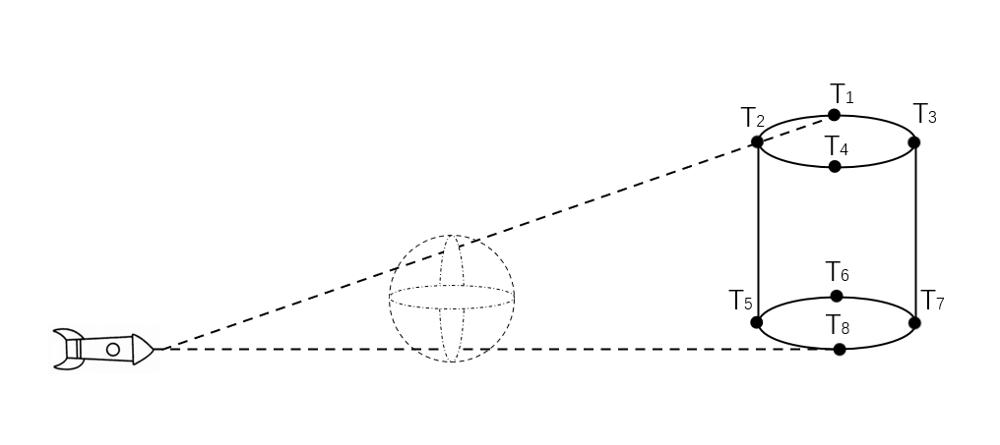

<center>图4.1  真目标几何模型与检查点分布</center>

定义目标检查点集合 $\mathcal{C}$，包含圆柱体顶面和底面圆周上的8个关键点：
$$
\mathcal{C} = 
\left\{
\begin{aligned}
&(7,200,0), (0,207,0), (-7,200,0), (0,193,0), \\
&(7,200,10), (0,207,10), (-7,200,10), (0,193,10)
\end{aligned}
\right\}
$$

导弹在时刻 $t$ 被烟幕云遮蔽的条件为：

1. 导弹位于烟幕云内部：$\|\mathbf{M}(t) - \mathbf{S}(t)\| \leq R_s$
2. 对于所有检查点 $\mathbf{C} \in \mathcal{C}$，烟幕云比导弹更靠近检查点
3. 对于所有检查点 $\mathbf{C} \in \mathcal{C}$，导弹与检查点连线到烟幕云中心的距离不大于烟幕云半径

数学表达为：

$$
\text{is\_shielding}(t) = 
\begin{cases} 
\text{true} & \|\mathbf{M}(t) - \mathbf{S}(t)\| \leq R_s \\
\text{false} & \exists \mathbf{C} \in \mathcal{C}, \|\mathbf{M}(t) - \mathbf{C}\| < \|\mathbf{S}(t) - \mathbf{C}\| \\
\text{false} & \exists \mathbf{C} \in \mathcal{C}, \dfrac{\|(\mathbf{S}(t) - \mathbf{C}) \times (\mathbf{M}(t) - \mathbf{C})\|}{\|\mathbf{M}(t) - \mathbf{C}\|} > R_s \\
\text{true} & \text{otherwise}
\end{cases}
$$

### 有效遮蔽时间计算

有效遮蔽时间为烟幕云存在期间 ($T_B \leq t \leq T_B + T_s$) 满足 $\text{is\_shielding}(t) = \text{true}$ 的时间区间总长度。由于遮蔽函数可能存在多个不连续区间，采用二分法精确查找遮蔽开始和结束时刻，然后求和：

$$
T_{\text{shielding}} = \sum_{i} (t_{\text{end},i} - t_{\text{start},i})
$$

其中 $[t_{\text{start},i}, t_{\text{end},i}]$ 为第 $i$ 个遮蔽时间区间。本研究中暂未发现涉及多个区间的情况。故上式可简化为$T_{\text{shielding}} = t_{\text{end}} - t_{\text{start}}$

## 模型求解

基于上述模型，编写Python程序计算有效遮蔽时间：

1. 定义导弹、无人机、烟幕弹和烟幕云的位置函数
2. 实现遮蔽判断函数 $\text{is\_shielding}(t)$
3. 在烟幕云存在时间区间 $[T_B, T_B + T_s]$ 内使用二分法查找遮蔽区间
4. 计算遮蔽区间总长度

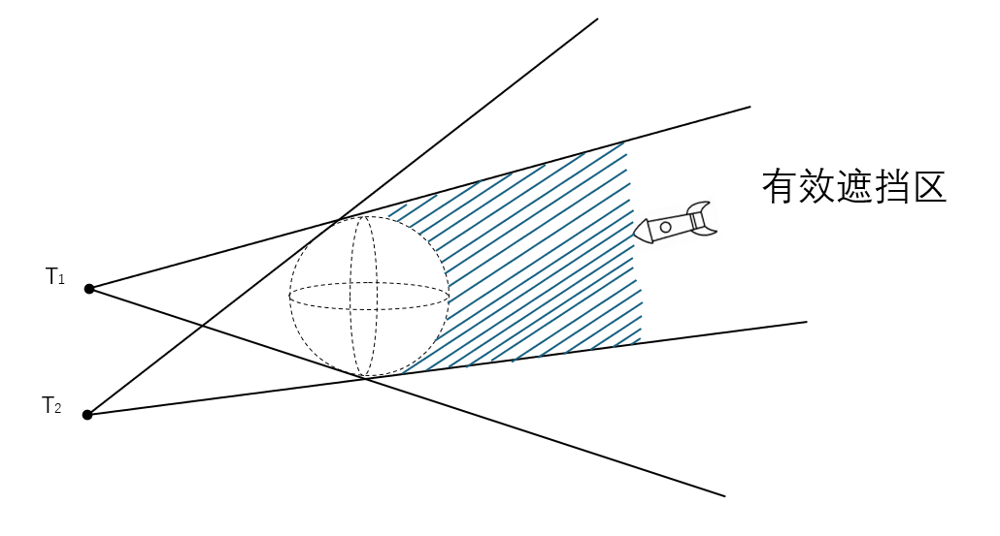

<center>图4.2  导弹轨迹与烟幕云遮蔽示意图</center>

### 计算结果

给定参数：

- 无人机飞行方向：$180.0^\circ$
- 无人机飞行速度：$120\text{m/s}$
- 烟幕弹投放时间：$1.5\text{s}$
- 烟幕弹引信时间：$3.6\text{s}$

计算得到有效遮蔽时间为：

$$
\boxed{T_{\text{shielding}} = 1.391983\text{s}}
$$

### 结果分析

烟幕云对导弹的有效遮蔽时间约为1.39秒，这一结果反映了在给定参数下烟幕干扰的效果。

# 五、问题二的模型建立与求解

## 优化模型建立

问题二要求在问题一模型基础上，通过调整无人机飞行参数和烟幕弹投放策略，最大化对导弹M1的有效遮蔽时间。这是一个四维连续优化问题，决策变量包括：

1. 无人机飞行方向 $\theta$（方位角，弧度）
2. 无人机飞行速度 $v$（m/s）
3. 烟幕弹投放时间 $T_L$（s）
4. 烟幕弹引信时间 $t_F$（s）

构建优化模型为：
$$
\begin{aligned}
\min_{\theta, v, T_L, t_F} \quad & -T_{\text{shielding}}(\theta, v, T_L, t_F) \\
\text{s.t.} \quad & \theta \in [0, 2\pi] \\
& v \in [70, 140] \\
& T_L \geq 0 \\
& t_F \geq 0
\end{aligned}
$$

### 算法比较与分析

针对此优化问题，我们尝试了多种优化算法，结果对比如下：

| 算法名称               | 参数设置                                    | 最优遮蔽时间(s) | 收敛性 | 计算效率 | 备注                     |
| ---------------------- | ------------------------------------------- | --------------- | ------ | -------- | ------------------------ |
| BFGS                   | 默认参数                                    | 收敛失败        | 差     | 高       | 梯度方法，易陷入局部最优 |
| 差分进化(DiffEvol)     | NP=50, F=0.5, CR=0.9                        | 收敛失败        | 差     | 中       | 全局搜索能力不足         |
| 盆地跳跃(Basinhopping) | niter=100, T=1.0                            | 收敛失败        | 差     | 中       | 难以跳出平坦区域         |
| 粒子群优化(PSO)        | c1=3, c2=1, w=0.99                          | 2.556160        | 一般   | 中       | 找到局部最优解           |
| 遗传算法(GA)           | pop_size=200, cxpb=0.5, mutpb=0.2, ngen=100 | 1.703871        | 一般   | 低       | 找到较差局部最优         |

传统优化算法在此问题上表现不佳的主要原因包括：

1. 目标函数存在大量平坦区域（烟雾弹完全无法遮蔽），梯度信息几乎为零
2. 有效解区域狭窄，传统全局搜索算法难以定位
3. 参数之间存在复杂耦合关系，局部搜索易陷入次优解

## 引入改进的LBAS算法

### BAS（天牛须搜索算法）

天牛须搜索算法（Beetle Antennae Search，BAS）是一种受到天牛觅食行为启发的智能优化算法，由Jiang等人在2017年提出^[1]^。该算法模拟了天牛利用触须感知食物气味强度并定向移动的觅食机制。当天牛觅食时，它并不知道食物的具体位置，而是通过比较两只触须感知的气味强度来判断移动方向。若左侧触须感知的气味强度大于右侧，天牛就会向左侧飞行；反之则向右侧飞行。通过这种简单的机制，天牛能够高效地找到食物源。这种仿生学原理为求解复杂优化问题提供了新思路：将待优化函数视为"气味场"，通过模拟天牛的定向移动行为来寻找函数的最优解。^[3]^

### BAS的基本数学模型

将天牛的觅食行为数学化，对于一个n维优化问题，BAS算法的核心步骤如下：

**Step 1**. 随机生成一个表示天牛朝向的归一化方向向量
$$
\mathbf{b} = \frac{\text{rands}(n, 1)}{\|\text{rands}(n, 1)\|}
$$
其中$\text{rands}(n, 1)$表示随机生成的n维向量。

**Step 2**. 计算天牛左右触须的位置
$$
\mathbf{x}_l = \mathbf{x} + d_0 \cdot \frac{\mathbf{b}}{2}, \quad \mathbf{x}_r = \mathbf{x} - d_0 \cdot \frac{\mathbf{b}}{2}
$$
其中$\mathbf{x}$表示天牛当前位置，$d_0$表示两须之间的距离。

**Step 3**. 根据左右须感知的函数值决定移动方向
$$
\mathbf{x}_{\text{new}} = \mathbf{x} - \delta \cdot \mathbf{b} \cdot \text{sgn}(f(\mathbf{x}_l) - f(\mathbf{x}_r))
$$
其中$\delta$为步长，$\text{sgn}$为取符号函数。

**Step 4**. 算法采用指数衰减策略更新步长和两须距离以收敛
$$
\delta_{t+1} = \eta \cdot \delta_t, \quad d_{0}^{t+1} = \eta \cdot d_{0}^{t}
$$
其中$\eta$为衰减系数（通常取0.95左右）。

天牛须算法采用单一个体进行寻优操作。由于单个个体所承载的信息存在局限性，导致其在寻优过程中对位置优劣的判断能力不足，进而常常易于陷入局部最优解。同时，该算法在寻优方向的调整策略上表现得较为单一，这也使得其寻优精度相对较低。^[2]^

### LBAS（引领者扰动天牛须搜索算法）原理与实现

针对基本BAS算法的不足，李辉和殷文明在2025年提出了引领者扰动天牛须算法（Leader Disturbance Beetle Antennae Search Algorithm，LBAS）^[2]^，引入了种群概念、引领者扰动机制、二次进化策略和自适应参数调整等改进措施，显著提升了算法性能。

#### 种群机制与排序策略

LBAS将单一天牛扩展为**种群**，模拟多天牛协同觅食的行为。算法将所有天牛按适应度进行排序，令适应度最好的天牛作为“引领者”，随后的天牛随之获得一个“更好”（自己的前一位个体位置）引导和“最佳”（全局最优解位置）引导。

#### 惯性系数

LBAS引入了惯性权重，该权重可使得个体的进化速度加快。
$$
\boldsymbol{x}^{t}=
\begin{cases}
\text{rand}() \times (\boldsymbol{x}^{t - 1} + \delta^t \boldsymbol{b}), & f(\boldsymbol{x}_\text{r}) > f(\boldsymbol{x}_\text{l}), \\
\text{rand}() \times (\boldsymbol{x}^{t - 1} - \delta^t \boldsymbol{b}), & f(\boldsymbol{x}_\text{r}) < f(\boldsymbol{x}_\text{l}),
\end{cases}
$$
惯性权重的引入可以使得个体加快向最优个体靠拢, 从而提高搜索效率.^[2]^

#### 二次进化策略

LBAS引入了基于概率的**二次进化机制**，使个体能够向更优个体和全局最优个体学习。对于每个非最优个体，以概率$P$（默认设为0.5）进行二次进化：

1. 向排序中前一个个体（更优个体）学习
2. 向全局最优个体学习

数学表达为：
$$
\mathbf{x}_{\text{secondary}} = \mathbf{x}_{\text{new}} + 0.5 \cdot (\mathbf{x}_{\text{prev}} - \mathbf{x}_{\text{new}}) + 0.5 \cdot (\mathbf{x}_{\text{best}} - \mathbf{x}_{\text{new}})
$$
其中$\mathbf{x}_{\text{new}}$是第一次进化后的位置，$\mathbf{x}_{\text{prev}}$是排序中前一个更优个体的位置，$\mathbf{x}_{\text{best}}$是全局最优解的位置。

如果不进行二次进化，该天牛将随机重生至最优解周围。

#### 引领者扰动机制

为避免算法过早陷入局部最优，LBAS引入了**引领者扰动机制**。当迭代次数超过初始阶段$t_0$（通常设为30）后，对全局最优解添加随机扰动：

$$
\mathbf{x}_{\text{perturbed}} = \mathbf{x}_{\text{best}} + \boldsymbol{\xi} \cdot \exp\left(-4 \cdot \frac{t}{T_{\text{max}}}\right)
$$
其中$\boldsymbol{\xi}$为随机扰动向量，$t$为当前迭代次数，$T_{\text{max}}$为最大迭代次数。指数衰减项$\exp(-4t/T_{\text{max}})$确保扰动幅度随着迭代进行逐渐减小，符合算法后期需要精细开发的特点。扰动后采用**贪婪选择策略**决定是否接受扰动解：
$$
\mathbf{x}_{\text{best}} = \begin{cases}
\mathbf{x}_{\text{perturbed}} & \text{if } f(\mathbf{x}_{\text{perturbed}}) < f(\mathbf{x}_{\text{best}}) \\
\mathbf{x}_{\text{best}} & \text{otherwise}
\end{cases}
$$

若扰动解更优，同时用其替换种群中最差个体，保持种群大小不变：
$$
\mathbf{x}_{\text{worst}} = \mathbf{x}_{\text{perturbed}}, \quad f(\mathbf{x}_{\text{worst}}) = f(\mathbf{x}_{\text{perturbed}})
$$

### 自适应参数调整

LBAS继承了BAS算法的参数衰减机制，但通过**种群搜索**替代了**个体搜索**，使参数设置更加稳健：

$$
d_0^{t+1} = \eta_d \cdot d_0^t, \quad \delta^{t+1} = \eta_\delta \cdot \delta^t
$$
其中$\eta_d$和$\eta_\delta$分别为两须距离和步长的衰减系数（通常取值0.9-0.95）。

初始步长和两须距离初始化为搜索空间规模的1/2，使其能充分探索空间边界：
$$
\delta_0 = d_0 = \frac{1}{2} (\mathbf{b}_{\text{max}} - \mathbf{b}_{\text{min}})
$$
其中$\mathbf{b}_{\text{max}}$和$\mathbf{b}_{\text{min}}$分别为搜索空间的上界和下界。


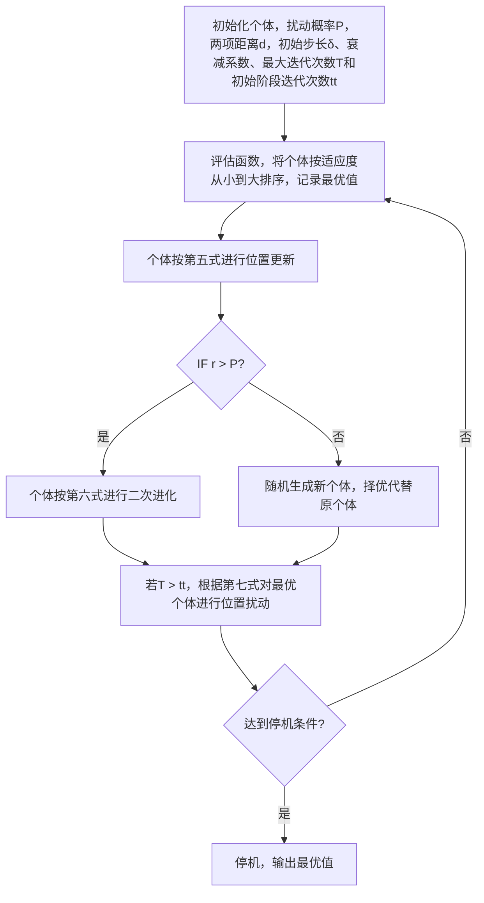

<center>图5.1 LBAS算法流程示意图


### 本文对LBAS算法的改进


#### 嗅探前随机化 $d_0$ 的改进

在方向向量生成后、计算须位置前，引入随机化因子：

$$
\mathbf{b} = \frac{\text{rands}(n, 1)}{\|\text{rands}(n, 1)\|} \cdot r
$$

其中 $r \sim U(0,1)$ 是随机数。这一改进实际上将固定长度的方向向量变为随机长度的方向向量，使得天牛须的"嗅探"行为更加多样化。

#### 二次进化距离的随机化改进

引入随机因子 $r \sim U(0,1)$，使二次进化的步长具有随机性：

$$
\mathbf{x}_{\text{secondary}} = \mathbf{x}_{\text{new}} + r \cdot \left[0.5 \cdot (\mathbf{x}_{\text{prev}} - \mathbf{x}_{\text{new}}) + 0.5 \cdot (\mathbf{x}_{\text{best}} - \mathbf{x}_{\text{new}})\right]
$$

随机因子 $r$ 的引入使得二次进化步骤具有了自适应步长调整的能力，平衡了探索与开发，针对本问题能够特别有效地搜索变量空间。

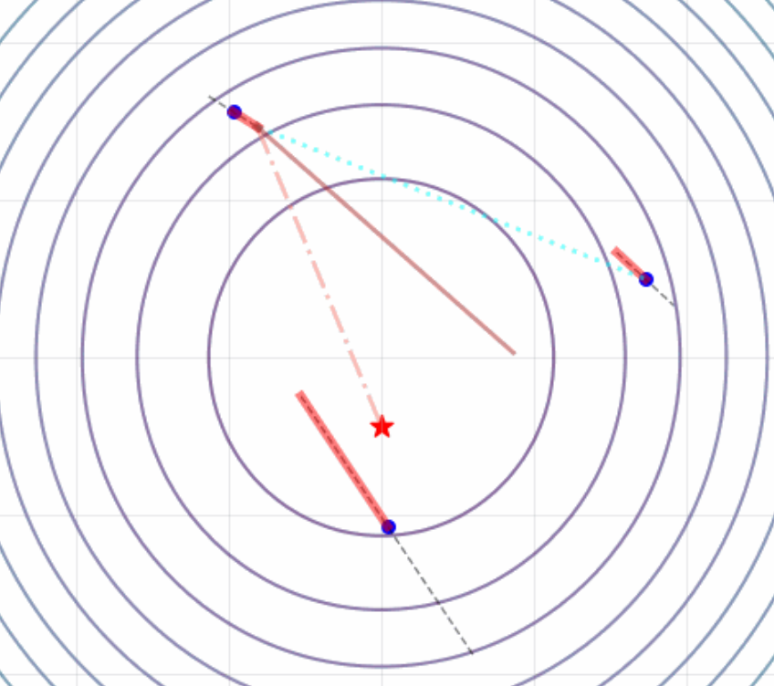

图5.2 展示了改进的LBAS算法的二次进化过程，其中灰色虚线为触角、红线为天牛个体主动移动，五角星为最优记录，蓝色点线为更优引导，橙色点划线为最优引导，棕线为最终二次进化路线。

## 模型求解

### LBAS算法参数设置

针对本问题，LBAS算法的参数设置如下：

| 参数             | 符号             | 值   | 说明               |
| ---------------- | ---------------- | ---- | ------------------ |
| 种群大小         | $N$              | 30   | 平衡计算量与多样性 |
| 二次进化概率     | $P$              | 0.5  | 平衡开发与探索     |
| 初始步长         | $\delta_0$       | 1.0  | 基于参数范围标准化 |
| 初始两须距离     | $d_0$            | 1.0  | 基于参数范围标准化 |
| 步长衰减系数     | $\eta_\delta$    | 0.95 | 控制收敛速度       |
| 距离衰减系数     | $\eta_d$         | 0.95 | 控制搜索精度       |
| 最大迭代次数     | $T_{\text{max}}$ | 100  | 确保充分收敛       |
| 初始阶段迭代次数 | $t_0$            | 20   | 控制扰动开始时     |

### 优化结果

使用改进的LBAS算法求解问题二，得到最优参数组合：

| 参数         | 最优值     | 单位 |
| ------------ | ---------- | ---- |
| 飞行方向     | 4.993674°  | °    |
| 飞行速度     | 124.169252 | m/s  |
| 投放时间     | 0.907518   | s    |
| 引信时间     | 0.137133   | s    |
| 最大遮蔽时间 | 4.587493   | s    |

最优投放点坐标：$(17912.26, 9.81, 1800.00)\text{m}$  
最优起爆点坐标：$(17929.22, 11.29, 1799.91)\text{m}$

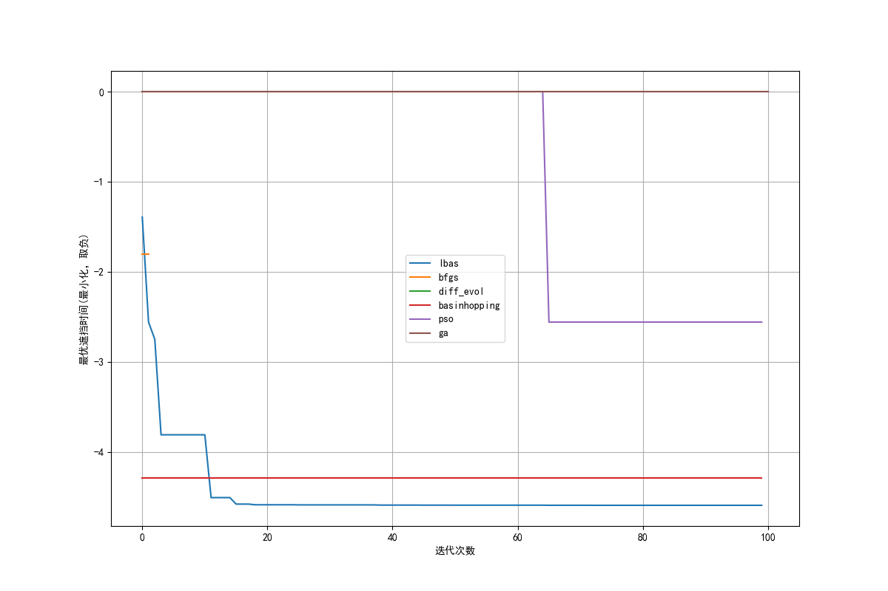

<center>图5.3 各算法收敛曲线对比</center>

# 六、问题三的模型建立与求解

## 优化模型建立

问题三要求在单无人机FY1上投放3枚烟幕干扰弹，实施对导弹M1的干扰，目标是最大化总有效遮蔽时间。这是一个8维优化问题，决策变量包括：

1. 无人机飞行方向 $\theta$（方位角）
2. 无人机飞行速度 $v$（m/s）
3. 第一枚烟幕弹投放时间 $T_{L1}$（s）c
4. 第一枚烟幕弹引信时间 $t_{F1}$（s）
5. 第二枚烟幕弹相对投放间隔 $\Delta T_{L2}$（s）
6. 第二枚烟幕弹引信时间 $t_{F2}$（s）
7. 第三枚烟幕弹相对投放间隔 $\Delta T_{L3}$（s）
8. 第三枚烟幕弹引信时间 $t_{F3}$（s）

$$
\max_{\theta, v, T_{L1}, t_{F1}, \Delta T_{L2}, t_{F2}, \Delta T_{L3}, t_{F3}} T_{\text{total}} = \sum_{i=1}^{3} I_{\text{shielding},i}(\theta, v, T_{Li}, t_{Fi})
$$

其中 $T_{L2} = T_{L1} + 1 + \Delta T_{L2}$，$T_{L3} = T_{L2} + 1 + \Delta T_{L3}$。$I_{\text{shielding}}$为求区间函数。$\sum$为重叠区间求和。

基于对FY1位置和导弹轨迹的分析，我们提出以下建模策略：

1. 由于FY1位置相对靠后，导弹会快速越过无人机，因此烟雾弹必须在短时间内迅速投放。将投放时间和引信时间上限设为5秒，大幅缩减搜索空间。

2. 通过将投放间隔表示为"最小间隔+增量"的形式处理投放间隔约束：
   $$
   T_{L2} = T_{L1} + 1 + \Delta T_{L2}, \quad T_{L3} = T_{L2} + 1 + \Delta T_{L3}
   $$
   其中 $\Delta T_{L2}, \Delta T_{L3} \geq 0$，确保满足至少1秒间隔的要求。

3. **两阶段优化策略**：
   
   - 第一阶段：添加无效烟雾弹惩罚，引导算法找到三个烟雾弹都有效的解区域
   - 第二阶段：取消惩罚，在可行解附近进行精细优化，找到全局最优解

## 模型求解

针对8维高维优化问题，对LBAS算法进行以下改进：

1. 增大种群规模：从30增加到300，增强全局探索能力
2. $d_{\eta} = \delta_{\eta} = 0.97$，减缓参数衰减速度
3. $P = 0.6$，增强学习能力
4. 方位角搜索范围扩大到 $[0, \frac{5\pi}{2}]$，避免最优空间在角度上割裂。

通过两阶段LBAS优化，得到的最优结果为：

| 飞行方向/rad | 飞行速度/(m/s) | 投放时间/s | 引信时间/s | 独立遮蔽时间 |
| ------------ | -------------- | ---------- | ---------- | ------------ |
| 0.087371     | 138.259364     | 0.00       | 0.00       | 2.556160     |
| 0.087371     | 138.259364     | 1.00       | 0.00       | 4.336823     |
| 0.087371     | 138.259364     | 2.00       | 0.00       | 0.000000     |

总遮蔽时间：6.403160

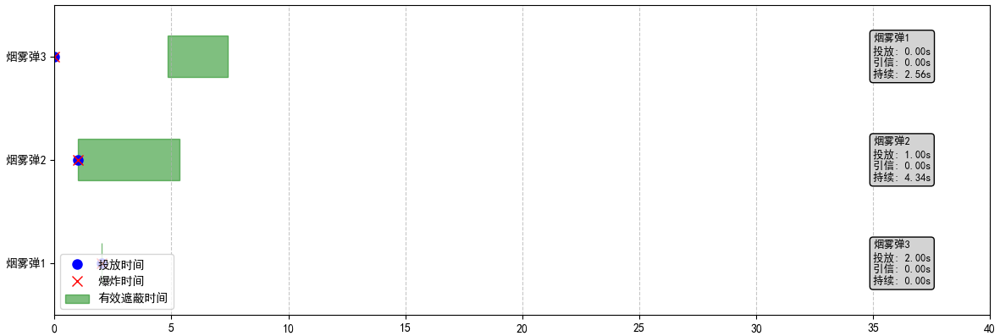

# 七、问题四的模型建立与求解

## 模型分析与猜想

问题四要求利用FY1、FY2、FY3三架无人机各投放1枚烟幕干扰弹，实施对导弹M1的协同干扰。通过对三架无人机初始位置的空间分析：

- FY1位置：(17800, 0, 1800) m
- FY2位置：(12000, 1400, 1400) m
- FY3位置：(6000, -3000, 700) m
- M1位置：(20000, 0, 2000) m
- 假目标位置：(0, 0, 0) m
- 真目标位置：(0, 200, 0) m

基于三架无人机的初始位置分析，三架无人机分布在导弹飞行路径的不同区段，且彼此间距较大。基于此，可以提出以下猜想：

**猜想7.1**：由于三架无人机空间分布差异显著，各自的最优遮蔽策略相互独立，协同优化可分解为三个独立的子优化问题。

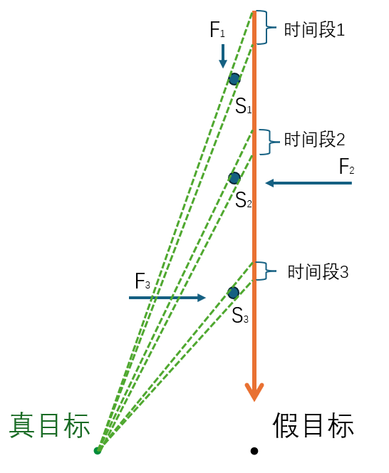

**猜想7.2**：三架无人机的最优投放时间存在先后顺序，与各自空间位置相关，形成时序不连续的遮蔽效果。预测三架无人机的遮蔽时间段不会重合，每架无人机负责导弹飞行路径的不同区段，形成分段遮蔽策略。

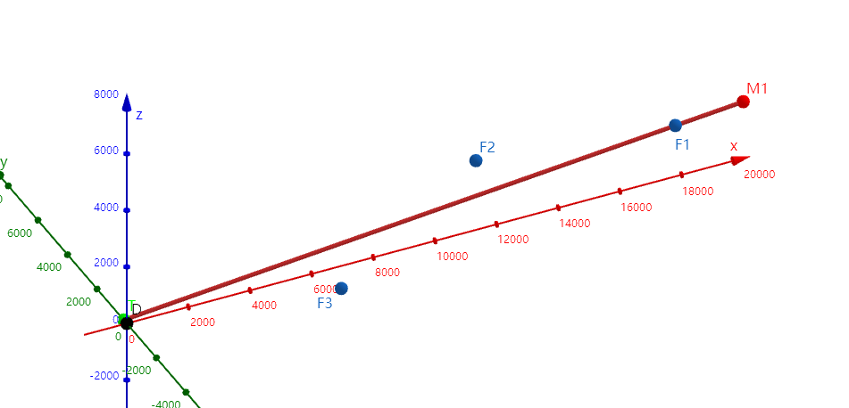
## 增强奖励函数

与问题二不同，该问题中F2,F3无人机的投放和引信时间变量空间更大，无法限制范围，解集更加稀疏。标准遮蔽时间函数 $T_{\text{shielding}}$ 在优化过程中存在明显缺陷：当烟雾弹完全未遮蔽导弹时，函数值为零，无法提供梯度信息，导致优化算法在平坦区域陷入停滞。为此可以设计一个增强的奖励函数，对于完全未遮蔽的情况下给予额外惩罚。为此，我们设计增强奖励函数，其数学表达式为：

$$
R(\theta, v, T_L, t_F) = 
\begin{cases} 
T_{\text{shielding}}(\theta, v, T_L, t_F) & \text{if } T_{\text{shielding}} > 0 \\
-\dfrac{d_{\text{smoke-to-route}}}{\|\mathbf{M}(t_m) - \mathbf{C}_0\|} \cdot \gamma & \text{otherwise}
\end{cases}
$$

其中：
- $t_m = T_L + t_F + \dfrac{T_s}{2}$ 为评估中点时刻
- $d_{\text{smoke-to-route}} = \dfrac{\|(\mathbf{S}(t_m) - \mathbf{C}_0) \times (\mathbf{M}(t_m) - \mathbf{C}_0)\|}{\|\mathbf{M}(t_m) - \mathbf{C}_0\|}$ 为烟雾云到导弹航线的距离
- $\mathbf{C}_0 = (0, 200, 5)$ 为目标中心点
- $\gamma = \begin{cases} 2 & \text{if } \|\mathbf{M}(t_m) - \mathbf{C}_0\| < \|\mathbf{S}(t_m) - \mathbf{C}_0\| \\ 1 & \text{otherwise} \end{cases}$ 为导弹不及时惩罚因子

增强奖励函数在未遮蔽区域仍能提供有意义的梯度信息，引导算法向有效解方向搜索。同时针对不及时造成的惩罚加倍，引导算法使无人机朝更早方向探索。

## 优化模型建立与求解

基于空间独立性猜想，我们将原问题分解为三个子问题：

$$
\max \sum_{i=1}^{3} R_i(\theta_i, v_i, T_{Li}, t_{Fi})
$$

其中 $R_i$ 为第 $i$ 架无人机的增强奖励函数。特殊地，在猜想之上，关于无人机FY1的结果可以直接沿用问题二的结果。

采用增强奖励函数和分解协调策略，得到的最优结果为：

| 无人机 | 飞行方向/rad | 飞行速度/(m/s) | 投放时间/s | 引信时间/s | 遮蔽时间/s |
| ------ | ------------ | -------------- | ---------- | ---------- | ---------- |
| FY1    | 0.0872       | 124.1693       | 0.9075     | 0.1371     | 4.5875     |
| FY2    | 5.0761       | 140.0000       | 5.0650     | 5.3108     | 3.9433     |
| FY3    | 1.2901       | 140.0000       | 22.9527    | 0.0000     | 3.1484     |

**总遮蔽时间**：11.6792 s

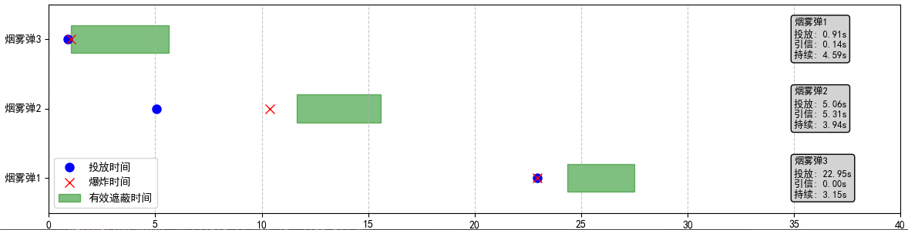

## 猜想验证与讨论

**验证猜想7.1**：三架无人机的最优参数差异显著，且各自遮蔽时间接近独立优化时的最大值，证实了空间独立性猜想的正确性。无人机间的最优策略确实相互独立，协同效应主要体现在有效遮蔽时间段的分离上。

**验证猜想7.2**：三架无人机的投放时间呈现明显的时间序列：FY1(0.91s) → FY2(10.50s) → FY3(29.91s)，这与各自空间位置吻合：距离导弹起点最近的FY1最先投放，距离最远的FY3最后投放。

# 八、问题五的模型建立与求解

## 问题描述与建模思路

### 问题复杂性分析

问题五要求利用5架无人机（FY1-FY5）各投放至多3枚烟幕干扰弹，实施对3枚来袭导弹（M1-M3）的协同干扰。这是一个高度复杂的优化问题。每架无人机有8个决策变量（方位角、速度、3枚烟雾弹的投放时间和引信时间），5架无人机共40个决策变量。需要同时优化对3枚导弹的遮蔽效果，目标间存在竞争关系。且存在烟雾弹投放给不适宜的导弹导致无法达到最优解（如第3或第2、3枚烟雾弹屏蔽到第1或第1、2个导弹的情形）

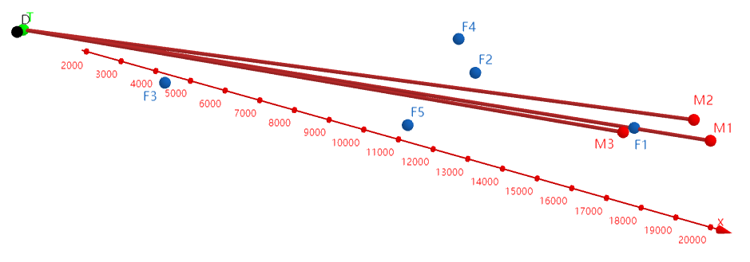

<center></center>

图8.1中，M1~M3为导弹位置，F1~F5为无人机位置，T为真目标位置。红线表示烟雾弹需要遮蔽的导弹探测视线。

### 分层优化策略

基于问题复杂性，我们提出分层优化策略：

**第一层：单无人机多导弹优化**（问题五子问题）

- 扩展至单无人机对多导弹遮蔽
- 采用"一弹一目标"分配策略，避免“烟雾弹错位遮蔽”
- 使用问题四优化的奖励函数，惩罚烟雾弹未有效遮蔽的情形，辅助快速收敛到解集密集区。

**第二层：多无人机多导弹优化**

- 整合各无人机优化结果
- 全局协调微调

### 资源分配策略

基于各无人机位置特征，制定如下资源分配方案：

| 无人机 | 烟雾弹1目标 | 烟雾弹2目标 | 烟雾弹3目标 |
| :----- | :---------- | :---------- | :---------- |
| FY1    | M1          | M1          | M1          |
| FY2    | M2          | M1          | M3          |
| FY3    | M3          | M1          | M2          |
| FY4    | M2          | M1          | M3          |
| FY5    | M3          | M1          | M2          |

该分配方案基于以下几何考虑：

- FY1位置最靠前，难以在M2和M3之前再布置烟雾弹。故可专注于遮蔽路线最近的M1
- FY2、FY4位置偏北，优先遮蔽M2和M1
- FY3、FY5位置偏南，优先遮蔽M3和M1

## 优化模型建立

对于每架无人机，定义其目标函数为对分配导弹的总遮蔽奖励：


全局目标函数为各无人机目标函数的和：
$$
\begin{equation*}
\begin{aligned}
&\min_{\substack{\theta_i, v_i, T_{Lij}, t_{Fij} \\ i=1,\dots,5; \, j=1,2,3}} \quad J = \sum_{i=1}^{5} R_i \\[8pt]
&\text{s.t.} \quad
\begin{cases}
R_i(\theta_i, v_i, \mathbf{T}_{Li}, \mathbf{t}_{Fi}) = \sum_{j=1}^{3} R(\theta_i, v_i, T_{Lij}, t_{Fij}, M_{ij}) & \forall i, \\[4pt]
\theta_i \in [0, 2\pi], \quad v_i \in [70, 140] & \forall i, \\[4pt]
T_{Li1} \geq 0, \quad T_{Lij} \geq T_{Li(j-1)} + 1 & \forall i; \, j=2,3, \\[4pt]
t_{Fij} \geq 0, \quad t_{Fij} \leq T_{\text{max}} - T_{Lij} & \forall i; \, j=1,2,3, \\[4pt]
\min_{k} \| \mathbf{S}_{ij}(t) - \mathbf{S}_{kl}(t) \| \geq R_{\text{min}} & \forall i \neq k; \, j,l=1,2,3.
\end{cases}
\end{aligned}
\end{equation*}
$$

其中：
- $M_{ij}$ 为第$i$架无人机第$j$枚烟雾弹分配的导弹目标
- $R$ 为增强的奖励函数。采用问题四中设计的增强奖励函数：

$$
R(\theta, v, T_L, t_F, M) = 
\begin{cases} 
T_{\text{shielding}} & \text{if } T_{\text{shielding}} > 0 \\
d_{\text{smoke-to-route}} \cdot \gamma & \text{otherwise}
\end{cases}
$$

## 两阶段优化流程

**第一阶段：增强奖励函数优化**

- 使用增强奖励函数快速找到解集密集区
- 获得初始解 $\mathbf{x}^{(0)}$

**第二阶段：标准目标函数优化**

- 使用标准计算重复时间区间的方法进行精细优化
- 以 $\mathbf{x}^{(0)}$ 为初始点，寻找全局最优解

## 优化结果与分析

| 导弹 | 总遮蔽时间 | FA1独立遮蔽 | FA2独立遮蔽 | FA3独立遮蔽 | FA4独立遮蔽 | FA5独立遮蔽 |
| ---- | ---------- | ----------- | ----------- | ----------- | ----------- | ----------- |
| M1   | 15.4487    | 6.4032      | 3.1346      | 2.4081      | 0.0000      | 3.5028      |
| M2   | 12.1635    | -           | 2.9866      | 2.6288      | 3.3043      | 3.2438      |
| M3   | 8.5784     | -           | 0.0000      | 2.3375      | 2.7562      | 3.4846      |

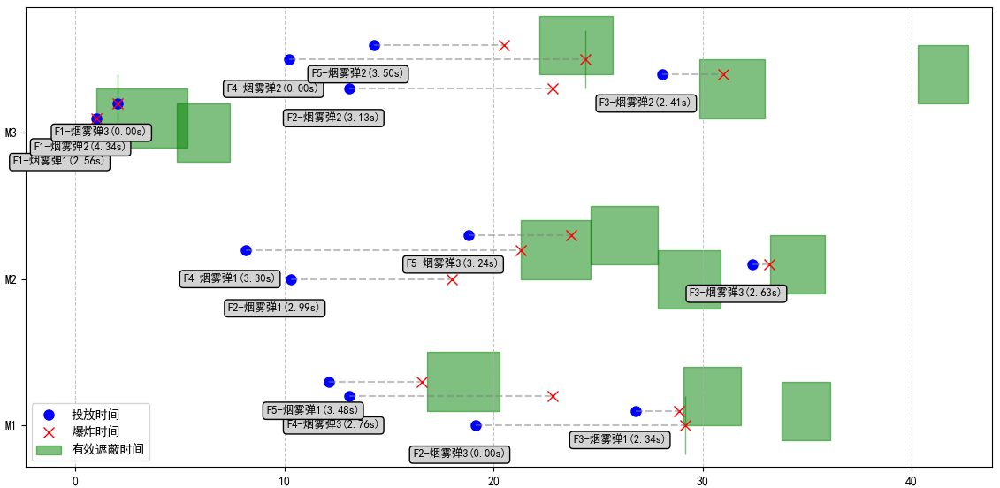

## 结论与启示

通过问题五的建模与求解，我们得到以下结论：

1. 改进的LBAS算法在解决此类高维、非线性、多约束的几何优化问题上展现出显著优势。
2. 如图8.2所示，本文提出的两阶段优化流程在实际应用中表现出色。针对生效时机相近的F2、F4、F5在M2导弹上的屏蔽展现了明显的优化偏移痕迹。
3. 通过三维运动学分析发现，F2和F4无法对第三枚导弹形成有效遮蔽并非算法局限，而是物理约束下的最优选择。以F2为例，如图8.3所示：

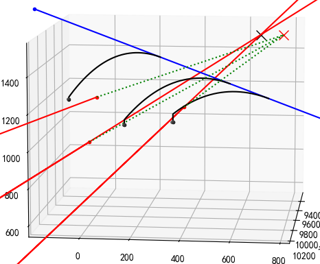

图8.3中，红色为导弹位置与轨迹，蓝色为无人机位置与轨迹，黑色为烟雾弹位置及轨迹，绿色为导弹的探测视线。此图中，烟雾弹1和2均在导弹越过无人机之前被遮挡，而当烟雾弹3到达其遮挡的导弹之前、遮挡已经结束。F2的速度已达到140m/s的上限，但在此速度下仍然无法有效地在到达M1之前使烟雾弹达到M1视线附近。故抛弃对此导弹屏蔽在全局范围内是具有策略性的

# 九、模型优缺点

## 模型的优点

1. 本研究提出的改进LBAS算法在多个方面展现创新性：

- **种群机制改进**：引入排序分组和角色划分，将单一天牛搜索扩展为群体协同搜索，全局搜索能力大幅提升。
- **二次进化策略**：通过向更优个体和引领者学习，有效在控制迭代次数总是不高于300次的情况下找到全局最优。
- **自适应扰动机制**：有效避免早熟收敛，在多种算法中收敛表现优异。

2. 模型采用**两阶段分解协调策略**，将40维问题降维处理，实时性能表现优异。

## 模型的缺点

1. 模型基于以下简化假设，在实际应用中可能存在偏差：

- **忽略空气阻力**：烟幕弹运动采用理想抛体模型，实际弹道可能因空气阻力产生偏移，结合研究中常见的滞空时间（约5s），使用优化的烟幕弹弹身设计，预计最大偏差可能达到8-12%

图9.1展示了大型烟幕弹(m=10kg,C=0.02,v0=100.0m/s)的平抛运动下是否加入空气阻力的理论影响。其中理论为有空气阻力，理想为无空气阻力。

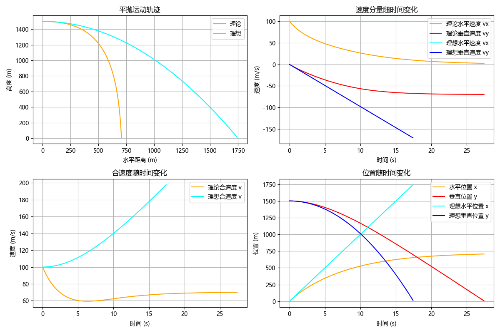

2. 图8.3展示了无人机的部分烟幕弹无法到达部分导弹，但未尝试使用这枚烟幕弹屏蔽其他导弹的情形。


<div style="page-break-after: always;"></div>


# 十一、参考文献

[1] Jiang, X., & Li, S. (2018). BAS: beetle antennae search algorithm for optimization problems. International Journal of Robotics and Control.

[2] 李辉,殷文明.引领者扰动天牛须算法及其应用J.数学建模及其应用,2025,14(02):20-27.

[3] 廖列法,杨红. 天牛须搜索算法研究综述 [J]. 计算机工程与应用, 2021, 57 (12): 54-64.

<div style="page-break-after: always;"></div>

# 附录

## 支撑材料列表

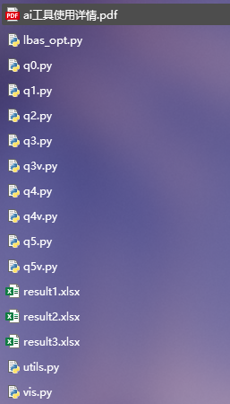

## LBAS算法实现代码

```python
"""
算法来自论文
李辉,殷文明.引领者扰动天牛须算法及其应用[J].数学建模及其应用,2025,14(02):20-27.
有修改
"""

import time
import kawaiitb.autoload

from matplotlib.animation import FuncAnimation
import numpy as np
import matplotlib.pyplot as plt
from tqdm import trange

plt.rcParams['font.sans-serif'] = ['Microsoft YaHei']
plt.rcParams['axes.unicode_minus'] = False

feature_config = {
    # 是否禁用在特定迭代次数后开始扰动最优点
	'disable_turbulent': False,

    # 是否禁用在未二次进化时重新roll点
    # True时更偏向每个个体自己的探索。让每个个体自行在P概率下移动到最优。
	'disable_regenerate': False,  # 30维球测试条件可证明禁用更好，高维不敏感

    # 是否只通过引领者进行进化。
    # 待测试：使个体要么往最优方向，要么往上位方向。指向性最好强一点
	'only_forward_best': False,  # 似乎对结果不明显。
    
    # 手动复现论文的公式(6)的bug
	'recurrent_bug_from_raw_paper': False,  # 任何情况禁用都更好。

    # 二次进化的距离是否使用随机数。论文没提但意思应该是那样的
    # 使用固定值会导致随机性很低的向优趋势。
    'secondary_evolution_use_random': True,

    # 是否在“嗅探”前就立刻地随机化d0。论文里公式这里不这么做，但退火时这样是反直觉且梯度强假设的
    'randomly_tester_d0': True,
}

# 引领者扰动天牛须算法 (LBAS) 实现
class LBAS:
    def __init__(self, obj_func, pop_size, bounds, max_iter, init_x=None,
                 seed=None,

                 # 超参数
                 P=None,  # 更大时有更大机会二次进化，朝更优者和引领者方向移动，否则重生。
                 d0=None, 
                 delta0=None, 
                 d0_init_ratio=0.5, 
                 delta0_init_ratio=0.5, 
                 d_eta=0.95, 
                 delta_eta=0.95, 
                 tol=1e-10, 

                 with_plot=False, 
                 tqdm=False, 
                 history_per_iter: int|None = 100):
        # 优化算法参数
        self.obj_func = obj_func  # 优化目标
        bounds = np.array(bounds)
        self.dim = len(bounds)  # 问题维度
        self.pop_size = pop_size  # 种群大小
        self.bounds = np.array(bounds)  # 搜索边界 [[min, max], ...]
        self.availd_domain = bounds[:, 1] - bounds[:, 0]
        self.max_iter = max_iter  # 最大迭代次数
        self.tol = tol  # 早停阈值
        self.best_history = []  # 记录每代最佳适应度
        self.seed = seed or int(time.time())
        self.rng = np.random.default_rng(self.seed)

        # 可视化选项和历史
        self.tqdm = tqdm
        self.history_per_iter = history_per_iter
        self.with_plot = with_plot
        if with_plot:
            if dim != 2:
                raise ValueError("2维问题才能绘制动画")
            self.with_plot = True
            self.positions_history = []
            self.onframe_lines = []
        
        # 天牛须算法参数
        self.d0 = d0 if d0 is not None else (
            (self.availd_domain) * d0_init_ratio
        )  # 初始两须距离
        self.delta0 = delta0 if delta0 is not None else (
            (self.availd_domain) * delta0_init_ratio
        )  # 初始步长
        self.d_eta = d_eta  # 距离衰减系数
        self.delta_eta = delta_eta  # 步长衰减系数
        
        # LBAS特定参数
        self.P = P or 0.5  # 二次进化概率
        self.t0 = 30  # 初始阶段迭代次数（之后开始扰动）
        self.reducing = 1  # 用于记录衰减系数
        
        # 初始化种群
        self.population = self.init_population(init_x)
        self.fitness = np.array([self.obj_func(ind) for ind in self.population])
        
        # 记录最佳解
        self.best_idx = np.argmin(self.fitness)
        self.best_solution = self.population[self.best_idx].copy()
        self.best_fitness = self.fitness[self.best_idx]
        
        # 记录收敛过程
        self.convergence = []
        self.iteration = 0
    
    def init_population(self, init_x=None):
        """初始化种群"""
        
        population = self.rng.uniform(
            low=self.bounds[:, 0],
            high=self.bounds[:, 1],
            size=(self.pop_size, self.dim)
        )
        
        if init_x != None:
            if len(init_x) != self.dim:
                raise ValueError("init_x的维度必须与问题维度一致")
            population[0] = self.clip(init_x)
        
        return population

    def clip(self, x):
        """确保解在有效域内"""
        return np.clip(x, self.bounds[:, 0], self.bounds[:, 1])

    def iterate(self):
        """执行一次迭代"""
        thisframe_lines = []
        self.iteration += 1
        if self.with_plot:
            self.positions_history.append(self.population.copy())
        # 对种群按适应度排序
        sorted_indices = np.argsort(self.fitness)
        sorted_population = self.population[sorted_indices]
        sorted_fitness = self.fitness[sorted_indices]
        
        # 更新全局最优
        if sorted_fitness[0] < self.best_fitness:
            self.best_fitness = sorted_fitness[0]
            self.best_solution = sorted_population[0].copy()
        
        self.best_history.append((self.best_solution.copy(), self.best_fitness))
        
        # 对每个个体进行更新
        for i in range(self.pop_size):
            # 当前个体
            x = self.population[i].copy()
            
            # 1. 生成随机方向向量
            b = self.rng.uniform(-1, 1, self.dim)
            b = b / np.linalg.norm(b)  # 单位化
            if feature_config.get('randomly_tester_d0', False):
                b = b * self.rng.random()  # 随机化
            
            # 2. 计算左右须位置
            x_left = x - self.d0 * b
            x_right = x + self.d0 * b
            
            # 确保在边界内
            x_left = self.clip(x_left)
            x_right = self.clip(x_right)
            
            # 3. 计算适应度
            f_left = self.obj_func(x_left)
            f_right = self.obj_func(x_right)
            
            # 4. 决定移动方向并应用惯性权重
            inertia = self.delta0 * b
            # 如果在计算时已经随机化步长，那现在就不随机化了
            if not feature_config.get('randomly_tester_d0', False):
                inertia = inertia * self.rng.random()
            if f_right > f_left:  # 向左移动
                x_new = x - inertia
            else:  # 向右移动
                x_new = x + inertia
            if self.with_plot:
                thisframe_lines.append((x_left, x_right, {  # 天牛须
                    'color': 'black',
                    'linestyle': '--',
                    'linewidth': 1
                }))
                thisframe_lines.append((x, x_new, {  # 天牛主动行动
                    'color': 'red',
                    'linestyle': '-',
                    'linewidth': 4
                }))
            
            # 确保在边界内
            x_new = self.clip(x_new)
            f_new = self.obj_func(x_new)
            
            # 5. 按概率P进行二次进化
            idx_in_sorted = np.where(sorted_indices == i)[0][0]
            if idx_in_sorted > 0:  # 如果不是最优个体
                # 找到排在当前个体前面的个体
                if self.rng.random() < self.P:
                    # 获取前一个个体和全局最优个体
                    x_prev = sorted_population[idx_in_sorted - 1]
                    x_best = self.best_solution
                    
                    # 二次进化：向更优个体和全局最优个体学习
                    # 使用正确的公式，基于上一次的位置
                    dx_secondary = 0.5 * (x_prev - x_new) + 0.5 * (x_best - x_new)
                    if feature_config.get('only_forward_best', False):
                        dx_secondary = 0 * (x_prev - x_new) + 1 * (x_best - x_new)
                    
                    use_rand = self.rng.random() if feature_config.get('secondary_evolution_use_random', False) else 1
                    x_secondary = x_new + dx_secondary * use_rand
                    if feature_config.get('recurrent_bug_from_raw_paper', False):
                        x_secondary = dx_secondary * use_rand
                    
                    if self.with_plot:
                        thisframe_lines.append((x_new, x_prev, {  # 二次进化，向更优个体学习
                            'color': 'cyan',
                            'linestyle': ':',
                            'linewidth': 2
                        }))
                        thisframe_lines.append((x_new, x_best, {  # 二次进化，向全局最优学习
                            'color': 'salmon',
                            'linestyle': '-.',
                            'linewidth': 2
                        }))
                        thisframe_lines.append((x_new, x_new + dx_secondary, {  # 二次进化总方向
                            'color': 'brown',
                            'linestyle': '-',
                            'linewidth': 2
                        }))
                        thisframe_lines.append((x_new, x_secondary, {  # 完整二次进化
                            'color': 'brown',
                            'linestyle': '-',
                            'linewidth': 4
                        }))
                    
                    x_secondary = self.clip(x_secondary)
                    f_secondary = self.obj_func(x_secondary)
                    
                    # 选择较好的解
                    if f_secondary < f_new:
                        x_new = x_secondary
                        f_new = f_secondary
                elif not feature_config.get('disable_regenerate', False):
                    # 未进行二次进化时，生成随机新个体
                    # 从最优个体开始往随机方向前进当前的两须长度再带个随机量
                    random_direction = self.rng.uniform(-1, 1, self.dim)
                    # 归一化方向向量
                    norm = np.linalg.norm(random_direction)
                    if norm > 0:
                        random_direction = random_direction / norm
                    
                    # 前进距离
                    step_length = self.delta0 * self.rng.random()  # 随机量设为0到d之间的值
                    
                    # 生成新个体
                    x_random = self.best_solution + random_direction * step_length
                    x_random = self.clip(x_random)
                    f_random = self.obj_func(x_random)
                    
                    # 如果新个体更优则接受
                    if f_random < f_new:
                        x_new = x_random
                        f_new = f_random
            

            # 6. 更新个体
            self.population[i] = x_new
            self.fitness[i] = f_new
        
        # 7. 对最优个体进行扰动（如果超过初始阶段）
        if (not feature_config.get('disable_turbulent', False)) and self.iteration > self.t0:
            # 对最优个体添加扰动
            perturbation = self.rng.uniform(-1, 1, self.dim) * self.availd_domain * np.exp(-4 * self.iteration / self.max_iter)
            x_perturbed = self.best_solution + perturbation
            x_perturbed = self.clip(x_perturbed)
            f_perturbed = self.obj_func(x_perturbed)
            
            # 如果扰动后的解更好，则替换最优解
            if f_perturbed < self.best_fitness:
                self.best_solution = x_perturbed
                self.best_fitness = f_perturbed
                
                # 也用扰动后的解替换种群中最差的个体
                worst_idx = np.argmax(self.fitness)
                self.population[worst_idx] = x_perturbed
                self.fitness[worst_idx] = f_perturbed
        
        # 早停
        # if self.best_fitness < self.tol:
        #     return True
        
        # 8. 更新步长和两须距离
        self.reducing = self.reducing * self.d_eta
        self.d0 = self.d_eta * self.d0
        self.delta0 = self.delta_eta * self.delta0
        
        # 记录当前最优适应度
        self.convergence.append(self.best_fitness)
        if self.with_plot:
            self.onframe_lines.append(thisframe_lines)
        return False
    
    def optimize(self):
        """执行优化过程"""
        if self.with_plot:
            self.positions_history = []
        self.convergence = []
        iters = trange if self.tqdm else range
        for self.iteration in iters(self.max_iter):
            if self.iterate():
                break
            if self.history_per_iter is not None and self.iteration % self.history_per_iter == 0:
                print(f"I{self.iteration:<6} | Fit={self.best_fitness:.4e}, rdc={self.reducing:.2e}")
        
        return self.best_solution, self.best_fitness, self.convergence
        
    def create_contour_plot(self):
        """创建等高线图"""
        x = np.linspace(self.bounds[0][0], self.bounds[0][1], 100)
        y = np.linspace(self.bounds[1][0], self.bounds[1][1], 100)
        X, Y = np.meshgrid(x, y)
        Z = np.zeros_like(X)
        
        for i in range(X.shape[0]):
            for j in range(X.shape[1]):
                Z[i, j] = self.obj_func(np.array([X[i, j], Y[i, j]]))
        
        plt.figure(figsize=(12, 10))
        contour = plt.contour(X, Y, Z, 50, cmap='viridis', alpha=0.6)
        plt.colorbar(contour, label='Function Value')
        plt.xlabel('X')
        plt.ylabel('Y')
        plt.title('LBAS Optimization Process')
        plt.grid(True, alpha=0.3)
        
        return plt.gca(), X, Y, Z
    
    def animate_optimization(self):
        """创建优化过程动画"""
        fig, ax = plt.subplots(figsize=(12, 10))
        ax: plt.Axes  # type: ignore
        
        # 创建等高线
        x = np.linspace(self.bounds[0][0], self.bounds[0][1], 100)
        y = np.linspace(self.bounds[1][0], self.bounds[1][1], 100)
        X, Y = np.meshgrid(x, y)
        Z = np.zeros_like(X)
        
        for i in range(X.shape[0]):
            for j in range(X.shape[1]):
                Z[i, j] = self.obj_func(np.array([X[i, j], Y[i, j]]))
        
        contour = ax.contour(X, Y, Z, 30, cmap='viridis', alpha=0.6)
        plt.colorbar(contour, ax=ax, label='Function Value')
        
        # 初始化图形元素
        beetles_scatter = ax.scatter([], [], c='blue', s=30, label='Beetles')
        best_beetle_scatter = ax.scatter([], [], c='red', s=100, marker='*', label='Best Beetle')
        antennae_lines = [ax.plot([], [], 'k-', alpha=0.5)[0] for _ in range(self.pop_size)]
        prev_lines = 100
        move_lines = [ax.plot([], [], 'r-', alpha=0.5)[0] for _ in range(prev_lines)]
        
        # 添加文本框显示迭代信息
        iter_text = ax.text(0.02, 0.95, '', transform=ax.transAxes, fontsize=12,
                           bbox=dict(facecolor='white', alpha=0.7))
        best_text = ax.text(0.02, 0.88, '', transform=ax.transAxes, fontsize=10,
                           bbox=dict(facecolor='white', alpha=0.7))
        
        ax.set_xlim(self.bounds[0])
        ax.set_ylim(self.bounds[1])
        ax.set_xlabel('X')
        ax.set_ylabel('Y')
        ax.set_title('Leader Disturbance Beetle Antennae Search Algorithm')
        ax.legend()
        ax.grid(True, alpha=0.3)

        # 动画更新函数
        def update(frame):
            if frame < len(self.positions_history) - 1:  # 最后一帧有位置但没动作，索性全都不更新
                positions = self.positions_history[frame]
                best_pos, best_fit = self.best_history[frame]
                going_arrows: list[tuple[np.ndarray, np.ndarray, dict]] = self.onframe_lines[frame]
                
                # 更新天牛位置
                beetles_scatter.set_offsets(positions)
                
                # 更新最优天牛位置
                best_beetle_scatter.set_offsets([best_pos])
                
                # 更新移动箭头
                # for i, arrow in enumerate(going_arrows):
                #     start, end = arrow
                #     move_lines[i].set_data([start[0], end[0]], [start[1], end[1]])
                for line, arrow in zip(move_lines, going_arrows + [((-9999, -9999), (-9999, -9999), {})] * prev_lines):
                    start, end, style = arrow
                    line.set_data([start[0], end[0]], [start[1], end[1]])
                    line.set_color(style.get('color', 'black'))
                    line.set_linestyle(style.get('linestyle', '-'))
                    line.set_linewidth(style.get('linewidth', 1))

                # 更新文本信息
                iter_text.set_text(f'Iteration: {frame+1}/{self.max_iter}')
                best_text.set_text(f'Best Fitness: {best_fit:.6f}\nBest Position: ({best_pos[0]:.4f}, {best_pos[1]:.4f})')
            
            return beetles_scatter, best_beetle_scatter, *antennae_lines, iter_text, best_text
        
        ani = FuncAnimation(fig, update, frames=len(self.positions_history), 
                          interval=200, blit=True)
        return ani
# 测试算法
if __name__ == "__main__":
    
    from pprint import pprint

    pprint(feature_config)
    def sphere_function(x):
        def function(x):
            return np.sum(x**2)
        return function, (-100, 100)
    # 参数设置
    center = 0
    test_function = sphere_function
    obj, func_bound = test_function(center)
    dim = 2  # 问题维度
    bounds = np.array([func_bound] * dim)  # 求解范围
    pop_size = 3  # 种群大小
    max_iter = 50  # 最大迭代次数
    
    # 创建并运行算法
    eta = 0.9
    lbas = LBAS(obj, pop_size, bounds, max_iter,
                d_eta=eta, delta_eta=eta, tol=1e-5, with_plot=True)
    best_solution, best_fitness, convergence = lbas.optimize()
    
    print()
    print(f"Test params: {dim=},{center=},{test_function.__name__=},{bounds=},")
    print(f"Algorithm params: {pop_size=},{max_iter=}")
    print(f"solution: {best_solution}")
    print(f"fitness: {best_fitness:.6e}")
    print(f"error: {np.linalg.norm(best_solution - center)}")
    print(f"iter: {lbas.iteration} / {lbas.max_iter}")
    
    # 绘制收敛曲线
    # plt.figure(figsize=(10, 6))
    # plt.semilogy(convergence)
    # plt.title('Convergence Curve')
    # plt.xlabel('Iteration')
    # plt.ylabel('Best Fitness (log scale)')
    # plt.grid(True)
    # plt.savefig(f'fig/fig{time.time()}.png')
    # plt.show()

    ani = lbas.animate_optimization()
    ani.save('lbas_optimization.gif', writer='pillow', fps=1)
    print("动画已保存为 'lbas_optimization.gif'")
    ani.event_source.stop()
    del ani
    plt.close()

```

## 问题一的模型代码

```python
from functools import lru_cache
from math import sin, cos
import numpy as np
from warnings import warn

from utils import bool_func_singularity, calc_total_true_length, total_interval_sum

g = 9.8  # 重力加速度(m/s^2)
TARGET_POSITION = np.array([0, 200, 0])  # 真目标位置
GRENADE_MIN_INTERVAL = 1  # 烟雾弹最小间隔(s)

# 真目标检查点
TARGET_CHECKPOINTS = [
    TARGET_POSITION + np.array([7,  0,  0]),
    TARGET_POSITION + np.array([0,  7,  0]),
    TARGET_POSITION + np.array([-7, 0,  0]),
    TARGET_POSITION + np.array([0, -7,  0]),
    TARGET_POSITION + np.array([7,  0, 10]),
    TARGET_POSITION + np.array([0,  7, 10]),
    TARGET_POSITION + np.array([-7, 0, 10]),
    TARGET_POSITION + np.array([0, -7, 10]),
]

DECOY_POSITION = np.array([0, 0, 0])  # 假目标位置
MISSILE_VELOCITY = 300  # 导弹飞行速度(m/s)
SMOKE_SHIELDING_TIME = 20  # 烟雾云屏蔽时间(s)
SMOKE_VELOCITY = [0, 0, -3]  # 烟雾云速度(m/s)
SMOKE_RADIUS = 10  # 烟雾云半径(m)

def missile_coord(M, t):
    """
    计算导弹在t时刻的位置
    M: 导弹初始位置
    t: 时间(s)
    """
    M = np.array(M)
    assert M.shape == (3,), f"M的形状必须为(3,), 实际为{M.shape}"
    # 导弹飞向假目标(0,0,0)
    direction = DECOY_POSITION - M
    distance = np.linalg.norm(direction)
    unit_vector = direction / distance
    
    # 导弹以300m/s的速度飞行
    flight_distance = MISSILE_VELOCITY * t
    if flight_distance >= distance:
        warn("导弹到达假目标")
        return DECOY_POSITION
    else:
        return M + unit_vector * flight_distance

def uav_coord(FA, theta, v, t):
    """
    计算无人机在t时刻的位置
    FA: 无人机初始位置
    theta: 朝向
    v: 飞行速度(m/s)
    t: 时间(s)
    """
    # 无人机朝向azimuth飞行
    vector = np.array([cos(theta), sin(theta), 0])  # 模长为1
    
    # 无人机以恒定速度飞行
    return FA + vector * v * t

def grenade_coord(FA, theta, v, t_launch, t_fuse, t):
    """
    计算烟幕弹在t时刻的位置
    FA: 无人机初始位置
    azimuth: 朝向假目标方向
    speed: 飞行速度(m/s)
    t_launch: 投放时间(s)
    t_fuse: 引信时间(s)(从投放后算起)
    t: 时间(s)
    """
    # 投放时刻无人机的位置和速度
    launch_pos = uav_coord(FA, theta, v, t_launch)
    
    # 无人机速度向量
    uav_velocity = np.array([np.cos(theta), np.sin(theta), 0]) * v
    
    # 爆炸时刻
    t_burst = t_launch + t_fuse
    
    if t > t_burst:
        warn("计算烟幕弹位置时发现烟幕弹已爆炸")
        t = t_burst
    if t < t_launch:
        warn("计算烟幕弹位置时发现烟幕弹未投放")
        t = t_launch
    
    # 平抛运动
    delta_t = t - t_launch
    dH = uav_velocity * delta_t
    dZ = np.array([0, 0, -0.5 * g * delta_t**2])  # 负号在这
    return launch_pos + dH + dZ

def smoke_coord(FA, theta, v, t_launch, t_fuse, t):
    """
    计算烟雾云在t时刻的位置
    FA: 无人机初始位置
    azimuth: 朝向假目标方向
    speed: 飞行速度(m/s)
    t_launch: 投放时间(s)
    t_fuse: 引信时间(s)(从投放后算起)
    t: 时间(s)
    """
    t_burst = t_launch + t_fuse
    if t < t_burst:
        warn("计算烟雾云位置时发现烟雾弹未爆炸")
        t = t_burst
    if t > t_burst + SMOKE_SHIELDING_TIME:
        warn("计算烟雾云位置时发现烟雾弹已爆炸")
        t = t_burst + SMOKE_SHIELDING_TIME
    grenade_pos = grenade_coord(FA, theta, v, t_launch, t_fuse, t_launch + t_fuse)
    return grenade_pos + np.array(SMOKE_VELOCITY) * (t - t_burst)  # 烟雾云高度100m

def is_shielding(smoke_coord, missile_coord):
    """
    判断导弹是否被烟雾云遮蔽
    1. 判断导弹是否在烟雾云内部，返回True
    2. 判断导弹是否比烟雾云更快，返回False
    3. 判断导弹与目标的直线与烟雾云的距离是否大于烟雾云半径，返回False
    返回True
    smoke_coord: 烟雾云位置
    missile_coord: 导弹位置
    """
    # 1. 判断导弹在烟雾云内部
    if np.linalg.norm(missile_coord - smoke_coord) <= SMOKE_RADIUS:
        return True
    
    for checkpoint in TARGET_CHECKPOINTS:
        ms2cp = missile_coord - checkpoint
        cp2sc = checkpoint - smoke_coord
        # 2. 判断导弹是否比烟雾云更快
        distance_to_checkpoint = np.linalg.norm(ms2cp)
        distance_to_smoke = np.linalg.norm(cp2sc)
        if distance_to_checkpoint < distance_to_smoke:
            return False
        # 3. 判断导弹与目标的直线与烟雾云的距离是否大于烟雾云半径
        d_smoke_to_route = np.linalg.norm(np.cross(cp2sc, ms2cp)) / distance_to_checkpoint
        if d_smoke_to_route > SMOKE_RADIUS:
            return False
    
    return True

def shielding_para(FA, M, azimuth, speed, launch_time, fuse_time):
    """
    计算有效遮蔽时间
    FA: 无人机初始位置
    M: 导弹初始位置
    azimuth: 朝向假目标方向
    speed: 飞行速度(m/s)
    launch_time: 投放时间(s)
    fuse_time: 引信时间(s)
    """
    # 计算有效遮蔽时间
    t_burst = launch_time + fuse_time
    interval = (t_burst, t_burst + SMOKE_SHIELDING_TIME)
    shielding_paras = bool_func_singularity(
        lambda t: is_shielding(
            smoke_coord(FA, azimuth, speed, launch_time, fuse_time, t), 
            missile_coord(M, t)
        ),
        interval, tol=1e-6, max_depth=6
    )
    return shielding_paras

def para_start_end(para):
    """
    计算有效遮蔽时间
    """
    leftval, n_point, points, interval = para
    if leftval and n_point == 0:
        return interval[0], interval[1]
    if not leftval and n_point == 0:
        return interval[0], interval[0]
    elif leftval and n_point == 1:
        return interval[0], points[0]
    elif not leftval and n_point == 1:
        return points[0], interval[1]
    elif leftval and n_point == 2:
        raise ValueError("不预期的两次遮挡")
    elif not leftval and n_point == 2:
        return points[0], points[1]
    else:
        raise ValueError(f"不预期的参数 {para}")

def shielding_time(FA, M, azimuth, speed, launch_time, fuse_time):
    """
    计算有效遮蔽时间
    FA: 无人机初始位置
    M: 导弹初始位置
    azimuth: 朝向假目标方向
    speed: 飞行速度(m/s)
    launch_time: 投放时间(s)
    fuse_time: 引信时间(s)
    """
    t_shielding = calc_total_true_length(*shielding_para(FA, M, azimuth, speed, launch_time, fuse_time))
    return t_shielding

def sum_of_shielding_times(*para_groups):
    """
    计算总有效遮蔽时间
    """
    intervals = [para_start_end(para) for para in para_groups]
    return total_interval_sum(intervals)

def shielding_reward(FA, M, azimuth, speed, launch_time, fuse_time, assert_no_shielding=False):
    """
    计算导弹被烟雾云遮蔽的奖励。**此函数为最大化函数**
    1. 判断导弹是否实际被烟雾云遮蔽，返回原始屏蔽时长作为奖励
    获取烟雾弹爆炸开始至消散的平均位置与导弹当时的平均位置
    2. 计算导弹航线与烟雾云的距离，返回基于此距离的惩罚。
    3. 计算是否是导弹更靠近检查点，如果是则遮蔽不到，惩罚加倍
    """
    # 1. 判断是否被烟雾云遮蔽
    if not assert_no_shielding:
        T_shielding = shielding_time(FA, M, azimuth, speed, launch_time, fuse_time)
        if T_shielding > 0:
            return T_shielding
    
    smoke_pos = smoke_coord(FA, azimuth, speed, launch_time, fuse_time, launch_time + fuse_time + SMOKE_SHIELDING_TIME / 2)
    missile_pos = missile_coord(M, launch_time + fuse_time + SMOKE_SHIELDING_TIME / 2)

    target_center = TARGET_POSITION + np.array([0,  0,  5])
    cp2ms = missile_pos - target_center
    sk2cp = target_center - smoke_pos
    # 2. 计算导弹航线与烟雾云的距离
    d_missile_target = np.linalg.norm(cp2ms)
    d_target_smoke = np.linalg.norm(sk2cp)
    d_smoke_to_route = np.linalg.norm(np.cross(sk2cp, cp2ms)) / d_missile_target
    penalty = -d_smoke_to_route
    # 3. 判断导弹是否比烟雾云更快
    if d_missile_target < d_target_smoke:
        return penalty * 2
    return penalty

# 问题1参数
FA = np.array([17800, 0, 1800])  # FY1初始位置
M1 = np.array([20000, 0, 2000])  # M1初始位置
azimuth = np.arctan2(DECOY_POSITION[1] - FA[1], DECOY_POSITION[0] - FA[0])
speed = 120  # 飞行速度(m/s)
launch_time = 1.5  # 投放时间(s)
fuse_time = 3.6  # 引信时间(s)

if __name__ == "__main__":
    # 解决问题1
    print("问题一计算结果：")
    print(f"飞行方向：{np.degrees(azimuth)}°")
    print(f"飞行速度：{speed} m/s")
    print(f"投放时间：{launch_time} s")
    print(f"引信时间：{fuse_time} s")
    effective_time = shielding_time(FA, M1, azimuth, speed, launch_time, fuse_time)
    print(f"遮蔽时间: {effective_time:.6f}秒")


if __name__ == "__main__1":  # 测试函数评估速度，即可优化性
    import timeit
    repeats = 5
    number_per_repeat = 20
    def test_shielding_time():
        return shielding_time(FA, M1, azimuth, speed, launch_time, fuse_time)
    
    times = timeit.repeat(test_shielding_time, number=number_per_repeat, repeat=repeats)
    
    print(f"重复测试 {repeats} 次，每次 {number_per_repeat} 轮")
    for i, time_taken in enumerate(times, 1):
        average_time = time_taken / number_per_repeat
        print(f"第 {i} 次测试 - 平均时间: {average_time:.6f} 秒")
    
    best_time = min(times) / number_per_repeat
    worst_time = max(times) / number_per_repeat
    avg_time = sum(times) / (repeats * number_per_repeat)
    
    print(f"\n最佳执行时间: {best_time:.6f} 秒")
    print(f"最差执行时间: {worst_time:.6f} 秒")
    print(f"平均执行时间: {avg_time:.6f} 秒")
    
    # 运行一次获取结果
    result = test_shielding_time()
    print(f"有效遮蔽时长: {result:.6f} 秒")
```

## 问题二的模型代码

```python
import numpy as np
from q1 import TARGET_POSITION, shielding_time, uav_coord, grenade_coord
from scipy.optimize import minimize

from lbas_opt import LBAS

def solve_q2(method='lbas'):
    """
    解决问题2
    """

    # 问题2参数
    FA = np.array([17800, 0, 1800])  # FY1初始位置
    M = np.array([20000, 0, 2000])  # M1初始位置
    
    # 定义目标函数
    def objective(params):
        azimuth, speed, launch_time, fuse_time = params
        for i, (param, (lower, upper)) in enumerate(zip(params, bounds)):
            if param < lower or param > upper:
                print(f"参数 {i} 超出边界: {param} 不在 [{lower}, {upper}] 范围内")
                return float('inf')  # 返回一个很大的值表示无效解
        return -shielding_time(FA, M, azimuth, speed, launch_time, fuse_time)
    
    # 参数边界约束
    bounds = [
        (0, 2 * np.pi),        # theta: 无人机方位角，0到2π弧度
        (70, 140),             # v: 无人机速度，70-140 m/s
        (0, 60),                # launch_time: 投下时间，0秒之后投放
        (0, 60)                # fuse_time: 引线时间，0秒之后起爆
    ]
    
    # 初始猜测值，基于问题1的参数
    x0 = [
        np.pi,  # 朝向假目标方向
        120,      # 速度120 m/s
        1.5,      # 投放时间1.5秒
        3.6       # 引信时间3.6秒
    ]
    
    opt_azimuth, opt_speed, opt_launch, opt_fuse, max_shielding_time = [0] * 5
    convergence = []
    # 执行优化
    if method == 'lbas':
        lbas = LBAS(
            # 最优化参数
            obj_func=objective,
            pop_size=50,
            bounds=bounds,
            max_iter=100,
            init_x=x0,

            # 超参数
            d_eta=0.97,
            delta_eta=0.97,

            # 可视化
            history_per_iter=10,
        )
        best_solution, best_fitness, convergence = lbas.optimize()
        opt_azimuth, opt_speed, opt_launch, opt_fuse = best_solution
        max_shielding_time = -best_fitness
    
    elif method == 'bfgs':
        result = minimize(
            objective,          # 目标函数
            x0,                 # 初始猜测
            bounds=bounds,      # 参数边界
            method='L-BFGS-B',  # 选择支持边界约束的优化方法
            options={
                'maxiter': 100,  # 最大迭代次数
                'disp': True     # 显示优化过程信息
            }
        )
        opt_azimuth, opt_speed, opt_launch, opt_fuse = result.x
        max_shielding_time = -result.fun
        convergence = [result.fun] * result.nit
    
    elif method == 'diff_evol':
        from scipy.optimize import differential_evolution
        result = differential_evolution(
            objective,
            bounds,
            strategy='best1bin',
            maxiter=100,
            popsize=20,
            tol=0.01,
            mutation=(0.5, 1),
            recombination=0.7,
            seed=42,
            callback=None,
            disp=True
        )
        opt_azimuth, opt_speed, opt_launch, opt_fuse = result.x
        max_shielding_time = -result.fun
        convergence = [result.fun] * result.nit

    elif method == 'basinhopping':
        from scipy.optimize import basinhopping
        minimizer_kwargs = {"method": "L-BFGS-B", "bounds": bounds}
        result = basinhopping(
            objective,
            x0,
            niter=100,
            minimizer_kwargs=minimizer_kwargs,
            stepsize=0.5,
            T=1.0,
            disp=True
        )
        opt_azimuth, opt_speed, opt_launch, opt_fuse = result.x
        max_shielding_time = -result.fun
        convergence = [result.fun] * result.nit

    elif method == 'pso':
        import pyswarms as ps
        
        # 包装目标函数以处理PSO的输入格式
        def objective_pso(params_array):
            # params_array 是二维数组，形状为 (n_particles, 4)
            # 我们需要对每个粒子计算目标函数值
            n_particles = params_array.shape[0]
            results = np.zeros(n_particles)
            
            for i in range(n_particles):
                # 提取单个粒子的参数
                azimuth, speed, launch_time, fuse_time = params_array[i]
                # 计算目标函数值
                results[i] = objective([azimuth, speed, launch_time, fuse_time])
            
            return results
        
        # 设置PSO参数
        options = {'c1': 3, 'c2': 1, 'w': 1.8}
        # 创建边界矩阵
        bounds_matrix = np.array(bounds).T
        # 初始化优化器
        optimizer = ps.single.GlobalBestPSO(
            n_particles=100, 
            dimensions=4, 
            options=options, 
            bounds=bounds_matrix
        )
        # 执行优化
        cost, pos = optimizer.optimize(objective_pso, iters=100)
        opt_azimuth, opt_speed, opt_launch, opt_fuse = pos
        max_shielding_time = -cost
        convergence = optimizer.cost_history

    elif method == 'ga':
        from deap import base, creator, tools, algorithms
        import random
        
        # 创建适应度类和个体类
        creator.create("FitnessMin", base.Fitness, weights=(-1.0,))
        creator.create("Individual", list, fitness=creator.FitnessMin)  # type: ignore
        
        # 初始化工具箱
        toolbox = base.Toolbox()
        
        # 定义属性生成函数
        def random_attribute(i):
            return random.uniform(bounds[i][0], bounds[i][1])
        
        # 注册个体和种群生成函数
        toolbox.register("attr_0", random_attribute, 0)
        toolbox.register("attr_1", random_attribute, 1)
        toolbox.register("attr_2", random_attribute, 2)
        toolbox.register("attr_3", random_attribute, 3)
        toolbox.register("individual", tools.initCycle, creator.Individual,   # type: ignore
                        (toolbox.attr_0, toolbox.attr_1, toolbox.attr_2, toolbox.attr_3), n=1)  # type: ignore
        toolbox.register("population", tools.initRepeat, list, toolbox.individual)  # type: ignore
        
        # 注册评估、交叉、变异和选择函数
        toolbox.register("evaluate", lambda ind: (objective(ind),))
        toolbox.register("mate", tools.cxBlend, alpha=0.5)
        toolbox.register("mutate", tools.mutGaussian, mu=0, sigma=1, indpb=0.2)
        toolbox.register("select", tools.selTournament, tournsize=3)
        
        # 创建初始种群
        pop = toolbox.population(n=200)  # type: ignore
        
        # 运行遗传算法
        hof = tools.HallOfFame(1)
        stats = tools.Statistics(lambda ind: ind.fitness.values)
        stats.register("avg", np.mean)
        stats.register("min", np.min)
        
        pop, log = algorithms.eaSimple(
            pop, toolbox, 
            cxpb=0.5, mutpb=0.2, ngen=100, 
            stats=stats, halloffame=hof, verbose=False
        )
        
        # 获取最优解
        best_individual = hof[0]
        opt_azimuth, opt_speed, opt_launch, opt_fuse = best_individual
        max_shielding_time = -best_individual.fitness.values[0]
        convergence = [log[i]['min'] for i in range(len(log))]


    # 计算最优投放点和起爆点
    launch_point = uav_coord(FA, opt_azimuth, opt_speed, opt_launch)
    burst_point = grenade_coord(FA, opt_azimuth, opt_speed, opt_launch, opt_fuse, opt_launch + opt_fuse)
    
    # 结果
    print("问题2优化结果:")
    print(f"最优飞行方向: {np.degrees(opt_azimuth):.6f}°")
    print(f"最优飞行速度: {opt_speed:.6f} m/s")
    print(f"最优投放时间: {opt_launch:.6f} s")
    print(f"最优引信时间: {opt_fuse:.6f} s")
    print(f"最大遮蔽时间: {max_shielding_time:.6f} s")
    print()
    print(f"最优投放点坐标: ({launch_point[0]:.2f}, {launch_point[1]:.2f}, {launch_point[2]:.2f}) m")
    print(f"最优起爆点坐标: ({burst_point[0]:.2f}, {burst_point[1]:.2f}, {burst_point[2]:.2f}) m")
    print("=" * 50)

    # # 绘制收敛曲线
    # import matplotlib.pyplot as plt
    # import time
    # plt.figure(figsize=(10, 6))
    # plt.plot(convergence)
    # plt.title('Convergence Curve')
    # plt.xlabel('Iteration')
    # plt.ylabel('Best Fitness')
    # plt.grid(True)
    # plt.show()
    
    return {
        'azimuth': opt_azimuth,
        'speed': opt_speed,
        'launch_time': opt_launch,
        'fuse_time': opt_fuse,
        '投放点': launch_point,
        '起爆点': burst_point,
        '遮蔽时间': max_shielding_time,
        'convergence': convergence,
    }

def plot_convergence_curves():
    methods = ['lbas', 'bfgs', 'diff_evol', 'basinhopping', 'pso', 'ga']
    convergence_data = {}
    
    for method in methods:
        result = solve_q2(method)
        convergence_data[method] = result['convergence']
    
    import matplotlib.pyplot as plt
    plt.rcParams['font.sans-serif'] = ['SimHei']
    plt.rcParams['axes.unicode_minus'] = False

    plt.figure(figsize=(12, 8))
    
    for method, data in convergence_data.items():
        plt.plot(data, label=method)
    
    plt.title('')
    plt.xlabel('迭代次数')
    plt.ylabel('最优遮挡时间(最小化，取负)')
    plt.legend()
    plt.grid(True)
    plt.show()

if __name__ == "__main__":
    # solve_q2('ga')
    plot_convergence_curves()
```

## 问题三的模型代码

```python
import time
import numpy as np
from q1 import TARGET_POSITION, para_start_end, shielding_para, shielding_reward, shielding_time, sum_of_shielding_times, uav_coord, grenade_coord, GRENADE_MIN_INTERVAL
from scipy.optimize import minimize
from utils import calc_total_true_length

from lbas_opt import LBAS

def solve_q3(method='lbas'):
    """
    解决问题3
    """

    # 与问题2参数相同
    FA = np.array([17800, 0, 1800])  # FY1初始位置
    M = np.array([20000, 0, 2000])  # M1初始位置

    x0 = [  # 初始猜测
        np.deg2rad(5.005980),   # 无人机方位角
        138.259364,     # 无人机速度

        0,      # 烟雾弹1投下时间
        0,      # 烟雾弹1引线时间
        1 - 1,  # 烟雾弹2间隔时间
        0,      # 烟雾弹2引线时间
        2 - 2,  # 烟雾弹3间隔时间
        0,      # 烟雾弹3引线时间
    ]
    
    # 定义目标函数
    def fitness(params):
        (azimuth, speed, 
         lc1, 
         fs1, 
         dlc2, 
         fs2, dlc3, fs3) = params
        lc2 = lc1 + GRENADE_MIN_INTERVAL + dlc2  # 至少间隔一秒
        lc3 = lc2 + GRENADE_MIN_INTERVAL + dlc3
        shield1 = shielding_para(FA, M, azimuth, speed, lc1, fs1)
        shield2 = shielding_para(FA, M, azimuth, speed, lc2, fs2)
        shield3 = shielding_para(FA, M, azimuth, speed, lc3, fs3)
        t_shield = sum_of_shielding_times(shield1, shield2, shield3)
        return t_shield

    def objective(params):
        (azimuth, speed, 
         lc1, 
         fs1, 
         dlc2, 
         fs2, 
         dlc3, fs3) = params
        lc2 = lc1 + GRENADE_MIN_INTERVAL + dlc2  # 至少间隔一秒
        lc3 = lc2 + GRENADE_MIN_INTERVAL + dlc3
        shield1 = shielding_para(FA, M, azimuth, speed, lc1, fs1)
        shield2 = shielding_para(FA, M, azimuth, speed, lc2, fs2)
        shield3 = shielding_para(FA, M, azimuth, speed, lc3, fs3)
        t_shield = sum_of_shielding_times(shield1, shield2, shield3)
        t_1 = calc_total_true_length(*shield1)
        t_2 = calc_total_true_length(*shield2)
        t_3 = calc_total_true_length(*shield3)
        imbalance_penalty = (
            (25 if t_1 == 0 else 0) +
            (25 if t_2 == 0 else 0) +
            (25 if t_3 == 0 else 0)
        )
        # imbalance_penalty = np.var([t_1, t_2, t_3]) ** 3
        # imbalance_penalty = 0

        return - t_shield + imbalance_penalty
    
    def objective_reward(params):
        (azimuth, speed, 
         lc1, 
         fs1, 
         dlc2, 
         fs2, 
         dlc3, fs3) = params
        lc2 = lc1 + GRENADE_MIN_INTERVAL + dlc2  # 至少间隔一秒
        lc3 = lc2 + GRENADE_MIN_INTERVAL + dlc3
        shield1 = shielding_para(FA, M, azimuth, speed, lc1, fs1)
        shield2 = shielding_para(FA, M, azimuth, speed, lc2, fs2)
        shield3 = shielding_para(FA, M, azimuth, speed, lc3, fs3)
        return -sum_of_shielding_times(shield1, shield2, shield3)
        reward1 = shielding_reward(FA, M, azimuth, speed, lc1, fs1)
        reward2 = shielding_reward(FA, M, azimuth, speed, lc2, fs2)
        reward3 = shielding_reward(FA, M, azimuth, speed, lc3, fs3)

        # imbalance_penalty = np.var([t_1, t_2, t_3]) ** 3
        # imbalance_penalty = 0

        return -sum([reward1, reward2, reward3])
    
    # 参数边界约束
    bounds = [
        (0, 5 * np.pi/2),        # theta: 无人机方位角，π/2到5π/2弧度。旋转90度避免无法进入热点区
        (70, 140),             # v:   无人机速度，70-140 m/s
        
        (0, 10),              # lc1:  烟雾弹1投下时间，0秒之后投放
        (0, 10),              # fs1:  烟雾弹1引线时间，0秒之后起爆
        (0, 10),              # dlc2: 烟雾弹2间隔时间，1+0秒之后投放
        (0, 10),              # fs2:  烟雾弹2引线时间，0秒之后起爆
        (0, 10),              # dlc3: 烟雾弹3间隔时间，1+0秒之后投放
        (0, 10)               # fs3:  烟雾弹3引线时间，0秒之后起爆
    ]

    opt_azimuth, opt_speed, opt_lc1, opt_fs1, opt_dlc2, opt_fs2, opt_dlc3, opt_fs3, max_shielding_time = [0] * 9
    # 执行优化
    seed = int(time.time())
    if method == 'lbas':
        lbas = LBAS(
            # 最优化参数
            obj_func=objective_reward,
            pop_size=20,
            bounds=bounds,
            max_iter=10,
            init_x=x0,

            # 超参数
            d_eta=0.92,
            delta_eta=0.92,
            P=0.6,

            # 可视化
            history_per_iter=5,

            # 杂项
            seed=seed,
        )
        best_solution, best_fitness, convergence = lbas.optimize()
        (opt_azimuth, opt_speed, 
         opt_lc1, 
         opt_fs1, 
         opt_dlc2, 
         opt_fs2, opt_dlc3, opt_fs3) = best_solution
        max_shielding_time = fitness(best_solution)
    elif method == 'pso':
        pass

    # 整理各种参数
    opt_lc2 = opt_lc1 + GRENADE_MIN_INTERVAL + opt_dlc2
    opt_lc3 = opt_lc2 + GRENADE_MIN_INTERVAL + opt_dlc3
    lc1_point = uav_coord(FA, opt_azimuth, opt_speed, opt_lc1)
    lc2_point = uav_coord(FA, opt_azimuth, opt_speed, opt_lc2)
    lc3_point = uav_coord(FA, opt_azimuth, opt_speed, opt_lc3)
    burst1_point = grenade_coord(FA, opt_azimuth, opt_speed, opt_lc1, opt_fs1, opt_lc1 + opt_fs1)
    burst2_point = grenade_coord(FA, opt_azimuth, opt_speed, opt_lc2, opt_fs2, opt_lc2 + opt_fs2)
    burst3_point = grenade_coord(FA, opt_azimuth, opt_speed, opt_lc3, opt_fs3, opt_lc3 + opt_fs3)

    shield_single1 = shielding_time(FA, M, opt_azimuth, opt_speed, opt_lc1, opt_fs1)
    shield_single2 = shielding_time(FA, M, opt_azimuth, opt_speed, opt_lc2, opt_fs2)
    shield_single3 = shielding_time(FA, M, opt_azimuth, opt_speed, opt_lc3, opt_fs3)
    interval_1 = para_start_end(shielding_para(FA, M, opt_azimuth, opt_speed, opt_lc1, opt_fs1))
    interval_2 = para_start_end(shielding_para(FA, M, opt_azimuth, opt_speed, opt_lc2, opt_fs2))
    interval_3 = para_start_end(shielding_para(FA, M, opt_azimuth, opt_speed, opt_lc3, opt_fs3))

    # 结果
    print("问题3优化结果:")
    print(f"最优飞行方向: {np.degrees(opt_azimuth):.6f}°")
    print(f"最优飞行速度: {opt_speed:.6f} m/s")
    print(f"最大遮蔽时间: {max_shielding_time:.6f} s")

    print("烟雾弹1")
    print(f"- 投放, 引信: {opt_lc1:.6f} s, {opt_fs1:.6f} s")
    print(f"- 投放点坐标: ({lc1_point[0]:.2f}, {lc1_point[1]:.2f}, {lc1_point[2]:.2f}) m")
    print(f"- 起爆点坐标: ({burst1_point[0]:.2f}, {burst1_point[1]:.2f}, {burst1_point[2]:.2f}) m")
    print(f"- 独立遮蔽时间: {shield_single1:.6f} s")
    print(f"- 遮蔽时间区间: {interval_1}")
    
    print("烟雾弹2")
    print(f"- 投放, 引信: {opt_lc2:.6f} s, {opt_fs2:.6f} s")
    print(f"- 投放点坐标: ({lc2_point[0]:.2f}, {lc2_point[1]:.2f}, {lc2_point[2]:.2f}) m")
    print(f"- 起爆点坐标: ({burst2_point[0]:.2f}, {burst2_point[1]:.2f}, {burst2_point[2]:.2f}) m")
    print(f"- 独立遮蔽时间: {shield_single2:.6f} s")
    print(f"- 遮蔽时间区间: {interval_2}")
    
    print("烟雾弹3")
    print(f"- 投放, 引信: {opt_lc3:.6f} s, {opt_fs3:.6f} s")
    print(f"- 投放点坐标: ({lc3_point[0]:.2f}, {lc3_point[1]:.2f}, {lc3_point[2]:.2f}) m")
    print(f"- 起爆点坐标: ({burst3_point[0]:.2f}, {burst3_point[1]:.2f}, {burst3_point[2]:.2f}) m")
    print(f"- 独立遮蔽时间: {shield_single3:.6f} s")
    print(f"- 遮蔽时间区间: {interval_3}")

    print(f"本次种子: {seed}")


if __name__ == '__main__':
    solve_q3('lbas')
```

## 问题四的模型代码

```python
from functools import partial
import time
import numpy as np
from q1 import TARGET_POSITION, para_start_end, shielding_para, shielding_time, sum_of_shielding_times, uav_coord, grenade_coord, GRENADE_MIN_INTERVAL, shielding_reward
from scipy.optimize import minimize
from utils import calc_total_true_length

from lbas_opt import LBAS

def solve_q2_1(Fi, M, seed=int(time.time())):
    """
    解决类问题2问题，但空间扩展，使用新的目标函数
    """
    # 定义目标函数
    def objective_step1(F, params):
        azimuth, speed, launch_time, fuse_time = params
        grenade_nearing_reward = shielding_reward(F, M, azimuth, speed, launch_time, fuse_time)
        return -grenade_nearing_reward-speed
    # 约束
    bounds_step1 = [
        (0, 2 * np.pi),# theta: 无人机方位角，0到2π弧度，略微扩展以避免可能的最优区割裂
        (70, 140),     # v: 无人机速度，70-140 m/s
        (0, 60),       # launch_time: 投下时间，0秒之后投放
        (0, 60)        # fuse_time: 引线时间，0秒之后起爆
    ]
    lbas = LBAS(
        # 最优化参数
        obj_func=partial(objective_step1, Fi),
        pop_size=300,
        bounds=bounds_step1,
        max_iter=50,
        seed=seed,
        # 超参数
        P=1,
        d_eta=0.95,
        delta_eta=0.95,
        # 可视化
        history_per_iter=5,
    )
    best_solution, best_fitness, convergence = lbas.optimize()
    return best_solution


def solve_q4(method='lbas'):
    """
    解决问题4
    """
    seed = int(time.time())

    # 各投放一个烟雾弹
    F1 = np.array([17800,     0, 1800])  # FY1初始位置
    F2 = np.array([12000,  1400, 1400])  # FY2初始位置
    F3 = np.array([ 6000, -3000,  700])  # FY3初始位置
    M  = np.array([20000,     0, 2000])  # M1初始位置

    # 一阶段：各自为战，找到解集密集区
    # 优化
    part_solutions = [[0,0,0,0] for _ in range(3)]
    for i, Fi in enumerate([F1, F2, F3]):
        print(f'正在优化 F{i+1}')
        if i == 0:
            """
            问题2优化结果:
            最优飞行方向:4.993674 °
            最优飞行速度:124.169252 m/s
            最优投放时间:0.907518 s
            最优引信时间:0.137133 s
            """
            opt_azimuth = np.deg2rad(4.993674)
            opt_speed   = 124.169252
            opt_launch  = 0.907518
            opt_fuse    = 0.137133
            best_solution = opt_azimuth, opt_speed, opt_launch, opt_fuse
        else:
            best_solution = solve_q2_1(Fi, M, seed=seed)
            opt_azimuth, opt_speed, opt_launch, opt_fuse = best_solution
        
        max_shielding_time = shielding_time(Fi, M, opt_azimuth, opt_speed, opt_launch, opt_fuse)

        print(f'F{i+1} 最优解: ')
        print(f'θ = {opt_azimuth:.4f} rad; v = {opt_speed:.4f} m/s')
        print(f'TL= {opt_launch:.4f} s  ; TF= {opt_fuse:.4f} s')
        print(f'最大遮蔽时间={max_shielding_time:.4f}')
        print()
        if max_shielding_time == 0:
            raise ValueError(f"F{i+1} 未找到解")
        part_solutions[i] = best_solution
    
    # 二阶段：不用二阶段了。这三个无人机的遮挡段是分离的
    a1, v1, lc1, fs1 = part_solutions[0]
    a2, v2, lc2, fs2 = part_solutions[1]
    a3, v3, lc3, fs3 = part_solutions[2]

    shield1 = shielding_para(F1, M, a1, v1, lc1, fs1)
    shield2 = shielding_para(F2, M, a2, v2, lc2, fs2)
    shield3 = shielding_para(F3, M, a3, v3, lc3, fs3)
    t_shield = sum_of_shielding_times(shield1, shield2, shield3)
    print(f"总时间：{t_shield}")
    # 计算投放点和起爆点坐标
    lc1_point = uav_coord(F1, a1, v1, lc1)
    burst1_point = grenade_coord(F1, a1, v1, lc1, fs1, lc1 + fs1)
    lc2_point = uav_coord(F2, a2, v2, lc2)
    burst2_point = grenade_coord(F2, a2, v2, lc2, fs2, lc2 + fs2)
    lc3_point = uav_coord(F3, a3, v3, lc3)
    burst3_point = grenade_coord(F3, a3, v3, lc3, fs3, lc3 + fs3)
    
    # 计算独立遮蔽时间
    shield_single1 = shielding_time(F1, M, a1, v1, lc1, fs1)
    shield_single2 = shielding_time(F2, M, a2, v2, lc2, fs2)
    shield_single3 = shielding_time(F3, M, a3, v3, lc3, fs3)
    interval_1 = para_start_end(shielding_para(F1, M, a1, v1, lc1, fs1))
    interval_2 = para_start_end(shielding_para(F2, M, a2, v2, lc2, fs2))
    interval_3 = para_start_end(shielding_para(F3, M, a3, v3, lc3, fs3))
    
    print("烟雾弹1")
    print(f"- 投放, 引信: {lc1:.6f} s, {fs1:.6f} s")
    print(f"- 投放点坐标: ({lc1_point[0]:.2f}, {lc1_point[1]:.2f}, {lc1_point[2]:.2f}) m")
    print(f"- 起爆点坐标: ({burst1_point[0]:.2f}, {burst1_point[1]:.2f}, {burst1_point[2]:.2f}) m")
    print(f"- 独立遮蔽时间: {shield_single1:.6f} s")
    print(f"- 遮蔽时间段: {interval_1}")
    
    print("烟雾弹2")
    print(f"- 投放, 引信: {lc2:.6f} s, {fs2:.6f} s")
    print(f"- 投放点坐标: ({lc2_point[0]:.2f}, {lc2_point[1]:.2f}, {lc2_point[2]:.2f}) m")
    print(f"- 起爆点坐标: ({burst2_point[0]:.2f}, {burst2_point[1]:.2f}, {burst2_point[2]:.2f}) m")
    print(f"- 独立遮蔽时间: {shield_single2:.6f} s")
    print(f"- 遮蔽时间段: {interval_2}")
    
    print("烟雾弹3")
    print(f"- 投放, 引信: {lc3:.6f} s, {fs3:.6f} s")
    print(f"- 投放点坐标: ({lc3_point[0]:.2f}, {lc3_point[1]:.2f}, {lc3_point[2]:.2f}) m")
    print(f"- 起爆点坐标: ({burst3_point[0]:.2f}, {burst3_point[1]:.2f}, {burst3_point[2]:.2f}) m")
    print(f"- 独立遮蔽时间: {shield_single3:.6f} s")
    print(f"- 遮蔽时间段: {interval_3}")

if __name__ == '__main__':
    solve_q4()
```

## 问题五的模型代码

```python
import time
import numpy as np
from q1 import para_start_end, shielding_para, shielding_time, sum_of_shielding_times, uav_coord, grenade_coord, GRENADE_MIN_INTERVAL, shielding_reward
from scipy.optimize import minimize

from lbas_opt import LBAS
from utils import total_interval_sum

seed=int(time.time())

# 5 架无人机的位置信息分别为 FY1(17800,0,1800)、FY2(12000,1400,1400)、FY3(6000,−3000,700)、FY4(11000,2000,1800)、FY5(13000,−2000,1300)。
F1 = np.array([17800, 0, 1800])
F2 = np.array([12000, 1400, 1400])
F3 = np.array([6000, -3000, 700])
F4 = np.array([11000, 2000, 1800])
F5 = np.array([13000, -2000, 1300])

# 3 枚导弹 M1、M2、M3分别位于 (20000,0,2000)、(19000,600,2100)、(18000,−600,1900)；
M1 = np.array([20000, 0, 2000])
M2 = np.array([19000, 600, 2100])
M3 = np.array([18000, -600, 1900])
def m_name(m):
    if m[2] == 2000:
        return "M1"
    elif m[2] == 2100:
        return "M2"
    elif m[2] == 1900:
        return "M3"
    else:
        raise ValueError

def solve_q5_1f3m_d(Fi, M4g1, M4g2, M4g3, x0=None, method='lbas'):
    """
    解决问题5的子问题 - 一无人机、三烟雾弹、三导弹情况
    需要一个无人机使用固定的角度和速度，投放三枚烟雾弹，分别屏蔽三个导弹
    在目标函数中，每个没找到自己导弹的烟雾弹都应该受到惩罚。
    M4gi: Missile for grenade i
    """
    # 定义目标函数
    def fitness(params):
        azimuth, speed, lc1, fs1, dlc2, fs2, dlc3, fs3 = params
        lc2 = lc1 + GRENADE_MIN_INTERVAL + dlc2  # 至少间隔一秒
        lc3 = lc2 + GRENADE_MIN_INTERVAL + dlc3
        time_g1 = shielding_time(Fi, M4g1, azimuth, speed, lc1, fs1)
        time_g2 = shielding_time(Fi, M4g2, azimuth, speed, lc2, fs2)
        time_g3 = shielding_time(Fi, M4g3, azimuth, speed, lc3, fs3)
        return time_g1, time_g2, time_g3

    def objective(params):
        azimuth, speed, lc1, fs1, dlc2, fs2, dlc3, fs3 = params
        lc2 = lc1 + GRENADE_MIN_INTERVAL + dlc2
        lc3 = lc2 + GRENADE_MIN_INTERVAL + dlc3
        shielding_reward_g1 = shielding_reward(Fi, M4g1, azimuth, speed, lc1, fs1)
        shielding_reward_g2 = shielding_reward(Fi, M4g2, azimuth, speed, lc2, fs2)
        shielding_reward_g3 = shielding_reward(Fi, M4g3, azimuth, speed, lc3, fs3)
        if shielding_reward_g1 < 0:
            shielding_reward_g1 *= 100
        if shielding_reward_g2 < 0:
            shielding_reward_g2 *= 100
        if shielding_reward_g3 < 0:
            shielding_reward_g3 *= 100
        return -(shielding_reward_g1 + shielding_reward_g2 + shielding_reward_g3)
    
    def objective_n(params):
        time_g1, time_g2, time_g3 = fitness(params)
        return -(time_g1 + time_g2 + time_g3)
    
    bounds = [
        (0, 2*np.pi + np.pi/6),  # 方位角
        (70, 140),  # 速度
        (0, 40),  # lc1
        (0, 18),  # fs1
        (0, 40),  # dlc2
        (0, 18),  # fs2
        (0, 40),  # dlc3
        (0, 18),  # fs3
    ]
    if method == 'lbas':
        lbas = LBAS(
            # 最优化参数
            obj_func=objective_n,
            pop_size=30,
            bounds=bounds,
            max_iter=300,
            seed=seed,
            init_x=x0,
            # 超参数
            P=0.5,
            d_eta=0.95,
            delta_eta=0.95,
            # 可视化
            history_per_iter=30,
        )
        best_solution, best_fitness, convergence = lbas.optimize()
    else:
        raise ValueError(f"Unknown method: {method}")


    return best_solution, fitness(best_solution)

def get_q5_1f3m(Fi, M4g1, M4g2, M4g3, x0, method='lbas'):
    print(f"Fi: {Fi}")
    if x0:
        azimuth, speed, lc1, fs1, dlc2, fs2, dlc3, fs3 = x0
        lc2 = lc1 + GRENADE_MIN_INTERVAL + dlc2  # 至少间隔一秒
        lc3 = lc2 + GRENADE_MIN_INTERVAL + dlc3
        time_g1 = shielding_time(Fi, M4g1, azimuth, speed, lc1, fs1)
        time_g2 = shielding_time(Fi, M4g2, azimuth, speed, lc2, fs2)
        time_g3 = shielding_time(Fi, M4g3, azimuth, speed, lc3, fs3)
        print(f"当前最优：{time_g1:.3f} s, {time_g2:.3f} s, {time_g3:.3f} s")
    best_solution, (time_m1, time_m2, time_m3) = solve_q5_1f3m_d(Fi, M4g1, M4g2, M4g3, x0, method)
    opt_azimuth, opt_speed, opt_lc1, opt_fs1, opt_dlc2, opt_fs2, opt_dlc3, opt_fs3 = best_solution

    # 整理各种参数
    opt_lc2 = opt_lc1 + GRENADE_MIN_INTERVAL + opt_dlc2
    opt_lc3 = opt_lc2 + GRENADE_MIN_INTERVAL + opt_dlc3
    lc1_point = uav_coord(Fi, opt_azimuth, opt_speed, opt_lc1)
    lc2_point = uav_coord(Fi, opt_azimuth, opt_speed, opt_lc2)
    lc3_point = uav_coord(Fi, opt_azimuth, opt_speed, opt_lc3)
    burst1_point = grenade_coord(Fi, opt_azimuth, opt_speed, opt_lc1, opt_fs1, opt_lc1 + opt_fs1)
    burst2_point = grenade_coord(Fi, opt_azimuth, opt_speed, opt_lc2, opt_fs2, opt_lc2 + opt_fs2)
    burst3_point = grenade_coord(Fi, opt_azimuth, opt_speed, opt_lc3, opt_fs3, opt_lc3 + opt_fs3)

    shield_g1m1 = shielding_time(Fi, M1, opt_azimuth, opt_speed, opt_lc1, opt_fs1)
    shield_g1m2 = shielding_time(Fi, M2, opt_azimuth, opt_speed, opt_lc1, opt_fs1)
    shield_g1m3 = shielding_time(Fi, M3, opt_azimuth, opt_speed, opt_lc1, opt_fs1)
    shield_g2m1 = shielding_time(Fi, M1, opt_azimuth, opt_speed, opt_lc2, opt_fs2)
    shield_g2m2 = shielding_time(Fi, M2, opt_azimuth, opt_speed, opt_lc2, opt_fs2)
    shield_g2m3 = shielding_time(Fi, M3, opt_azimuth, opt_speed, opt_lc2, opt_fs2)
    shield_g3m1 = shielding_time(Fi, M1, opt_azimuth, opt_speed, opt_lc3, opt_fs3)
    shield_g3m2 = shielding_time(Fi, M2, opt_azimuth, opt_speed, opt_lc3, opt_fs3)
    shield_g3m3 = shielding_time(Fi, M3, opt_azimuth, opt_speed, opt_lc3, opt_fs3)


    # 结果
    print("问题5-1f3m优化结果:")
    print(f"最优飞行方向: {np.degrees(opt_azimuth):.6f}°")
    print(f"最优飞行速度: {opt_speed:.6f} m/s")
    print(f"各导弹被遮蔽时间: {time_m1:.3f} s, {time_m2:.3f} s, {time_m3:.3f} s")

    print("烟雾弹1")
    print(f"- 投放, 引信: {opt_lc1:.6f} s, {opt_fs1:.6f} s")
    print(f"- 投放点坐标: ({lc1_point[0]:.2f}, {lc1_point[1]:.2f}, {lc1_point[2]:.2f}) m")
    print(f"- 起爆点坐标: ({burst1_point[0]:.2f}, {burst1_point[1]:.2f}, {burst1_point[2]:.2f}) m")
    print(f"- 独立遮蔽时间: {shield_g1m1:.3f} s, {shield_g1m2:.3f} s, {shield_g1m3:.3f} s")
    
    print("烟雾弹2")
    print(f"- 投放, 引信: {opt_lc2:.6f} s, {opt_fs2:.6f} s")
    print(f"- 投放点坐标: ({lc2_point[0]:.2f}, {lc2_point[1]:.2f}, {lc2_point[2]:.2f}) m")
    print(f"- 起爆点坐标: ({burst2_point[0]:.2f}, {burst2_point[1]:.2f}, {burst2_point[2]:.2f}) m")
    print(f"- 独立遮蔽时间: {shield_g2m1:.3f} s, {shield_g2m2:.3f} s, {shield_g2m3:.3f} s")
    
    print("烟雾弹3")
    print(f"- 投放, 引信: {opt_lc3:.6f} s, {opt_fs3:.6f} s")
    print(f"- 投放点坐标: ({lc3_point[0]:.2f}, {lc3_point[1]:.2f}, {lc3_point[2]:.2f}) m")
    print(f"- 起爆点坐标: ({burst3_point[0]:.2f}, {burst3_point[1]:.2f}, {burst3_point[2]:.2f}) m")
    print(f"- 独立遮蔽时间: {shield_g3m1:.3f} s, {shield_g3m2:.3f} s, {shield_g3m3:.3f} s")
    
    print("数据观测参数")
    print(f"""
        azimuth = [{opt_azimuth}]
        speed = [{opt_speed}]
        grenades = [[({opt_lc1}, {opt_fs1}), ({opt_lc2}, {opt_fs2}), ({opt_lc3}, {opt_fs3})]]""")
    print()
    print("迭代参数")
    print(f"{list(best_solution)}")

f2init = [3.5798407960319683, 139.95150489308995, 10.239036512780858, 7.79331074493688, 1.8456855553958122, 9.80941768962815, 5.145235179158354, 10.069753943152957]

f3init = [1.4879409512940358, 98.29814399927496, 26.799930909799667, 2.026032510520734, 0.26826783438157636, 2.9253834084706805, 3.3739514012844323, 0.7678129206747897]

f4init = [3.743304686999795, 140.0, 8.151067146947158, 13.087409075180682, 1.135142049497204, 14.085924273751292, 3.0130271555181456, 14.083224883703947]

f5init = [2.3573542031237005, 140.0, 12.167079798942705, 4.415470449657926, 1.1171071707140803, 6.165828622284752, 3.58671333288304, 4.8576695724368175]

def solve_q5_5f3m_enumeratly(method='lbas'):
    # get_q5_1f3m(F1, [np.deg2rad(366.312771), 122.199967, 0, 0, 0, 0, 0, 0])

    prev = [
        ('F2', F2, M2, M1, M3, f2init),
        ('F3', F3, M3, M1, M2, f3init),
        ('F4', F4, M2, M1, M3, f4init),
        ('F5', F5, M3, M1, M2, f5init),
    ]
    for name, f, m1, m2, m3, x0 in prev:
        print('\n\n')
        print(f"{name:=^30}")
        get_q5_1f3m(f, m1, m2, m3, x0, method=method)
        

def solve_q5_a3m():
    """
    协同所有参数同时进行高维优化
    """
    prevs = [
        ('F2', F2, M2, M1, M3, f2init),
        ('F3', F3, M3, M1, M2, f3init),
        ('F4', F4, M2, M1, M3, f4init),
        ('F5', F5, M3, M1, M2, f5init),
    ]
    x0 = [
        *f2init,
        *f3init,
        *f4init,
        *f5init,
    ]
    def objective_a3m(params):
        (
            f2a, f2v, f2lc1, f2fs1, f2dlc2, f2fs2, f2dlc3, f2fs3,
            f3a, f3v, f3lc1, f3fs1, f3dlc2, f3fs2, f3dlc3, f3fs3,
            f4a, f4v, f4lc1, f4fs1, f4dlc2, f4fs2, f4dlc3, f4fs3,
            f5a, f5v, f5lc1, f5fs1, f5dlc2, f5fs2, f5dlc3, f5fs3,
        ) = params
        params_fi = {
            "F2": (f2a, f2v, f2lc1, f2fs1, f2dlc2, f2fs2, f2dlc3, f2fs3),
            "F3": (f3a, f3v, f3lc1, f3fs1, f3dlc2, f3fs2, f3dlc3, f3fs3),
            "F4": (f4a, f4v, f4lc1, f4fs1, f4dlc2, f4fs2, f4dlc3, f4fs3),
            "F5": (f5a, f5v, f5lc1, f5fs1, f5dlc2, f5fs2, f5dlc3, f5fs3),
        }
        intervals_fi = {
            "M1": [],
            "M2": [],
            "M3": [],
        }
        total_fi = {
            "M1": 0.0,
            "M2": 0.0,
            "M3": 0.0,
        }
        for name, f, m4g1, m4g2, m4g3, x0 in prevs:
            params_i = params_fi[name]
            a, v, lc1, fs1, dlc2, fs2, dlc3, fs3 = params_i
            lc2 = lc1 + GRENADE_MIN_INTERVAL + dlc2
            lc3 = lc2 + GRENADE_MIN_INTERVAL + dlc3
            m4g1_name = m_name(m4g1)
            m4g2_name = m_name(m4g2)
            m4g3_name = m_name(m4g3)
            intervals_fi[m4g1_name].append(para_start_end(shielding_para(f, m4g1, a, v, lc1, fs1)))
            intervals_fi[m4g2_name].append(para_start_end(shielding_para(f, m4g2, a, v, lc2, fs2)))
            intervals_fi[m4g3_name].append(para_start_end(shielding_para(f, m4g3, a, v, lc3, fs3)))
        for fi, intervals in intervals_fi.items():
            total_fi[fi] = total_interval_sum(intervals)
        
        return total_fi
    
    def objective_a3m_fitness(params):
        total_fi = objective_a3m(params)
        return -sum(total_fi.values())
    
    bounds = [
        (0, 5 * np.pi / 2), (70, 140), (0, 60), (0, 60), (0, 60), (0, 60), (0, 60), (0, 60),
        (0, 5 * np.pi / 2), (70, 140), (0, 60), (0, 60), (0, 60), (0, 60), (0, 60), (0, 60),
        (0, 5 * np.pi / 2), (70, 140), (0, 60), (0, 60), (0, 60), (0, 60), (0, 60), (0, 60),
        (0, 5 * np.pi / 2), (70, 140), (0, 60), (0, 60), (0, 60), (0, 60), (0, 60), (0, 60),
    ]

    # res = minimize(objective_a3m, init_x0, method='L-BFGS-B', bounds=bounds)
    lbas = LBAS(
        # 最优化参数
        obj_func=objective_a3m_fitness,
        pop_size=20,
        bounds=bounds,
        max_iter=300,
        seed=seed,
        init_x=x0,
        # 超参数
        P=0.5,
        d_eta=0.98,
        delta_eta=0.98,
        
        d0_init_ratio=1e-2,
        delta0_init_ratio=1e-2,

        # 可视化
        history_per_iter=30,
        tqdm=True,
    )
    best_solution, best_fitness, convergence = lbas.optimize()
    print("最佳结果", objective_a3m(best_solution))
    (
        f2a, f2v, f2lc1, f2fs1, f2dlc2, f2fs2, f2dlc3, f2fs3,
        f3a, f3v, f3lc1, f3fs1, f3dlc2, f3fs2, f3dlc3, f3fs3,
        f4a, f4v, f4lc1, f4fs1, f4dlc2, f4fs2, f4dlc3, f4fs3,
        f5a, f5v, f5lc1, f5fs1, f5dlc2, f5fs2, f5dlc3, f5fs3,
    ) = best_solution
    for name, paras in [('F2', (f2a, f2v, f2lc1, f2fs1, f2dlc2, f2fs2, f2dlc3, f2fs3)),
                        ('F3', (f3a, f3v, f3lc1, f3fs1, f3dlc2, f3fs2, f3dlc3, f3fs3)),
                        ('F4', (f4a, f4v, f4lc1, f4fs1, f4dlc2, f4fs2, f4dlc3, f4fs3)),
                        ('F5', (f5a, f5v, f5lc1, f5fs1, f5dlc2, f5fs2, f5dlc3, f5fs3))]:
        print(name)
        a, v, lc1, fs1, dlc2, fs2, dlc3, fs3 = paras
        lc2 = lc1 + GRENADE_MIN_INTERVAL + dlc2
        lc3 = lc2 + GRENADE_MIN_INTERVAL + dlc3

        _, F, M4g1, M4g2, M4g3, _ = next(prev for prev in prevs if prev[0] == name)
        
        # 计算遮蔽参数
        shield1 = shielding_para(F, M4g1, a, v, lc1, fs1)
        shield2 = shielding_para(F, M4g2, a, v, lc2, fs2)
        shield3 = shielding_para(F, M4g3, a, v, lc3, fs3)
        t_shield = sum_of_shielding_times(shield1, shield2, shield3)
        print(f"总时间：{t_shield}")
        
        # 计算投放点和起爆点坐标
        lc1_point = uav_coord(F, a, v, lc1)
        burst1_point = grenade_coord(F, a, v, lc1, fs1, lc1 + fs1)
        lc2_point = uav_coord(F, a, v, lc2)
        burst2_point = grenade_coord(F, a, v, lc2, fs2, lc2 + fs2)
        lc3_point = uav_coord(F, a, v, lc3)
        burst3_point = grenade_coord(F, a, v, lc3, fs3, lc3 + fs3)
        
        # 计算独立遮蔽时间
        shield_single1 = shielding_time(F, M4g1, a, v, lc1, fs1)
        shield_single2 = shielding_time(F, M4g2, a, v, lc2, fs2)
        shield_single3 = shielding_time(F, M4g3, a, v, lc3, fs3)
        interval_1 = para_start_end(shielding_para(F, M4g1, a, v, lc1, fs1))
        interval_2 = para_start_end(shielding_para(F, M4g2, a, v, lc2, fs2))
        interval_3 = para_start_end(shielding_para(F, M4g3, a, v, lc3, fs3))
        
        print(f"烟雾弹1")
        print(f"- 投放, 引信: {lc1:.6f} s, {fs1:.6f} s")
        print(f"- 投放点坐标: ({lc1_point[0]:.2f}, {lc1_point[1]:.2f}, {lc1_point[2]:.2f}) m")
        print(f"- 起爆点坐标: ({burst1_point[0]:.2f}, {burst1_point[1]:.2f}, {burst1_point[2]:.2f}) m")
        print(f"- 独立遮蔽时间: {shield_single1:.6f} s")
        print(f"- 遮蔽时间段: {interval_1}")
        print()
        
        print(f"烟雾弹2")
        print(f"- 投放, 引信: {lc2:.6f} s, {fs2:.6f} s")
        print(f"- 投放点坐标: ({lc2_point[0]:.2f}, {lc2_point[1]:.2f}, {lc2_point[2]:.2f}) m")
        print(f"- 起爆点坐标: ({burst2_point[0]:.2f}, {burst2_point[1]:.2f}, {burst2_point[2]:.2f}) m")
        print(f"- 独立遮蔽时间: {shield_single2:.6f} s")
        print(f"- 遮蔽时间段: {interval_2}")
        print()
        
        print(f"烟雾弹3")
        print(f"- 投放, 引信: {lc3:.6f} s, {fs3:.6f} s")
        print(f"- 投放点坐标: ({lc3_point[0]:.2f}, {lc3_point[1]:.2f}, {lc3_point[2]:.2f}) m")
        print(f"- 起爆点坐标: ({burst3_point[0]:.2f}, {burst3_point[1]:.2f}, {burst3_point[2]:.2f}) m")
        print(f"- 独立遮蔽时间: {shield_single3:.6f} s")
        print(f"- 遮蔽时间段: {interval_3}")
        print()

        print(f"{name} 完整参数: {list(paras)}")


if __name__ == '__main__':
    # solve_q5_5f3m_enumeratly('lbas')

    solve_q5_a3m()
```

## 重要工具函数代码

```python
from typing import Callable, Tuple


def number_bfs(max_depth):
    it = 1.0
    depth = 0
    while depth < max_depth:
        base = it / 2
        while True:
            yield base
            base += it
            if base >= 1:
                break
        it /= 2
        depth += 1


def __bool_func_singularity_single(func, interval, tol=1e-6):
    """
    找到布尔函数在区间内的唯一突变点，二分法
    函数区间的左右必定不同，且必定存在一个突变点
    """
    a, b = interval
    left_val = func(a)
    while b - a > tol:
        mid = (a + b) / 2.0
        if func(mid) == left_val:
            a = mid
        else:
            b = mid
    return (a + b) / 2.0

def bool_func_singularity(func: Callable[[float], bool], interval: tuple[float, ...], max_depth=6, tol=1e-6) -> Tuple[bool, int, list[float], Tuple[float, ...]]:
    """
    找到布尔函数在区间内的突变点
    二分搜索。忽略1/64 interval的区间。最多检查2个突变点
    检查左右阈限
        如果相同：
            BFS地检查子区间位置，直至找到一个不同的值
            如果找到：
                记录位置
                分别对左侧和右侧的变异点二分搜索
            如果未找到：
                返回无突变点
        如果不同：
            二分搜索突变点
    
    返回:
    函数区间左侧值，突变点个数，突变点位置列表，区间
    """
    left, right = interval
    leftval = func(left)
    rightval = func(right)

    if leftval == rightval:
        for ratio in number_bfs(max_depth):
            exploring_point = left + ratio * (right - left)
            if func(exploring_point) != leftval:  # 两个突变点
                return leftval, 2, [
                    __bool_func_singularity_single(func, (left, exploring_point), tol),
                    __bool_func_singularity_single(func, (exploring_point, right), tol),
                ], interval
        return leftval, 0, [], interval  # 没有突变点
    else:
        return leftval, 1, [__bool_func_singularity_single(func, interval, tol)], interval  # 一个突变点

def calc_total_true_length(leftval, n_point, points, interval):
    """
    计算布尔函数在区间内为True的总长度
    """
    left, right = interval
    interval_len = right - left

    if n_point == 0:
        return leftval * interval_len
    elif n_point == 1:
        if leftval:
            return points[0] - left
        else:
            return right - points[0]
    else:
        center = points[1] - points[0]
        if not leftval:
            return center
        else:
            return interval_len - center

def merge_intervals(intervals):
    if not intervals:
        return []
    
    intervals_sorted = sorted(intervals, key=lambda x: x[0])
    merged = []
    current_start, current_end = intervals_sorted[0]
    
    for interval in intervals_sorted[1:]:
        if interval[0] <= current_end:
            current_end = max(current_end, interval[1])
        else:
            merged.append((current_start, current_end))
            current_start, current_end = interval
    merged.append((current_start, current_end))
    
    return merged

def total_interval_sum(intervals):
    merged = merge_intervals(intervals)
    total = 0.0
    for start, end in merged:
        total += end - start
    return total

if __name__ == '__main__':
    ret = bool_func_singularity(lambda x: abs(x)<3, (-20, 20), tol=1e-10)
    print(ret)
```

## 可视化验证代码

```python
import numpy as np
from numpy.typing import NDArray
import matplotlib.pyplot as plt
from matplotlib.animation import FuncAnimation
from mpl_toolkits.mplot3d import Axes3D
from q1 import missile_coord, shielding_time, uav_coord, grenade_coord, smoke_coord, TARGET_CHECKPOINTS
plt.rcParams['font.sans-serif'] = ['SimHei']
plt.rcParams['axes.unicode_minus'] = False


# 常量定义
DECOY_POSITION = np.array([0, 0, 0])  # 假目标位置
TARGET_POSITION = np.array([0, 200, 0]) 
SMOKE_RADIUS = 10  # 烟雾云半径(m)

# 5 架无人机的位置信息分别为 FY1(17800,0,1800)、FY2(12000,1400,1400)、FY3(6000,−3000,700)、FY4(11000,2000,1800)、FY5(13000,−2000,1300)。
F1 = np.array([17800, 0, 1800])
F2 = np.array([12000, 1400, 1400])
F3 = np.array([6000, -3000, 700])
F4 = np.array([11000, 2000, 1800])
F5 = np.array([13000, -2000, 1300])

# 3 枚导弹 M1、M2、M3分别位于 (20000,0,2000)、(19000,600,2100)、(18000,−600,1900)；
M1 = np.array([20000, 0, 2000])
M2 = np.array([19000, 600, 2100])
M3 = np.array([18000, -600, 1900])

M: list[NDArray] = []  # 导弹初始位置
FA: list[NDArray] = []  # 无人机初始位置
azimuth: list[float] = []  # 方位角
speed: list[float] = []  # 无人机速度
grenades: list[list[tuple[float, float]]] = []  # 烟雾弹投下和引信
missile_prev = 0
uav_prev = 0
grenade_prev = 0
view_box1 = 40
view_box2 = 500
follow_uav = False

prev = 'q5-1m3f-auto'
match prev:
    case 'q1':  # 问题一预设
        M = [M1]
        FA = [F1]
        azimuth = [np.arctan2(DECOY_POSITION[1] - FA[0][1], DECOY_POSITION[0] - FA[0][0])]
        speed = [120]
        grenades = [[(1.5, 3.6)]]
    case 'q2opt':  # 问题二优化
        M = [M1]
        FA = [F1]
        azimuth = [np.deg2rad(3.8191)]
        speed = [105.0614]
        grenades = [[(12.8644, 8.3575)]]
    case 'q3opt':  # 问题三优化
        M = [M1]
        FA = [F1]
        azimuth = [np.deg2rad(366.312771)]
        speed = [122.199967]
        grenades = [[(0, 0), (1, 0), (2, 0)]]
        grenade_prev = 1
        follow_uav = True
    case 'q4opt':  # 问题四优化
        M = [M1]
        FA = [F1, F2, F3]
        azimuth = [
            0.0872,
            4.7623,
            1.3523,
        ]
        speed = [
            124.1693,
            113.7334,
            117.6129,
        ]
        grenades = [
            [( 0.9075, 0.1371)],
            [( 6.0254, 6.0193)],
            [(24.7345, 2.1004)],
        ]
    case 'q5-1m3f-f1':  # 问题五子问题 - 关于离群的F1
        M = [M1, M2, M3]
        FA = [F1]
        azimuth = [np.deg2rad(110)]
        speed = [140]
        grenades = [[(0, 0), (2.220374, 1.665190), (5.298336, 2.009814)]]
        follow_uav = True
    case 'q5-1m3f-auto':  # 问题五子问题 - q5生成的参数预览
        M = [M1, M2, M3]
        FA = [F2]
        azimuth = [3.5798407960319683]
        speed = [139.95150489308995]
        grenades = [[(10.239036512780858, 7.79331074493688), (13.08472206817667, 9.80941768962815), (19.229957247335026, 10.069753943152957)]]
        
        follow_uav = True
        missile_prev = 2
    case 'q5-1m3f-all':  # 问题五 - 看全局
        M = [M1, M2, M3]
        FA = [F1, F2, F3, F4, F5]
        azimuth = [0,0,0,0,0]
        speed = [0,0,0,0,0]
        grenades = [[(0,0)],[(0,0)],[(0,0)],[(0,0)],[(0,0)]]
        follow_uav = True

if len(M) == 0:
    print("未选中预设")
    exit()

# 创建图形和3D轴
def set_view(ax: Axes3D):
    ax.set_xlabel('X (m)')
    ax.set_ylabel('Y (m)')
    ax.set_zlabel('Z (m)')
    ax.plot([DECOY_POSITION[0]], [DECOY_POSITION[1]], [DECOY_POSITION[2]], 'kx', markersize=10, label='假目标')
    ax.plot([TARGET_POSITION[0]], [TARGET_POSITION[1]], [TARGET_POSITION[2]], 'rx', markersize=10, label='真目标')
    
    missile_traj = [ax.plot([], [], [], 'r-', label='导弹轨迹')[0] for _ in range(len(M))]
    missile_point = ax.plot([], [], [], 'ro', markersize=3, label='导弹')[0]
    uav_traj = [ax.plot([], [], [], 'b-', label='无人机轨迹')[0] for _ in range(len(FA))]
    uav_point = ax.plot([], [], [], 'bo', markersize=3, label='无人机')[0]
    grenade_traj = [[ax.plot([], [], [], 'k-', label='烟雾弹轨迹')[0] for _ in range(len(grenades[i]))] for i in range(len(FA))]
    grenade_point = ax.plot([], [], [], 'ko', markersize=3, label='烟雾弹')[0]
    viewline = [ax.plot([], [], [], 'g:', label='导弹探测线')[0] for _ in range(len(M))]
    smoke_spheres = []

    return {
        'missile_traj': missile_traj,  # 导弹轨迹，Artist: missile[i] 表示第i个导弹的轨迹
        'missile_point': missile_point,  # 导弹，Artist: missile_point 表示所有导弹的位置
        'uav_traj': uav_traj,  # 无人机轨迹，Artist: uav_traj[i] 表示第i个无人机的轨迹
        'uav_point': uav_point,  # 无人机，Artist: uav_point 表示所有无人机的位置
        'grenade_traj': grenade_traj,  # 烟雾弹轨迹，Artist: grenade_traj[i][j] 表示第i个无人机的第j个烟雾弹的轨迹
        'grenade_point': grenade_point,  # 烟雾弹，Artist: grenade_point 表示所有烟雾弹的位置
        'viewline': viewline,  # 导弹探测线，Artist: viewline[i] 表示第i个导弹的探测线
        'smoke_spheres': smoke_spheres,  # 烟雾云，Artist: smoke_spheres[i] 表示第i个烟雾云
    }

fig = plt.figure(figsize=(16, 8))
ax1 = fig.add_subplot(121, projection='3d')
ax2 = fig.add_subplot(122, projection='3d')
ax1.set_title('导弹锁定观察真目标/导弹重合烟雾即遮挡')
ax2.set_title('烟雾弹视角')
axes = [ax1, ax2]
axobjslst = [set_view(ax) for ax in axes]  # type: ignore

def update_view(ax: Axes3D, objs, data):
    objs['missile_point']   .set_data(data['missile_point'][0], data['missile_point'][1])
    objs['missile_point']   .set_3d_properties(data['missile_point'][2])
    objs['uav_point']       .set_data(data['uav_point'][0], data['uav_point'][1])
    objs['uav_point']       .set_3d_properties(data['uav_point'][2])
    objs['grenade_point']   .set_data(data['grenade_point'][0], data['grenade_point'][1])
    objs['grenade_point']   .set_3d_properties(data['grenade_point'][2])
    for i in range(len(M)):
        objs['missile_traj'][i]  .set_data(data['missile_traj'][i][0], data['missile_traj'][i][1])
        objs['missile_traj'][i]  .set_3d_properties(data['missile_traj'][i][2])
        objs['viewline'][i]      .set_data(data['viewline'][i][0], data['viewline'][i][1])
        objs['viewline'][i]      .set_3d_properties(data['viewline'][i][2])
    for i in range(len(FA)):
        objs['uav_traj'][i]      .set_data(data['uav_traj'][i][0], data['uav_traj'][i][1])
        objs['uav_traj'][i]      .set_3d_properties(data['uav_traj'][i][2])
    for i in range(len(FA)):
        for j in range(len(grenades[i])):
            objs['grenade_traj'][i][j]  .set_data(data['grenade_traj'][i][j][0], data['grenade_traj'][i][j][1])
            objs['grenade_traj'][i][j]  .set_3d_properties(data['grenade_traj'][i][j][2])
    
    for sphere in objs['smoke_spheres']:
        sphere.remove()
    objs['smoke_spheres'].clear()
    for sphere_pos in data['smoke_spheres']:
        # sphere = ax.plot([sphere_pos[0]], [sphere_pos[1]], [sphere_pos[2]], 'go', markersize=20, alpha=0.5)[0]
        u = np.linspace(0, 2 * np.pi, 10)
        v = np.linspace(0, np.pi, 10)
        x = SMOKE_RADIUS * np.outer(np.cos(u), np.sin(v)) + sphere_pos[0]
        y = SMOKE_RADIUS * np.outer(np.sin(u), np.sin(v)) + sphere_pos[1]
        z = SMOKE_RADIUS * np.outer(np.ones(np.size(u)), np.cos(v)) + sphere_pos[2]
        sphere = ax.plot_surface(x, y, z, color='gray', alpha=0.7)
        objs['smoke_spheres'].append(sphere)


# 轨迹历史存储
missile_history = [[[], [], []] for _ in range(len(M))]
uav_history = [[[], [], []] for _ in range(len(FA))]
grenade_history = [[[[], [], []] for _ in range(len(grenades[i]))] for i in range(len(FA))]
def t_append(dest, src):
    for i in range(len(dest)):
        dest[i].append(src[i])

# 动画更新函数
def update(frame):
    t = t_ani_start + frame * t_ani_tpf
    smoke_spheres = []

    # 更新导弹位置
    viewlines_data = []
    missile_points = ([], [], [])
    for i in range(len(M)):
        # 更新导弹位置
        missile_pos = missile_coord(M[i], t)
        t_append(missile_history[i], missile_pos)
        t_append(missile_points, missile_pos)
        # 更新导弹观察线
        viewlines_data.append([[missile_pos[d], TARGET_POSITION[d]] for d in (0, 1, 2)])
    
    # 更新无人机位置
    uav_points = ([], [], [])
    for i in range(len(FA)):
        uav_pos = uav_coord(FA[i], azimuth[i], speed[i], t)
        t_append(uav_history[i], uav_pos)
        t_append(uav_points, uav_pos)
    
    # 更新烟雾弹/烟雾位置
    grenade_points = ([], [], [])
    for i in range(len(FA)):
        for j in range(len(grenades[i])):
            t_L, t_F = grenades[i][j]
            t_B = t_L + t_F
            if t >= t_L and t < t_B:
                # 烟雾弹飞行阶段
                grenade_pos = grenade_coord(FA[i], azimuth[i], speed[i], t_L, t_F, t)
                t_append(grenade_history[i][j], grenade_pos)
                t_append(grenade_points, grenade_pos)
            elif t >= t_B and t <= t_B + 20:
                # 烟雾扩散阶段
                smoke_pos = smoke_coord(FA[i], azimuth[i], speed[i], t_L, t_F, t)
                t_append(grenade_history[i][j], smoke_pos)
                t_append(grenade_points, smoke_pos)
                smoke_spheres.append(smoke_pos)

    
    data = {
        'missile_traj': missile_history,
        'missile_point': missile_points,
        'viewline': viewlines_data,
        'uav_traj': uav_history,
        'uav_point': uav_points,
        'grenade_traj': grenade_history,
        'grenade_point': grenade_points,
        'smoke_spheres': smoke_spheres,
    }
    # 更新数据
    [update_view(ax, axobjs, data) for ax, axobjs in zip(axes, axobjslst)]  # type: ignore

    # 更新坐标轴并强制重绘

    # ax1视图：跟随导弹，总是朝向真目标
    first_missile = (missile_points[0][missile_prev], missile_points[1][missile_prev], missile_points[2][missile_prev])
    ax1_viewpos = first_missile
    ax1.set_xlim([ax1_viewpos[0] - view_box1, ax1_viewpos[0] + view_box1])  # type: ignore
    ax1.set_ylim([ax1_viewpos[1] - view_box1, ax1_viewpos[1] + view_box1])  # type: ignore
    ax1.set_zlim([ax1_viewpos[2] - view_box1, ax1_viewpos[2] + view_box1])  # type: ignore
    
    view_vector = ax1_viewpos - TARGET_POSITION
    azimuth_angle = np.arctan2(view_vector[1], view_vector[0])
    distance_xy = np.sqrt(view_vector[0]**2 + view_vector[1]**2)
    elevation_angle = np.arctan2(view_vector[2], distance_xy)
    ax1.view_init(  # type: ignore
        elev=np.degrees(elevation_angle)-1.4,
        azim=np.degrees(azimuth_angle)
    )
    ax1.figure.canvas.draw()  # type: ignore

    # ax2视图：跟随烟雾弹
    follow_uav_pos = (uav_points[0][uav_prev], uav_points[1][uav_prev], uav_points[2][uav_prev])
    follow_grenade_pos = (grenade_points[0][grenade_prev], grenade_points[1][grenade_prev], grenade_points[2][grenade_prev]) if grenade_points[0] else None
    ax2_viewpos = (
        follow_uav_pos if t < grenades[0][0][0] else
        (follow_grenade_pos or follow_uav_pos) if t < sum(grenades[0][0]) + 20 else  # type: ignore
        follow_uav_pos)
    if follow_uav:
        ax2_viewpos = follow_uav_pos
    ax2.set_xlim([ax2_viewpos[0] - view_box2, ax2_viewpos[0] + view_box2])  # type: ignore
    ax2.set_ylim([ax2_viewpos[1] - view_box2, ax2_viewpos[1] + view_box2])  # type: ignore
    ax2.set_zlim([ax2_viewpos[2] - view_box2, ax2_viewpos[2] + view_box2])  # type: ignore
    ax2.figure.canvas.draw()  # type: ignore

    objs = []
    def append_artists(ax_objs):
        objs.append(ax_objs['missile_point'])
        objs.append(ax_objs['uav_point'])
        objs.append(ax_objs['grenade_point'])
        objs.extend(ax_objs['missile_traj'])
        objs.extend(ax_objs['uav_traj'])
        [objs.extend(ax_objs['grenade_traj'][i]) for i in range(len(FA))]
        objs.extend(ax_objs['viewline'])
        objs.extend(ax_objs['smoke_spheres'])
    
    [append_artists(axo) for axo in axobjslst]


    return objs

# 创建动画
t_ani_start = 0
t_ani_tpf = 0.1
t_ani_end = 60
ani_frames = int((t_ani_end - t_ani_start) / t_ani_tpf)
ani = FuncAnimation(fig, update, frames=ani_frames, interval=50, blit=True)
ax1.legend()

plt.show()
```

