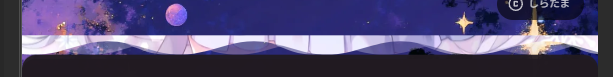
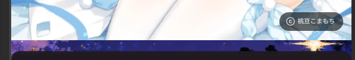

那么我的要求是这样：

1. Banner中间的文本会挡在图片中的某一固定部分，而且它会随文档流滚动，所以**Banner背景必须拥有滚动视差**。其中视口视差是较好的方案。鼠标视差比较吃性能，而且几乎不可避免js且不兼容移动端。

2. 阅读文章的过程中没有背景（即便只有两侧的装饰，并且移动端也有模糊）会十分单调。若分设两个背景，在从Banner展示页（通常是主页）过渡到正文时，全局背景必然早已加载。因此**Banner展示页必须同时拥有两个背景**，一个banner随机大图，另一个是普通阅读时的装饰背景。

3. **Banner背景与正文背景之间必须以优雅的水波过渡**。单纯为美观考虑，这种“优雅的水波过渡”可以为以水波为分级分隔的多级渐变。

4. 如果不能兼容移动端，采取一个移动端能接受的方式。

要求提完了，接下来该开始到处碰壁了。

## 实现基本逻辑

### H5结构

这方面没什么好说的，外面一个方形窗口用来挡住里面的异形轨道，就像录像带的那个窗口，里面的异形轨道接入`clip-path`制造波浪以真裁切这个视窗再内部的`bg-fixed`图片。

### 外层窗口的限制

通过`overflow-x-hidden`和`width`确定宽度避免撑开，准备承接多个track子元素。

实际代码中用的是固定宽度是避免不同设备上波浪的频率不同。

### 中部异形轨道的移动

采用

```css
@keyframes banner2-desktop-cycle {
    0% { left: 0; }
    100% { left: calc(-1 * var(--banner-width)); }
}
```

无限线性循环可以使得视窗向左滚动后极限拉回，然后再使用`absolute w-[200%]`确定为外层窗口的两倍宽用于无缝衔接。这样做数学上有个bug就是这样频率只能设定为宽度的整除倍，目前没什么好的解决方案。

使用`left`动画是因为`translate`动画会导致`bg-fixed`失效。这是W3C Recommendation现在[明文文档建议](https://drafts.csswg.org/css-transforms/#transform-rendering)级别的。

> 被` transform `影响的元素，其 `background‑attachment: fixed` 渲染时视为 `scroll`，计算值不变。

然而`left`终究是布局元素，动这么大的图片是会出事的。在性能一般的手机上多个大图这样移动时会导致闪屏，不得不用`translate`替代。

将各个轨道设置不同的动画时长、`clip-path`、透明度就能自定义水波的参数。`absolute`叠加即可实现多层水波纹效果。

### 内部图片的固定

内部图片，桌面端的纹理自然可以用`bg-fixed`直接固定，但手机端因为用了`translate`不太好这么做。

在尝试了包括但不限于`sticky`(照样会被`translate`杀)、滚动进度动画(实在太新了)等方案，我决定以毒攻毒，用`translate`本身抵消`translate`。

移动端现在中部使用左循环移动视窗，内部的图片使用右移动抵消左移动，牺牲纵向滚动视差，同时用上了各种优化，好歹是能用了。

### 闪屏的解决方案(26.03.23)

闪烁原因是一张张巨大的图片在屏幕上移动同时计算透明度会吃掉移动端本就一般的显卡巨量的性能造成失帧。

解决方案是优化clippath svg路径使其只处理水波纹部分，就像这样：



然后再添加一张不动，普通的，反而是下面波纹部分被切去的图片：



这项改动并不复杂，但其效果是巨大的（我怎么早没想到）

这个最低的分割高度应当满足：
$$
\mathrm{SplitHeight}_i = \operatorname{max}_i^n\,(H_i + A_i)
$$
即
```js
// 最大的高度+振幅
const maxVbpa = Math.max(...heights.map((h, i) => {
	return h + amplitudes[i]
}));
```

## 波浪SVG

```js
// 动态的水波层

const wT; // 一宽的循环次数，越大频率越高。经验值桌面3~4移动7~8
const A; // 振幅，单位1=图片高度
const vb; // 高度修正。为正时从底部提高，单位1=图片高度
const maxVbps; // 

const w = 1 / 4 / wT; // 循环节长度
const wc = 4 / 25 / wT; // 二次贝塞尔近似三角函数的控制点经验值
const repeatTimes = Math.ceil(0.4999 / w); // 避免误差ceil到上一级
const wavePath =
`M0,${1 - vb} ` + // 起始点，从左下角开始上升到最低高度，最低高度由此生效
`c${w/2},0,${wc},${-A},${w},${-A} s${wc},${A},${w},${A} ` +
(
	`${wc},${-A},${w},${-A} ` + // 上升段
	`${wc},${A},${w},${A} ` // 下降段
).repeat(repeatTimes - 1) + // 循环，注意忽略第一节（第一节是cs不是ss）
`v${-maxVbps} h-${repeatTimes * 2 * w} z`; // 垂直上升至波峰(v -A) → 水平左移回左侧(h -总宽度) → 闭合路径(z)，形成封闭裁剪区域

// 静态的那个图片

const staticBannerPath = `M0,0 v${1-maxVbps} h1 v${maxVbps-1} z`;

```

## Code

```html
<div class="banner2-window">
	<div class="banner2-track track-a"></div>
	<div class="banner2-track track-b"></div>
	<!-- etc. -->
	<div class="banner2-track banner2-static-track"></div>
</div>
```

```css
.track-a { animation-duration: 2s; clip-path: url(#clip-path-a); }
.track-b { animation-duration: 3s; clip-path: url(#clip-path-b); }
/* etc. */

.banner2-window {
    --banner-height: 100%;
    position: absolute;
    inset: 0;
    width: var(--banner-width);
    height: var(--banner-height);
    overflow-x: hidden;
}

.banner2-track {
    position: absolute;
    width: 200%;
    height: 100%;
    display: flex;
    animation-timing-function: linear;
    animation-iteration-count: infinite;
    z-index: 2;
}

.banner2-track.banner2-static-track {
	position: absolute;
	left: 0;
	width: 100vw;
	height: 100%;
	display: flex;
	box-sizing: border-box;
	background: no-repeat top / cover;
	background-image: var(--banner2-track-bg);
}

.banner2-track.banner2-static-track::after {
	display: none;
}

.banner2-track::after {
    position: sticky;
    left: 0;
    width: 50%;
    height: 100%;
    content: '';
    display: block;
    box-sizing: border-box;
    background-image: var(--banner2-track-bg);
    background-repeat: no-repeat;
}

/* 桌面端 */
@media (min-width: 1025px) {
    .banner2-window {
        --banner-width: 2560px;
        left: calc(50% - var(--banner-width) / 2);
    }
    
    .banner2-track {
        animation-name: banner2-desktop-cycle;
    }
    
    .banner2-track::after {
        background: no-repeat fixed center / cover;
    }
}

/* 手机端 */
@media (max-width: 1024px) {
    .banner2-window {
        --banner-width: 1024px;
    }
    
    .banner2-track {
        left: 0;
        animation-name: banner2-mobile-leftcycle;
        transform: translateZ(0);
        will-change: transform;
    }
    
    .banner2-track::after {
        width: 100vw;
        background: no-repeat top / cover;
        animation-name: banner2-mobile-rightcycle;
        animation-timing-function: linear;
        animation-iteration-count: infinite;
        animation-duration: inherit;
        transform: translateZ(0);
        will-change: transform;
    }
}

@keyframes banner2-desktop-cycle {
    0% { left: 0; }
    100% { left: calc(-1 * var(--banner-width)); }
}

@keyframes banner2-mobile-leftcycle {
    0% { transform: translateX(0); }
    100% { transform: translateX(calc(-1 * var(--banner-width))); }
}

@keyframes banner2-mobile-rightcycle {
    0% { transform: translateX(0); }
    100% { transform: translateX(calc(var(--banner-width))); }
}
```

