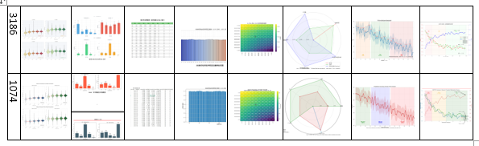

爆竹声中一岁除，今年或许是我成长得最快的一年，简单回顾一下今年的经历吧

上大学开始起我有个习惯，任何项目的目录名在前面加上年月当成已完成/已弃置的项目历史记录归档，基于此，下面就是今年的大部分比较有标志性的项目

### 2501地图画noir

我有一个mc 1.16.5的存档，在里面造过我最大的建筑也是地图画，今年我*应该*是一次都没进过这个存档。我的游戏选择正在多元化，但总时间却在减少。没错，这个地图画自投影创建后就几乎未曾动工。

起码mc陪了我十年，这个游戏我是不会忘的。希望如此吧，今年所有关于mc的圈名和头像几乎都被我清算了

### 2504 bpuffer.github.io

起因是老师让我总结一下我的python自学历程，而我当时恰好窥见博客圈的一角，此前也数次bing进个人博客并成功解决各种问题，本就有强烈建站想法的我便立刻开始了第一次建站，因为有html+css基础和刚刚可以开始解决问题的AI辅助，从零开始的vanilla建站十分顺利，此后又做了个学分自动计算的小页面相当于把js基础补全了。从这个意义上来讲，我建站应该也算有一年了（？）还是按域名算吧（

### 2505关于认证杯论文问题

认证杯是一个很特别的数学建模比赛。在他们老掉牙的论坛里，他们会**开放所有人提交的论文**。

这次比赛让我切实看到了数学建模中**论文买卖产业**的基数。一期结果公布后，一群里展开了轰轰烈烈的反作弊风潮，我在其中使用各种工具甚至自行写特征算法查出了几十篇几乎可以确定是换色图的论文，甚至还有一些完全一模一样的论文，是的，**他们完全没做查重**。

不论查重的技术有多高级，但起码获奖的论文该查一下吧？

最后并非所有那些论文都被查处。不过我也无所谓了。一方面自己的参与奖不可能被翻身，另一方面认识到自己的力量太渺小也是一种成长的过程。国赛（高教社杯）目前仍然是最公平的比赛。我也大概明白小比赛都是什么妖魔鬼怪在获奖了。

### 2507...-jwgl

如[反向代理的代价](/posts/2025-10-25-00/)，这个假期我花了几乎所有时间去0.1基础学习vue+flask技术栈。那是我第二充实的假期，昼夜颠倒12小时整，醒了就是VSCode启动，关闭开发服务器倒头就睡。第一次选购服务器、选购域名、第一次工程化地考虑各种技术选型、学习响应式框架和浏览器知识。兴趣驱动居然可以对ADHD实现如此大的抑制，以至于完成后多遍测试我也无法想象自己真的完成了这件事。虽然日后又发现了很多bug，两个月过去也基本没了。非常宝贵的经验。

### 2509LBAS

说来也是运气好，我考试之前翻论文正好翻到一个优化算法，随手复刻了发现特异性有点强，今年高教社杯目标题型刚好考到一个优化，恰好传统方法就不行，这个优化方法就行。创新分应该是给了不少，代码也不是从零写的，也是第一次拿到了史高省一，爽。

### 2509typora2paper

我再也不会用word排版了。 typora现在是我的御用论文工具，花不少时间养好的css样式完全对齐论文样式。就打印件的可排版性而言，css是word的完全上位替。

（obsidian还在学)

### 2510blog.tsukimiya.site

第一次进入博客圈是被Mizuki的宣传视频吸引进的群，此后了解到了非常多运维的知识，一步步造出了自己的小世界，还是很有成就感的

### 2601emumu.xyz

这就是我目前正在使用的新域名。目前正在抽时间开发实验室站lab.~(学React ing)，会包含一些自部署的开源小项目、小玩具什么的，还会有一些外链收集什么的（假期结束前应该会上线）敬请期待awa

另外，实验室站正式发布后我会制作vanilla的www.~ 个人主页，这也是我目前不怎么积极友链的原因，因为日后还要改。

---

以上。十分充实的一年，没提到的就是今年也好好决定了考研目标，可喜可贺。不过毕竟跨考，压力不小。目标不大，存活最好。
