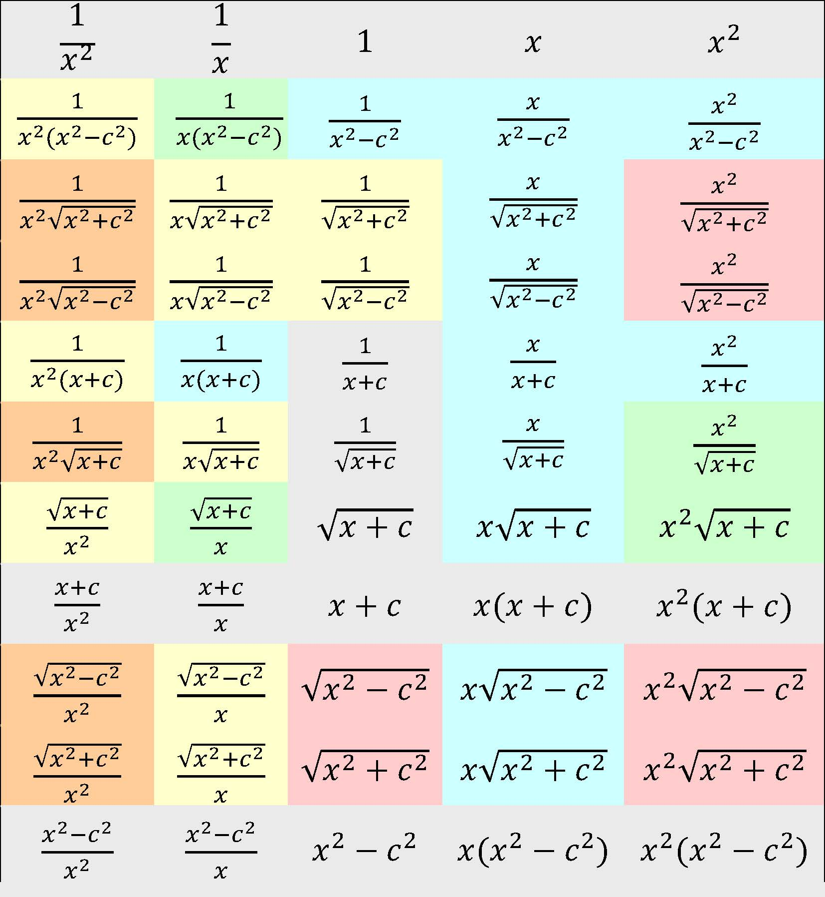

> $\int \sqrt{x^2-1}\,\mathrm{dx}$ 看着很简单吧？速逃。别回头。

众所周知，任何有理函数都可积。但其解法五花八门之严重导致新手入门入了门还在入门，看似简单的函数积出来却两张纸写不下。在题里算错得到，浪费大量时间则更致命（因为很少有非主观题会考特别复杂的积分）

ps: 扩展了一下。有理+根号下有理的情况也很多，也很重要。

图中按难度递进为
- 灰 - 入门/显式积分表
- 蓝 - 需要大脑活动参与
- 绿 - 要一点小巧思
- 黄 - 基础十分坚实
- 橙 - 奔最优解法直线走也比较费劲
- 红 - 以这张图的范围，再难也难不到解不开的程度……吧？
	- *其实是外形骗人的额外恶心分*
### 答案（建议中键to新标签页）

| $\frac{1}{x^2}$                                                                             | $\frac{1}{x}$                                                                           | $1$                                                                                   | $x$                                                                                   | $x^2$                                                                                     |
| ------------------------------------------------------------------------------------------- | --------------------------------------------------------------------------------------- | ------------------------------------------------------------------------------------- | ------------------------------------------------------------------------------------- | ----------------------------------------------------------------------------------------- |
| [$\frac{1}{x^2(x^2-c^2)}$](<https://mathdf.com/int/#expr=\frac{1}{x^2(x^2-c^2)}>)           | [$\frac{1}{x(x^2-c^2)}$](<https://mathdf.com/int/#expr=\frac{1}{x(x^2-c^2)}>)           | [$\frac{1}{x^2-c^2}$](<https://mathdf.com/int/#expr=\frac{1}{x^2-c^2}>)               | [$\frac{x}{x^2-c^2}$](<https://mathdf.com/int/#expr=\frac{x}{x^2-c^2}>)               | [$\frac{x^2}{x^2-c^2}$](<https://mathdf.com/int/#expr=\frac{x^2}{x^2-c^2}>)               |
| [$\frac{1}{x^2\sqrt{x^2+c^2}}$](<https://mathdf.com/int/#expr=\frac{1}{x^2\sqrt{x^2+c^2}}>) | [$\frac{1}{x\sqrt{x^2+c^2}}$](<https://mathdf.com/int/#expr=\frac{1}{x\sqrt{x^2+c^2}}>) | [$\frac{1}{\sqrt{x^2+c^2}}$](<https://mathdf.com/int/#expr=\frac{1}{\sqrt{x^2+c^2}}>) | [$\frac{x}{\sqrt{x^2+c^2}}$](<https://mathdf.com/int/#expr=\frac{x}{\sqrt{x^2+c^2}}>) | [$\frac{x^2}{\sqrt{x^2+c^2}}$](<https://mathdf.com/int/#expr=\frac{x^2}{\sqrt{x^2+c^2}}>) |
| [$\frac{1}{x^2\sqrt{x^2-c^2}}$](<https://mathdf.com/int/#expr=\frac{1}{x^2\sqrt{x^2-c^2}}>) | [$\frac{1}{x\sqrt{x^2-c^2}}$](<https://mathdf.com/int/#expr=\frac{1}{x\sqrt{x^2-c^2}}>) | [$\frac{1}{\sqrt{x^2-c^2}}$](<https://mathdf.com/int/#expr=\frac{1}{\sqrt{x^2-c^2}}>) | [$\frac{x}{\sqrt{x^2-c^2}}$](<https://mathdf.com/int/#expr=\frac{x}{\sqrt{x^2-c^2}}>) | [$\frac{x^2}{\sqrt{x^2-c^2}}$](<https://mathdf.com/int/#expr=\frac{x^2}{\sqrt{x^2-c^2}}>) |
| [$\frac{1}{x^2(x+c)}$](<https://mathdf.com/int/#expr=\frac{1}{x^2(x+c)}>)                   | [$\frac{1}{x(x+c)}$](<https://mathdf.com/int/#expr=\frac{1}{x(x+c)}>)                   | [$\frac{1}{x+c}$](<https://mathdf.com/int/#expr=\frac{1}{x+c}>)                       | [$\frac{x}{x+c}$](<https://mathdf.com/int/#expr=\frac{x}{x+c}>)                       | [$\frac{x^2}{x+c}$](<https://mathdf.com/int/#expr=\frac{x^2}{x+c}>)                       |
| [$\frac{1}{x^2\sqrt{x+c}}$](<https://mathdf.com/int/#expr=\frac{1}{x^2\sqrt{x+c}}>)         | [$\frac{1}{x\sqrt{x+c}}$](<https://mathdf.com/int/#expr=\frac{1}{x\sqrt{x+c}}>)         | [$\frac{1}{\sqrt{x+c}}$](<https://mathdf.com/int/#expr=\frac{1}{\sqrt{x+c}}>)         | [$\frac{x}{\sqrt{x+c}}$](<https://mathdf.com/int/#expr=\frac{x}{\sqrt{x+c}}>)         | [$\frac{x^2}{\sqrt{x+c}}$](<https://mathdf.com/int/#expr=\frac{x^2}{\sqrt{x+c}}>)         |
| [$\frac{\sqrt{x+c}}{x^2}$](<https://mathdf.com/int/#expr=\frac{\sqrt{x+c}}{x^2}>)           | [$\frac{\sqrt{x+c}}{x}$](<https://mathdf.com/int/#expr=\frac{\sqrt{x+c}}{x}>)           | [$\sqrt{x+c}$](<https://mathdf.com/int/#expr=\sqrt{x+c}>)                             | [$x\sqrt{x+c}$](<https://mathdf.com/int/#expr=x\sqrt{x+c}>)                           | [$x^2\sqrt{x+c}$](<https://mathdf.com/int/#expr=x^2\sqrt{x+c}>)                           |
| [$\frac{x+c}{x^2}$](<https://mathdf.com/int/#expr=\frac{x+c}{x^2}>)                         | [$\frac{x+c}{x}$](<https://mathdf.com/int/#expr=\frac{x+c}{x}>)                         | [$x+c$](<https://mathdf.com/int/#expr=x+c>)                                           | [$x(x+c)$](<https://mathdf.com/int/#expr=x(x+c)>)                                     | [$x^2(x+c)$](<https://mathdf.com/int/#expr=x^2(x+c)>)                                     |
| [$\frac{\sqrt{x^2-c^2}}{x^2}$](<https://mathdf.com/int/#expr=\frac{\sqrt{x^2-c^2}}{x^2}>)   | [$\frac{\sqrt{x^2-c^2}}{x}$](<https://mathdf.com/int/#expr=\frac{\sqrt{x^2-c^2}}{x}>)   | [$\sqrt{x^2-c^2}$](<https://mathdf.com/int/#expr=\sqrt{x^2-c^2}>)                     | [$x\sqrt{x^2-c^2}$](<https://mathdf.com/int/#expr=x\sqrt{x^2-c^2}>)                   | [$x^2\sqrt{x^2-c^2}$](<https://mathdf.com/int/#expr=x^2\sqrt{x^2-c^2}>)                   |
| [$\frac{\sqrt{x^2+c^2}}{x^2}$](<https://mathdf.com/int/#expr=\frac{\sqrt{x^2+c^2}}{x^2}>)   | [$\frac{\sqrt{x^2+c^2}}{x}$](<https://mathdf.com/int/#expr=\frac{\sqrt{x^2+c^2}}{x}>)   | [$\sqrt{x^2+c^2}$](<https://mathdf.com/int/#expr=\sqrt{x^2+c^2}>)                     | [$x\sqrt{x^2+c^2}$](<https://mathdf.com/int/#expr=x\sqrt{x^2+c^2}>)                   | [$x^2\sqrt{x^2+c^2}$](<https://mathdf.com/int/#expr=x^2\sqrt{x^2+c^2}>)                   |
| [$\frac{x^2-c^2}{x^2}$](<https://mathdf.com/int/#expr=\frac{x^2-c^2}{x^2}>)                 | [$\frac{x^2-c^2}{x}$](<https://mathdf.com/int/#expr=\frac{x^2-c^2}{x}>)                 | [$x^2-c^2$](<https://mathdf.com/int/#expr=x^2-c^2>)                                   | [$x(x^2-c^2)$](<https://mathdf.com/int/#expr=x(x^2-c^2)>)                             | [$x^2(x^2-c^2)$](<https://mathdf.com/int/#expr=x^2(x^2-c^2)>)                             |
> 这个网站真的很好用，可惜没开源 TAT
## 初学级 - 灰蓝色部分

### 快速线性换元

对于形如 $f(ax+b)$ 的积分，直接利用 $\mathrm{d}x = \frac{1}{a}\mathrm{d}(ax+b)$得

$$\int{f(ax+b) \,\mathrm{d}x}=\frac{1}{a}F(ax+b)+C$$

### 因式分解与分式裂项

就是用初中数学原理翻腾一遍多项式。

例如：
$$
\begin{aligned}

\int \frac{1}{x^2-c^2} \,\mathrm{d}x \\ 

\text{(因式分解)} \quad &= \int \frac{1}{(x-c)(x+c)} \,\mathrm{d}x \\ 

\text{(分式裂项)} \quad &= \int \frac{1}{2c}\left( \frac{1}{x-c} - \frac{1}{x+c} \right) \,\mathrm{d}x \\ 

&= \frac{1}{2c}\ln\left| \frac{x-c}{x+c} \right| + C 

\end{aligned} 
$$
这个以后会单独出文细说。

### 换元和凑微分

处理 $x$ 与 $\sqrt{x+c}$ 或 $x^2$ 关系的入门招式。

- **根式换元**：遇到 $\sqrt{a x+b}$，令 $t = \sqrt{a x+b}$ 往往能化根式为多项式。
    
- **凑微分**：观察分子是否为分母的导数。例如 $\int \frac{x}{x^2-c^2}\mathrm{dx} = \frac{1}{2}\int \frac{\mathrm{d}(x^2-c^2)}{x^2-c^2}$。
    $\frac{x}{(ax^2+b)^n}$形的指定杀器。
:::tip
如果整体匹配上了但系数没匹配上，建立一个直觉，系数是可以随意出入积分号的，这代表外部是可以随意补系数进来的。
:::

---

## 基础级 - 绿黄色部分

### 反三角的积分公式

- $\int \frac{1}{\sqrt{c^2-x^2}}\mathrm{dx} = \arcsin\frac{x}{c} + C$ (没有 $1/c$)

- $\int \frac{1}{c^2+x^2}\mathrm{d}x = \frac{1}{c}\arctan\frac{x}{c} + C$ (有 $1/c$)

### 分部积分法
$$\int u \,\mathrm{d}v = uv - \int v \,\mathrm{d}u$$
或者更直观的“凑微分”的理论形式：
$$\int f(x)g'(x) \,\mathrm{d}x = f(x)g(x) - \int g(x)f'(x) \,\mathrm{d}x$$

这应该是基本功，但实际上一开始很多人就完全意识不到怎么设u，或者说根本意识不到可以用分部积分法解决。

**LIATE原则**是一个用于分部积分法的记忆法则，表示选择函数的优先顺序。具体来说，LIATE代表以下顺序：

- **L**: 对数函数 - Logarithmic functions
$$
u=\ln x \quad du=\frac{1}{x}dx
$$
典型应用：$\int \ln x \,\mathrm{d}x$
- **I**: 反三角函数 - Inverse trigonometric functions
$$
u=\arctan \frac{x}{c} \quad du=\frac{c}{x^2+c^2}dx
$$
典型应用：$\int \arctan x \,\mathrm{d}x$
- **A**: 代数函数 - Algebraic functions
$$
u=x \quad du=dx
$$
典型应用：$\int x \sin x \,\mathrm{d}x$（又称降幂积分，再下面有特别说）
- **T**: 三角函数 - Trigonometric functions 
$$
u=\sin x \quad \mathrm{d}u=\cos x \,\mathrm{d}x
$$
典型应用：$\int e^x \sin x \,\mathrm{d}x$（分部两次的循环积分）
- **E**: 指数函数 - Exponential functions
$$
u=e^x \quad \mathrm{d}u=e^x \,\mathrm{d}x
$$
典型应用：（这个还是老老实实当dv吧……）

优先选择LIATE中靠前的函数作为u，剩余函数作为dv，可以简化计算过程。

以上典型应用读者自证不难。

:::caution
LIATE 不是物理定律，只是经验法则。可以优先尝试，切勿奉为圭臬。
:::

### 一条超绝近路
$$
\int{\frac{1}{\sqrt{x^2\pm c^2}}\mathrm{d}x}=\ln\left(\left|\sqrt{{x}^{2}\pm{c}^{2}}+x\right|\right)+C
$$
我的建议是直接背诵。遇到 $\frac{1}{\sqrt{x^2+c^2}}$ 或 $\frac{1}{\sqrt{x^2-c^2}}$ 时，直接套用对数形式公式，不需要再走三角代换的老路，也是一些红橙区的基础，能省下大量时间。

如果实在想弄清楚为什么，可以前往[笔记之二的双曲函数章节](/posts/2026-03-19-00/#双曲函数)

到这里你应该已经学会处理这六种情况及其扩展情况了：

| 形式                                            | 方法     | 结果                                                                |
| --------------------------------------------- | ------ | ----------------------------------------------------------------- |
| $\int{\frac{1}{x^2+c^2}\,\mathrm{d}x}$        | 套反三角公式 | $\frac{1}{c} \arctan \frac{x}{c} + C$                             |
| $\int{\frac{1}{x^2-c^2}\,\mathrm{d}x}$        | 因式分解   | $\frac{1}{2c} \ln \left\vert \frac{x - c}{x + c} \right\vert + C$ |
| $\int{\frac{1}{c^2-x^2}\,\mathrm{d}x}$        | 因式分解   | $\frac{1}{2c} \ln \left\vert \frac{c + x}{c - x} \right\vert + C$ |
| $\int{\frac{1}{\sqrt{x^2+c^2}}\,\mathrm{d}x}$ | 套积分表   | $\ln \left\vert \sqrt{x^2 + c^2} + x \right\vert + C$             |
| $\int{\frac{1}{\sqrt{x^2-c^2}}\,\mathrm{d}x}$ | 套积分表   | $\ln \left\vert \sqrt{x^2 - c^2} + x \right\vert + C$             |
| $\int{\frac{1}{\sqrt{c^2-x^2}}\,\mathrm{d}x}$ | 套反三角公式 | $\arcsin \frac{x}{c} + C$                                         |

---

## 毕业级 - 橙红色部分

### 换元之三角代换

当以上路子全部行不通时，根号内平方和/差可以利用三角恒等式尝试消根号：

- **遇到 $\sqrt{a^2-x^2}$**：令 $x = a\sin\theta$，利用 $1-\sin^2\theta = \cos^2\theta$。

- **遇到 $\sqrt{a^2+x^2}$**：令 $x = a\tan\theta$，利用 $1+\tan^2\theta = \sec^2\theta$。

- **遇到 $\sqrt{x^2-a^2}$**：令 $x = a\sec\theta$，利用 $\sec^2\theta-1 = \tan^2\theta$。

> PS: 作者真的很讨厌拓展三角函数。

:::caution[CAUTION: 男生女生特别扣分的两点]
  - 积分结束后是 $\theta$ 的函数，回代时可以画出直角三角形，根据边角关系强行还原回$x$，不要尝试手动解决譬如$\tan(\arcsin{x})$的问题，几何法真可以秒杀。
  - 换元微分项：换元时千万别忘了 $\mathrm{d}x$ 也要变，例如 $x=a\tan\theta \Rightarrow \mathrm{d}x = a\sec^2\theta\,\mathrm{d}\theta$。定积分的话上下限也要变。
:::
### 换元之倒代换

当分母的 $x$ 次数高于分子，或分母结构为 $x^n\sqrt{\text{二次型}}$ 时，直接换元。

- **操作**：令 $x = \frac{1}{t}$，则 $\mathrm{d}x = -\frac{1}{t^2}\mathrm{d}t$。

- **奇效**：它能把深陷分母的 $x$ 提到分子位置，或将复杂的根式内项转化为容易凑微分的形式。

- **典型应用**：$\int \frac{1}{x^2\sqrt{x^2-c^2}}\,\mathrm{d}x$。倒代换后，原积分会瞬间坍缩为简单的三角函数积分。

### 升降幂积分与回环积分

> 升降幂这个名字是我自己起的。这种技巧似乎没有统一正式常用的名字，但这个方法是实实在在非常常用。

升降幂积分实际上就是分部积分法的特殊情况，其特殊之特使得我必须拿出来强调一下。他可以处理一个你十分熟悉的函数f(x)的以下两种变体：

**升幂积分**：
$$\int f(x) \,\mathrm{d}x = x f(x) - \int x f'(x) \,\mathrm{d}x$$
**降幂积分**：
$$\int x f(x) \,\mathrm{d}x = x F(x) - \int F(x) \,\mathrm{d}x \quad (\text{其中 } F'(x) = f(x))$$

或者简单点说：
- **升幂**：适用于 $f(x)$ 积不动但导数很简单的函数（如 $\ln x, \arctan x$）。
- **降幂**：适用于 $f(x)$ 积得动，但前面的 $x$ 很碍事的情况（如 $x \cos x$）。

针对 $x^2\sqrt{x^2\pm c^2}$ 或 $\sqrt{x^2\pm c^2}$ 这种红区重灾区，可以使用升降幂积分恢复或消耗x因子。又，升降幂积分又经常连接到一类特殊情况：**回环积分**，名字挺大气，实际上你一看就明白了：
$$
\begin{align}

\int \sqrt{x^2 + c^2} \,\mathrm{d}x &= x\sqrt{x^2 + c^2} - \int \frac{x^2}{\sqrt{x^2 + c^2}} \,\mathrm{d}x \quad\text{(升幂积分)} \\

&= x\sqrt{x^2 + c^2} - \int \frac{x^2 + c^2 - c^2}{\sqrt{x^2 + c^2}} \,\mathrm{d}x \\

&= x\sqrt{x^2 + c^2} - \int \sqrt{x^2 + c^2} \,\mathrm{d}x + c^2 \int \frac{1}{\sqrt{x^2 + c^2}} \,\mathrm{d}x \\

2\int \sqrt{x^2 + c^2} \,\mathrm{d}x &= x\sqrt{x^2 + c^2} +  c^2 \int \frac{1}{\sqrt{x^2 + c^2}} \,\mathrm{d}x\quad\text{(<-这是上一节的公式)}

\end{align}
$$
:::tip[恭喜]
你已经能解决了开头的速逃题了。现在上手试试吧？
:::

:::caution
**非主观题如果真出了红区题，建议还是检查一下之前步骤对不对。所有红区题我几乎没在非主观题里见到实用场景。最大的应用场景是迷途知返检查错误。**
:::

---

感谢Google Gemini对本文提供的大力支持。眼花缭乱的符号真的很难看清有没有错漏。
