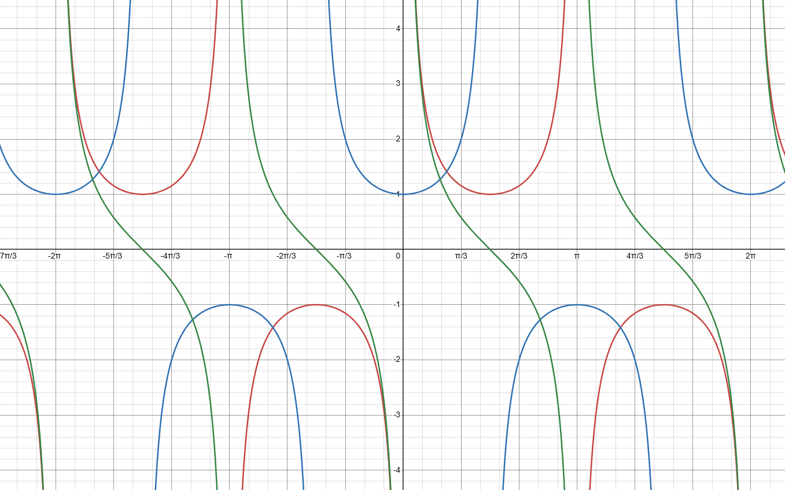
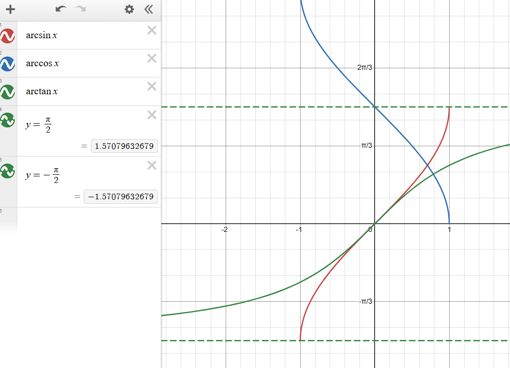
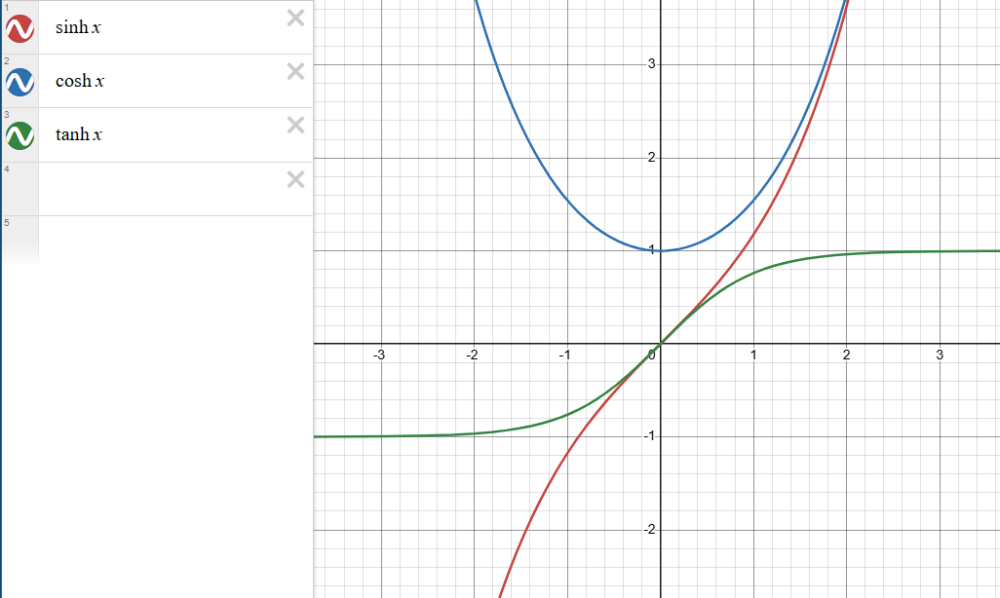

> **序：关于整个三角函数及双曲函数的宏观视界**
> 
> 在考研体系中，三角函数并不是一个孤立的章节，而是像一个高中知识一样贯穿于极限、导数、积分与微分方程的始终。很多同学（包括曾经的我:spoiler[和现在的我]）计算瓶颈，往往是因为底层的三角变形不熟练。这些三角函数也是高中不教大学不教的典型例子。

---

## 普通三角函数

这一部分是所有复杂微积分操作的基石，主要考察的是在求极限时的等价代换，以及在求积分时的恒等变形。

### 初高中的公式复习

考研中不需要你去解复杂的三角迷宫，但以下几组核心公式必须形成肌肉记忆，它们是积分化简的核心工具：

**平方关系：** $\sin^2 x + \cos^2 x = 1$

**倍角公式：**
$$
\begin{align*}
&\sin(2x) = 2\sin x\cos x \\
&\cos(2x) = \cos^2 x - \sin^2 x = 2\cos^2 x - 1 = 1 - 2\sin^2 x \\
&\sin^2 (2x) = \frac{1-\cos{x}}{2} \\
&\cos^2 (2x) = \frac{1+\cos{x}}{2}
\end{align*}
$$
**和差化积与积化和差：**
$$
\begin{align*}
&\sin x \cos y = \frac{1}{2}[\sin(x+y) + \sin(x-y)] \\
&\cos x \cos y = \frac{1}{2}[\cos(x+y) + \cos(x-y)]
\end{align*}
$$
**处理线性组合（辅助角公式）：** 
$$
\begin{align*}
&a\sin x + b\cos x = \sqrt{a^2+b^2}\sin(x+\varphi) \\
&\tan\varphi = \frac{b}{a}
\end{align*}
$$
### 导数

$\tan{x}$的导数是走近扩展三角函数的起点

$$(\tan x)' = \sec^2 x$$

至于怎么起，下一章再说

~~什么叫sinx的导数是什么~~
### 泰勒展开

在求极限时，单纯的等价无穷小（如 $x \to 0$ 时 $\sin x \sim x$）往往不够用。以下是必须背诵的麦克劳林展开式：
$$
\begin{align*}
&\sin x = x - \frac{x^3}{6} + \frac{x^5}{120} - o(x^5) \\
&\cos x = 1 - \frac{x^2}{2} + \frac{x^4}{24} - o(x^4) \\
&\tan x = x + \frac{x^3}{3} + \frac{2x^5}{15} + o(x^5)
\end{align*}
$$
- 注意 $\tan x$ 的系数规律性不强，建议手推或死记到三阶即可。五阶应用场景就很少见了。
- 另外，sinx和cosx的无限推导虽然很好记，**但不要忘了阶乘就行**

---

## 扩展三角函数

### 定义

定义非常简单，就是普通三角函数的倒数，有同样的周期性。
$$
\begin{align*}
\csc{x} &= \frac{1}{\sin{x}} \quad (\sin{x} \neq 0) \\
\sec{x} &= \frac{1}{\cos{x}} \quad (\cos{x} \neq 0) \\
\cot{x} &= \frac{1}{\tan{x}} = \frac{\cos{x}}{\sin{x}} \quad (\sin{x} \neq 0, \tan{x} \neq 0)
\end{align*}
$$
反扩展三角函数可以写成如下形式
$$
\begin{align*}
\operatorname{arccsc}{x} &= \arcsin{\frac{1}{x}} \quad (x \neq 0) \\
\operatorname{arcsec}{x} &= \arccos{\frac{1}{x}} \quad (x \neq 0) \\
\operatorname{arccot}{x} &= \arctan{\frac{1}{x}} = \frac{\pi}{2} - \arctan{x} \quad (x \neq 0)
\end{align*}
$$

### 从 $d(\tan x) = \sec^2 x dx$ 开始

很多同学对 $\sec x$（正割）感到陌生，但我们在积分中遇到它其实非常友好。因为 $(\tan x)' = \sec^2 x$，这意味着在积分式中，只要你凑出了 $\sec^2 x dx$，就可以直接将其打包变成 $d(\tan x)$。这种微分的联动，是解决许多复杂三角积分的突破口。

同时，由 $\sin^2 x + \cos^2 x = 1$ 两边同除 $\cos^2 x$，我们能得到扩展三角函数最重要的恒等式：
$$1 + \tan^2 x = \sec^2 x$$
同时，此处提及$\sec x$的导数：
$$(\sec x)' = \sec x \tan x$$
这在分部积分中经常作为基础元件出现，因为这是普通三角函数和扩展三角函数的关联入口。

### 处理积分中的 $x^2-1$ 与 $x^2+1$

在不定积分和定积分中，当被积函数含有根号下的二次多项式时，三角代换是标准解法。

**1. 遇到 $\sqrt{x^2+1}$ : 使用正切代换**

令 $x = \tan t$，则 $dx = \sec^2 t dt$。此时 $\sqrt{x^2+1} = \sqrt{\tan^2 t + 1} = \sec t$。

**例题：** 求 $\int \frac{1}{(x^2+1)^{3/2}} dx$
$$
\begin{align*}
&\text{令}x = \tan t,\,dx = \sec^2 t dt \\
&\text{原式} = \int \frac{\sec^2 t dt}{(\sec^2 t)^{3/2}} = \int \frac{\sec^2 t}{\sec^3 t} dt = \int \cos t dt = \sin t + C \\
&\text{有直角三角形中} \tan{t}=x=\frac{x}{1},\text{斜边为}\sqrt{x^2+1} \\
&\text{故}\sin t = \frac{x}{\sqrt{x^2+1}} \\
&\text{代回得原式}=\frac{x}{\sqrt{x^2+1}} + C
\end{align*}
$$

**2. 遇到 $\sqrt{x^2-1}$ : 使用正割代换**

令 $x = \sec t$，则 $dx = \sec t \tan t dt$。此时 $\sqrt{x^2-1} = \sqrt{\sec^2 t - 1} = \tan t$。

**例题：** 求 $\int \frac{\sqrt{x^2-1}}{x} dx$

结果：$\sqrt{x^2-1} - \arccos\frac{1}{x} + C$。读者自证不难。

:::note
定义说过，$\operatorname{arcsec}{x} = \arccos{\frac{1}{x}}$。或者用反函数定义互相捯饬一下不难。
:::

### 另外两个兄弟

除了 $\sec x$，还有 $\csc x = \frac{1}{\sin x}$（余割）和 $\cot x = \frac{1}{\tan x}$（余切）。在数二的考纲和历年真题中，它们出现的频率极低。你只需要知道它们的存在，以及 $1 + \cot^2 x = \csc^2 x$ 这个关系即可，无需花费大量精力死磕。其基本逻辑其实和$\sin^2x+\cos^2x=1$，$\tan^2x+1=\sec^2x$是三面对称的，有兴趣可以自行探索

### 仍然是不重要的

**泰勒展开：** 几乎不会考 $\sec x$ 等扩展三角函数的泰勒展开。如果真在极限题中遇到，千万不要去背它们复杂的展开式，现场利用等价代换（如 $\sec x = \frac{1}{\cos x}$，再用 $\cos x$ 的泰勒展开做除法或广义二项式展开）即可手推。

**反扩展三角函数：** 虽然理论上存在 $\text{arcsec} x$ 等反扩展三角函数，但遇到需要回代的情况，通常可以用 $\arccos\frac{1}{x}$ 这种形式绕过去。

**导数**：只要你不主动用$\csc x$和$\cot x$，就几乎都能用倒数糊弄过去。

---

## 反三角函数

反三角函数在考研中**极其重要**，AI总结了几个尤其，但我觉得它在哪都很重要，出现率和三角函数相当。一大原因是它的导数形式很适合到处塞。

### 导数和基本公式

反三角函数的导数公式是没有根号和有根号的分水岭，积分时如果看到分母有 $x^2+1$ 或 $\sqrt{1-x^2}$，要立刻条件反射想到：

| **函数**      | **导数**                    | **对应积分常考形式**                                                    |
| ----------- | ------------------------- | --------------------------------------------------------------- |
| $\arcsin x$ | $\frac{1}{\sqrt{1-x^2}}$  | $\int \frac{1}{\sqrt{a^2-x^2}} dx = \arcsin\frac{x}{a} + C$     |
| $\arccos x$ | $-\frac{1}{\sqrt{1-x^2}}$ | （考得少，因为可以用 $\arcsin$ 加负号代替）                                     |
| $\arctan x$ | $\frac{1}{1+x^2}$         | $\int \frac{1}{a^2+x^2} dx = \frac{1}{a}\arctan\frac{x}{a} + C$ |

利用图像的对称性，有两个恒等式在化简时能起到奇效：
$$\arcsin x + \arccos x = \frac{\pi}{2}$$
$$\arctan x + \text{arccot} x = \frac{\pi}{2}$$
### 泰勒

反三角函数的泰勒展开中，$\arctan x$ 是绝对的重点。它不仅在求极限时大有用处，其特殊形式还与圆周率 $\pi$ 的计算紧密相连。
$$x\to0\,,\,\,\arctan x = x - \frac{x^3}{3} + \frac{x^5}{5} - \frac{x^7}{7} + o(x^7)$$
> **拓展小知识：** 如果令 $x = 1$，由于 $\arctan 1 = \frac{\pi}{4}$，我们就得到了著名的莱布尼茨公式计算 $\pi$：$\frac{\pi}{4} = 1 - \frac{1}{3} + \frac{1}{5} - \frac{1}{7} + \dots$

至于 $\arcsin x$ 的泰勒展开较为复杂（包含双阶乘），只需知道 $x \to 0$ 时 $\arcsin x \sim x$ 即可。

### 图像及性质

- **$\arcsin x$：** 定义域 $[-1, 1]$，值域 $[-\frac{\pi}{2}, \frac{\pi}{2}]$。奇函数，单调递增。

- **$\arccos x$：** 定义域 $[-1, 1]$，值域 $[0, \pi]$。非奇非偶函数，单调递减。

- **$\arctan x$：** 定义域 $(-\infty, +\infty)$，值域 $(-\frac{\pi}{2}, \frac{\pi}{2})$。奇函数，单调递增。**注意其水平渐近线：** $x \to +\infty$ 时 $y \to \frac{\pi}{2}$；$x \to -\infty$ 时 $y \to -\frac{\pi}{2}$。

---

## 双曲函数

**前言说明：** 双曲函数在数二的大纲中并不是硬性要求的核心考点，你完全可以用普通三角函数的知识覆盖它。**但是**，对于学有余力、想要在积分计算上追求速度和准确率的同学来说，双曲函数是一个非常值得扩展的外挂。和高考不同，只要不跳步太多或者太二级结论，一般不会出现超纲解法扣分的情况。

让我们从一道经典的难题入题：求解 $\int \frac{1}{\sqrt{x^2+1}} dx$

我们前面讲过，令 $x = \tan t$，原式化为 $\int \sec t dt$。这个积分的结果是 $\ln|\sec t + \tan t| + C$。最后回代，得到 $\ln(x + \sqrt{x^2+1}) + C$。过程较为繁琐，且需要背诵 $\sec t$ 的积分。

如果引入双曲函数，这道题的推导将变成简单的多项式级别的操作。下面我们来看看这个武器的真面目。

### 定义

双曲函数本质上是指数函数 $e^x$ 与 $e^{-x}$ 的线性组合，它们之所以被称为“双曲”，是因为它们的参数方程构成的是双曲线 $x^2 - y^2 = 1$，而不是圆。

**双曲正弦：** $\sinh x = \frac{e^x - e^{-x}}{2}$

**双曲余弦：** $\cosh x = \frac{e^x + e^{-x}}{2}$

**双曲正切：** $\tanh x = \frac{\sinh x}{\cosh x} = \frac{e^x - e^{-x}}{e^x + e^{-x}}$

**核心恒等式（对应三角的 $\sin^2 x + \cos^2 x = 1$）：**
$$\cosh^2 x - \sinh^2 x = 1$$
注意中间是减号，这意味着 $\sqrt{x^2+1}$ 如果用 $x = \sinh t$ 代换，直接就变成了 $\sqrt{\sinh^2 t + 1} = \cosh t$。

### 反函数（\*重要，不背没法用）

如果你能记住反双曲函数的对数表达形式，很多带根号的复杂积分公式就再也不用死记硬背了。

- **反双曲正弦：** $\text{arsinh} x = \ln(x + \sqrt{x^2+1})$

- **反双曲余弦：** $\text{arcosh} x = \ln(x + \sqrt{x^2-1})$ （$x \ge 1$）

### 导数和基本公式

双曲函数的求导比三角函数舒适得多，因为没有负号交替：

- $(\sinh x)' = \cosh x$
- $(\cosh x)' = \sinh x$

另外，普通三角函数和双曲函数有一点微妙的关系

| **类别**  | **普通三角函数**                         | **双曲函数**                             | **记忆点** |
| ------- | ---------------------------------- | ------------------------------------ | ------- |
| **关系**  | $\sin^2 x + \cos^2 x = 1$          | $\cosh^2 x - \sinh^2 x = 1$          | 双曲是减法   |
| **二倍角** | $\sin 2x = 2\sin x \cos x$         | $\sinh 2x = 2\sinh x \cosh x$        | 完全一致    |
| **二倍角** | $\cos 2x = \cos^2 x - \sin^2 x$    | $\cosh 2x = \cosh^2 x + \sinh^2 x$   | 双曲是加法   |
| **半角**  | $\sin^2 x = \frac{1 - \cos 2x}{2}$ | $\sinh^2 x = \frac{\cosh 2x - 1}{2}$ | 双曲相反    |
| **半角**  | $\cos^2 x = \frac{1 + \cos 2x}{2}$ | $\cosh^2 x = \frac{\cosh 2x + 1}{2}$ | 完全一致    |

### 例子

1. 回到开头的积分 $I=\int \frac{1}{\sqrt{x^2+1}} dx$：
$$
\begin{align*}
&\text{令}x = \sinh t,\,dx = \cosh t dt \\
&I = \int \frac{\cosh t}{\sqrt{\sinh^2 t + 1}} dt = \int \frac{\cosh t}{\cosh t} dt = \int 1 dt = t + C \\
&\text{回代：}t = \text{arsinh} x = \ln(x + \sqrt{x^2+1}) \\
&I = \int \frac{1}{\sqrt{x^2+1}} dx = \ln(x + \sqrt{x^2+1}) + C
\end{align*}
$$
一步到位，同理，$\int \frac{1}{\sqrt{x^2-1}} dx$ 令 $x = \cosh t$ 也能瞬间得出 $\ln|x + \sqrt{x^2-1}| + C$。

2. 来一道[上一个笔记](/posts/2026-02-17-01/)里镇楼的题：$I=\int \sqrt{x^2 - 1} dx$

$$
\begin{align*}
&\text{令}x = \cosh t\ (x \geq 1, t \geq 0),\,dx = \sinh t dt \\
&I = \int \sqrt{\cosh^2 t - 1} \cdot \sinh t dt = \int \sinh t \cdot \sinh t dt = \int \sinh^2 t dt \\
&\text{由双曲恒等式：}\sinh^2 t = \frac{\cosh 2t - 1}{2} \\
&I = \int \frac{\cosh 2t - 1}{2} dt = \frac{1}{2}\int \cosh 2t dt - \frac{1}{2}\int 1 dt = \frac{1}{4}\sinh 2t - \frac{1}{2}t + C \\
&\text{由倍角公式：}\sinh 2t = 2\sinh t \cosh t,\ \text{代入得}= \frac{1}{2}\sinh t \cosh t - \frac{1}{2}t + C \\
&\text{回代：}\cosh t = x,\ \sinh t = \sqrt{x^2 - 1},\ t = \text{arcosh} x = \ln(x + \sqrt{x^2 - 1}) \\
&I = \int \sqrt{x^2 - 1} dx = \frac{1}{2}x\sqrt{x^2 - 1} - \frac{1}{2}\ln(x + \sqrt{x^2 - 1}) + C
\end{align*}
$$
双曲，爽！
### 图像及性质

$\sinh x$：奇函数，穿过原点，形状类似 $y=x^3$ 但增长极快（因为是指数级）。单调递增。

$\cosh x$：偶函数，图像像一条悬垂的铁链（悬链线），最低点在 $(0, 1)$。在 $x>0$ 单调递增。

$\tanh x$：奇函数，被夹在 $y=-1$ 和 $y=1$ 两条水平渐近线之间，形状类似 $\arctan x$。

