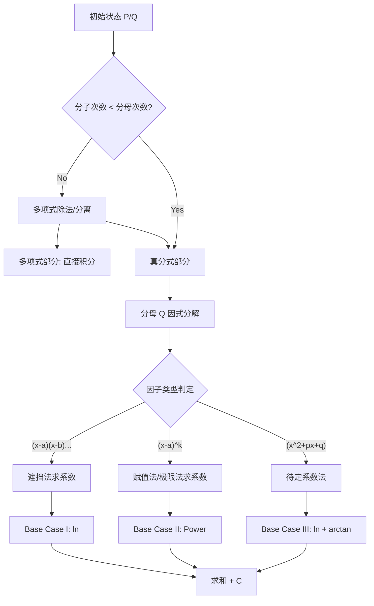

## \[常考点]因式分解与分式裂项

> 我真感觉我高中没学过这个。真的。

这一节没有颜色区分，**全员必考，全员背诵**。

这是整个不定积分计算的“汇编语言”底层——无论多复杂的函数，只要能转化成有理函数，最终都会坍缩成下面这套流程。

我们将整个过程视为**动态规划 (Dynamic Programming)**：

- **状态 (State)**: 当前的有理分式 $\frac{P(x)}{Q(x)}$。
    
- **转移 (Transition)**: 通过代数变形降阶。
    
- **基准情况 (Base Case)**: 不可约的目标形式（直接积分）。
    

---

### 1. 前置条件与 Base Case

**前置检查 (Pre-check)**：

积分必须是**真分式**（分子次数 $<$ 分母次数）。

> ⚠️ **如果是假分式（$\deg(P) \ge \deg(Q)$）**：必须先做**多项式除法**，剥离出多项式部分，只对余下的真分式做裂项。
> 
> $\frac{x^3}{x^2+1} \Rightarrow x - \frac{x}{x^2+1}$

**目标状态 (不可约 Base Case)**：

所有有理函数最终只能被分解为以下三种基准形态的线性组合。

| **形态**                                 | **归宿 (直接积分结果)**            |
| -------------------------------------- | -------------------------- |
| **I. 一次单根** $\frac{A}{x-a}$            | $A\ln\left\|x-a\right)$    |
| **II. 一次重根** $\frac{A}{(x-a)^k}$       | $\frac{A}{1-k}(x-a)^{1-k}$ |
| **III. 二次不可约** $\frac{Mx+N}{x^2+px+q}$ | $\frac{M}{2}\ln$           |

---

### 2. 转换路线图 (State Transition Diagram)

代码段

---

### 3. 基本操作 (The Toolset)

我们不需要死算，有三种工具可以组合使用：

1. **遮挡法 (Cover-up Method)** —— _针对 $(x-a)$ 单根_
    
    - **操作**：求 $\frac{A}{x-a}$ 的系数 $A$ 时，在原式中遮住 $(x-a)$，然后将 $x=a$ 代入剩余部分。
        
    - **评价**：秒杀级，必用。
        
2. **极限/赋值法** —— _针对最高次项或常数项_
    
    - **操作**：
        
        - 令 $x=0$：快速求出常数项关系。
            
        - 令 $x \to \infty$：两边同乘 $x$，快速求出最高次系数关系。
            
    - **评价**：用于辅助遮挡法解决不了的剩余系数。
        
3. **求导法** —— _针对重根 $(x-a)^k$_
    
    - **操作**：对等式两边求导，可以获得关于次高次幂系数的方程。
        
    - **评价**：屠龙技，考研一般用到二重根 $(x-a)^2$ 即可，不必强求。
        

---

### 4. 降阶指南：从 N 次到 Base Case

我们将分母 $Q(x)$ 的最高次数看作问题规模，逐级击破。

#### Level N: 高次通用 (降阶入口)

**状态**：$Q(x)$ 是 $n$ 次多项式。

**策略**：寻找**实根**。

- 代数基本定理保证了：任何实系数多项式都可以分解为**一次因式**与**二次不可约因式**的乘积。
    
- **试根法**：先试 $\pm 1, \pm 2, \pm 1/2$。找到一个根 $x=a$，就由长除法除以 $(x-a)$，降阶为 $n-1$ 次问题。
    

#### Level 4: 四次 (特型)

**状态**：$Q(x)$ 为四次，常见于双二次型。

**转移方程**：

1. **形式 $x^4 - a^4$**：
    
    - $\Rightarrow (x^2-a^2)(x^2+a^2) \Rightarrow (x-a)(x+a)(x^2+a^2)$
        
    - **结果**：2个 Base I + 1个 Base III。
        
2. **形式 $x^4 + a^4$ (难点)**：
    
    - **技巧**：配方。$x^4+a^4 = (x^2+a^2)^2 - 2a^2x^2 = (x^2+a^2-\sqrt{2}ax)(x^2+a^2+\sqrt{2}ax)$。
        
    - **结果**：2个 Base III。不要试图找实根，直接解两个二次方程。
        

#### Level 3: 三次 (必有一实根)

**状态**：$Q(x)$ 为三次多项式。

**转移方程**：

- 既然是奇数次，图像必穿过 $x$ 轴，**必有一个实根** $x=a$。
    
- **操作**：找到那个实根（通常是整系数），提取 $(x-a)$。
    
- **剩余**：变成 $(x-a)(Ax^2+Bx+C)$。
    
- **判定**：看二次部分的 $\Delta$。
    
    - $\Delta > 0$: 全是 Base I。
        
    - $\Delta = 0$: 一个 Base I + 一个 Base II。
        
    - $\Delta < 0$: 一个 Base I + 一个 Base III。
        

#### Level 2: 二次 (最终决战)

**状态**：$Q(x) = ax^2+bx+c$。

**转移方程**：

1. **$\Delta > 0$ (有两个不同实根)**：
    
    - 十字相乘法分解 $\Rightarrow$ 两个 Base I。
        
2. **$\Delta = 0$ (重根)**：
    
    - 完全平方式 $\Rightarrow$ 一个 Base II。
        
3. **$\Delta < 0$ (无实根)**：
    
    - **配方法**：化为 $(x+m)^2 + n^2$。
        
    - **分子拆分**：
        
        - 凑导数项：$\frac{2(x+m)}{(x+m)^2+n^2} \to \ln$
            
        - 凑常数项：$\frac{C}{(x+m)^2+n^2} \to \arctan$
            
    - **结果**：Base III。
        

:::tip[总结]

解有理函数积分，其实就是一个**DFS（深度优先搜索）**过程：

先看是不是真分式 $\to$ 找分母的根 $\to$ 拆成小项 $\to$ 匹配三种 Base Case $\to$ 查表输出。

:::
## \[易懵点]升幂和降幂积分

> 这个名字好像没有广泛采用？但这两个形式实在太常用了。

## \[难点]数二玩家的二阶线性微分方程

> 一直觉得微分方程解法这块在数学里……挺癫的

## \[超车点]双曲三角函数

> 比微分方程癫

## 会用到的物理公式

> “开智了自己会删”

