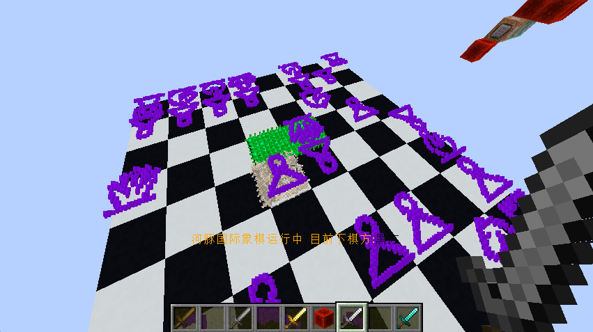

我在25年5月左右首次依赖github pages搭建了网页，放了两篇文章；25年10月左右我首次在blog.tsukimiya.site搭建了Mizuki主题Astro博客并实验性地更新了几篇文章；现在完成初步前端入门的我创建了这个新的自改版Fuwari博客站点[blog.emumu.xyz](https://blog.emumu.xyz)，不久的将来也将上线[个人主页 www.emumu.xyz](https://www.emumu.xyz)和[实验室 lab.emumu.xyz](https://lab.emumu.xyz)，めでたし，めでたし。

旧域名将留作神秘用途[（？）](https://blog.tsukimiya.site)

重新正式自我介绍一下：我叫月宫绘梦，主打Python、数学建模和LLM Agent方向。欢迎友链～

## 月宮絵夢？

我第一个微信机器人的名字我用的是某超冷门角色的姓“月宮”，最开始的网址也用了tsukimiya，自然而然地它就进入了我的账号和项目体系中，成为了不可忽视的标志。絵夢来源于[鳳えむ](https://pjsekai.sega.jp/character/unite04/emu/index.html)，恰好构成一个主动宾。左上角的header是 [白咲美絵瑠](http://unisonshift.amusecraft.com/products/project31/character01.html#C04_jump)。头像是[依々(ゆーね)](https://www.pixiv.net/artworks/64338566)

换到今天的`emumu.xyz`是因为tsukimiya确实很难敲。。

## 爱好

Minecraft十年老玩家。独处的日子里陪过我可玩性最高的单机游戏对我有非凡的意义。mc指令是我用过的第一种编程语言。作为编程语言，mc指令的可读性、实时性等等方面都十足地为我奠定了编程兴趣。可惜时至今日，mc指令底层逻辑有了翻天覆地的变化，我也早已不再紧跟。

不轻不重的二次元。偶尔看番、漫画，喜欢温馨日常和平的番，或者龙傲天凤傲天异世界厕纸之类毫无压力的，以及纯爱白开水Galgame。说到Galgame就不得不提一个神奇的现象，当我与人当面闲聊（多半是对面来尬聊）我第一句有时候能想出一句日语。大概是我Galgame里的对话量要比现实中多了吧（

玩过很长一段时间音游，算是小有所成（osu 3kpp），但不出所料，在学习计划逐渐充实，游戏逐渐淡出生活之后很多游戏水平都下降了，尤其是mc pvp和音游这类肌肉记忆的方面<del>年纪轻轻就一把年纪了</del>。所以目前会玩的是一些不太需要操作但有难度的，比如mc的科技类整合包，或者文明6，之类的。

## 关于文章发布

我有一些文章产出偏好，希望您能在订阅前了解：

1. 我会尽最大可能不使用AI生成。这并不意味着我的文章会更(不)真实或(不)客观，而是我希望自己以自己的能力和见解独立地产出知识。当然这并不妨碍我使用AI工具查阅资料和总结观点，以及我的表述为达到准确和易读，有时将不可避免地“看起来像AI”。

2. 我会记录经过自己新探索的过程凝聚的新知识。无论是不是重复造轮子。毕竟实践学习本身就是一个又一个造轮子的过程，造轮子不是目的而是学习的手段，造熟练了、融会贯通之后才能带来真正的创新。

3. “漫谈”类别是未经严谨证成或含大量主观内容、或纯娱乐性内容的文章。是一个娱乐类别，请特别注意。

在上个半年恶补了前端知识之后，我打算回到自己的老本行领域-以Python语言为主的数学建模方向以及大模型和Agent方向，所以后续的文章可能不怎么太会出现前端或者serverless了。

同时由于考研复习紧锣密鼓安排中，更新频率会变。但无法预测会变到什么程度。或许又会开始更408的学习笔记，谁知道呢😌

## 展望

### 2025.10

没什么大理想。以我的背景能挤进计算机行业敲代码养活自己就很满足了。当然如果有机会的话还是希望能做出一些有意义的东西。

### 2026.03

尝试跨考获得科班身份逆天改命，但408量真的好多……不过似乎没有特别难啃的awa

## 友链

请前往 [友链页面](https://blog.emumu.xyz/friends) 进行申请。

没有什么深层要求哦，只要不是根本没建好或者有坏心思都欢迎哦

## ???

<del>黑历史</del>

\*由于某些原因 部分英文id(如github)保留了以前名字puffer的字眼，所以mc puffer或者深水の河豚也是我哦。。

---

## 技术栈

本网站基于 Astro 框架，采用 [Fuwari](https://github.com/saicaca/fuwari) 主题浅度魔改并搭建。

::github{repo="saicaca/fuwari"}

Mermaid 客户端渲染暂时采用了 [Mizuki](https://github.com/matsuzaka-yuki/mizuki) 的插件方案。

::github{repo="matsuzaka-yuki/Mizuki"}
